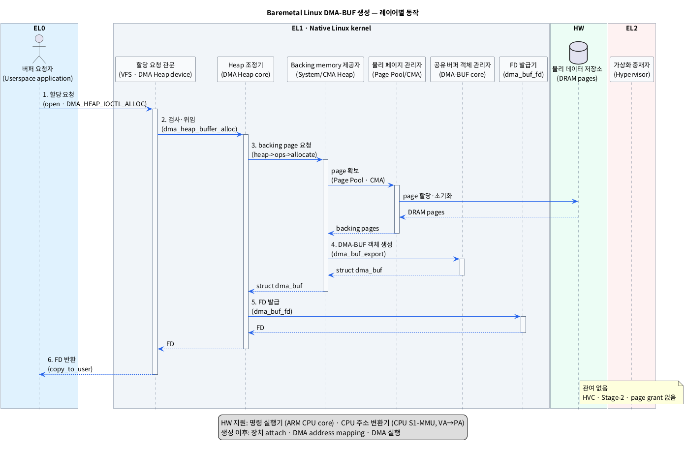

# Baremetal Linux에서 DMA-BUF 생성 단계

## 1. 범위와 완료 조건

이 문서에서 baremetal은 OS가 없는 펌웨어 환경이 아니라, **하이퍼바이저와 VM 없이 Linux가 HW를 직접 사용하는 환경**을 뜻한다. Linux가 전혀 없는 환경에는 DMA-BUF 서브시스템도 없다.

- `baremetal Linux`: Linux kernel이 하이퍼바이저의 중재 없이 SoC를 직접 관리하는 실행 환경이다.

설명은 사용자가 DMA Heap에 버퍼를 요청하는 표준 경로를 기준으로 한다.

- `DMA Heap`: 사용자가 용도에 맞는 메모리 할당자를 선택하여 DMA-BUF를 요청하는 Linux 인터페이스다.

DMA-BUF 생성 완료의 기준은 **DRAM backing page, kernel DMA-BUF 객체와 사용자 FD가 모두 만들어진 상태**다.

- `DMA-BUF`: 여러 프로세스와 장치가 같은 버퍼를 공유할 수 있게 하는 Linux kernel 객체다.
- `DRAM backing page`: DMA-BUF의 실제 데이터가 저장되는 DRAM 메모리 영역이다.
- `FD`: 사용자가 kernel의 열린 DMA-BUF 객체를 가리킬 때 쓰는 정수 번호다.

이 단계에서는 아직 DMA 장치 연결, IOVA 매핑이나 DMA 실행을 하지 않는다.

- `IOVA`: DMA 장치가 메모리에 접근할 때 사용하는 장치용 가상 주소다.

## 2. 레이어별 모듈

단순화를 위해 사용자는 EL0, native Linux kernel은 EL1에서 실행한다고 가정한다. EL2는 레이어 구분을 위해 표시하지만 DMA-BUF 생성에는 관여하지 않는다.

- `EL0`: 일반 사용자 애플리케이션이 실행되는 권한 레벨이다.
- `EL1`: Linux kernel과 kernel driver가 실행되는 권한 레벨이다.
- `EL2`: Hypervisor가 VM을 제어할 때 사용하는 권한 레벨이다.
- `HW`: 명령을 실행하고 데이터를 저장하는 실제 SoC 구성요소다.

### 2.1 EL0

| 추상 모듈 (실제 이름) | 책임 |
|---|---|
| 버퍼 요청자 (`Userspace application`) | 버퍼 크기와 FD 속성을 지정하고 할당을 요청한다. |

### 2.2 EL1

| 추상 모듈 (실제 이름) | 책임 |
|---|---|
| 할당 요청 관문 (`VFS`, `DMA Heap character device`) | EL0의 `open()`과 `ioctl()` 요청을 kernel 내부로 전달한다. |
| Heap 조정기 (`DMA Heap core`) | 요청을 검사하고 선택된 Heap의 할당 동작을 호출한다. |
| Backing memory 제공자 (`System Heap` 또는 `CMA Heap`) | Heap 정책에 맞는 페이지를 확보하고 DMA-BUF exporter 정보를 구성한다. |
| 물리 페이지 관리자 (`Page Pool`/`Buddy Allocator` 또는 `CMA`) | 사용할 DRAM page를 선택하고 할당 상태를 관리한다. |
| 공유 버퍼 객체 관리자 (`DMA-BUF core`) | backing memory를 `struct dma_buf`로 감싸고 공유에 필요한 kernel 객체를 만든다. |
| FD 발급기 (`dma_buf_fd()`, process FD table) | DMA-BUF file을 EL0 프로세스의 FD table에 등록한다. |

- `VFS`: 파일과 장치에 대한 system call을 알맞은 kernel 모듈로 연결하는 Linux 계층이다.
- `ioctl`: 사용자가 장치별 명령과 인자를 kernel driver에 전달하는 system call이다.
- `Heap`: 여기서는 일반 프로그램 heap이 아니라, DMA-BUF의 메모리 종류와 할당 정책을 고르는 allocator다.
- `CMA`: 물리적으로 연속된 DRAM page 묶음을 확보하기 위한 Linux 메모리 할당 방식이다.
- `exporter`: backing memory를 소유하고 DMA-BUF 객체와 관련 동작을 제공하는 kernel 모듈이다.

### 2.3 EL2

| 추상 모듈 (실제 이름) | 책임 |
|---|---|
| 가상화 중재자 (`Hypervisor`: baremetal에서는 없음) | 호출되지 않는다. Stage-2 mapping, page grant와 HVC도 발생하지 않는다. |

- `Stage-2 mapping`: Hypervisor가 VM의 주소를 실제 물리 주소에 연결하는 2차 주소 변환이다.
- `page grant`: 한 VM의 메모리 page를 다른 VM이 접근하도록 Hypervisor가 허용하는 기능이다.
- `HVC`: EL1이 EL2의 Hypervisor 기능을 요청할 때 사용하는 호출이다.

### 2.4 HW

| 추상 모듈 (실제 이름) | 책임 |
|---|---|
| 명령 실행기 (`ARM CPU core`) | EL0 요청과 EL1 kernel 코드를 실행한다. |
| CPU 주소 변환기 (`CPU S1-MMU`) | EL0/EL1의 VA를 실제 PA로 변환한다. Stage 2가 없으므로 출력은 바로 PA다. |
| 물리 데이터 저장소 (`DRAM pages`) | DMA-BUF backing data를 저장한다. 관련 kernel metadata는 별도 DRAM 영역에 저장된다. |

- `VA`: CPU가 프로그램을 실행하며 사용하는 가상 주소다.
- `PA`: DRAM에 실제로 접근할 때 사용하는 물리 주소다.

## 3. 단계별 생성 동작

표기 형식은 **추상화한 모듈·동작 (`실제 Linux 이름 또는 symbol`)**이다.

| 단계 | 모듈 이동 | 동작 | 결과 |
|---|---|---|---|
| 1. 할당 요청 | **EL0** 버퍼 요청자 (`Userspace application`) → **EL1** 할당 요청 관문 (`VFS`, `DMA Heap character device`) | 할당 통로를 열고 (`open("/dev/dma_heap/<heap>")`) 크기와 FD 속성을 담은 할당 요청을 보낸다 (`ioctl(DMA_HEAP_IOCTL_ALLOC)`). | 요청이 EL0에서 EL1로 들어간다. |
| 2. 요청 검사 | **EL1** 할당 요청 관문 (`DMA Heap character device`) → **EL1** Heap 조정기 (`DMA Heap core`) | 요청을 검사하고 (`dma_heap_ioctl()`, `dma_heap_ioctl_allocate()`) 길이를 page 단위로 맞춘 뒤 선택한 Heap에 위임한다 (`dma_heap_buffer_alloc()`, `heap->ops->allocate()`). | 사용할 Heap 정책이 결정된다. |
| 3. Page 확보 | **EL1** Backing memory 제공자 (`System Heap` 또는 `CMA Heap`) → **EL1** 물리 페이지 관리자 (`Page Pool`/`Buddy Allocator` 또는 `CMA`) → **HW** 물리 데이터 저장소 (`DRAM pages`) | 요청 크기만큼 backing page를 확보하고 (`system_heap_allocate()` 또는 `cma_heap_allocate()`/`cma_alloc()`) 필요하면 내용을 초기화한다. | 실제 데이터가 놓일 DRAM page가 준비된다. |
| 4. DMA-BUF 객체 생성 | **EL1** Backing memory 제공자 (`System Heap` 또는 `CMA Heap`) → **EL1** 공유 버퍼 객체 관리자 (`DMA-BUF core`) | page 정보, 크기와 exporter 동작을 공유 객체로 감싸고 (`dma_buf_export()`) anonymous file과 기본 `dma_resv`를 연결한다. | kernel 내부 `struct dma_buf`가 생성된다. |
| 5. FD 발급 | **EL1** Heap 조정기 (`DMA Heap core`) → **EL1** FD 발급기 (`DMA-BUF core`, process FD table) | 비어 있는 FD를 얻고 DMA-BUF file을 등록한다 (`dma_buf_fd()`, `get_unused_fd_flags()`, `fd_install()`). | DMA-BUF를 가리키는 FD가 생긴다. |
| 6. 결과 반환 | **EL1** 할당 요청 관문 (`DMA Heap character device`) → **EL0** 버퍼 요청자 (`Userspace application`) | 생성된 FD를 사용자 메모리에 돌려준다 (`copy_to_user()`, `dma_heap_allocation_data.fd`). | EL0 애플리케이션이 DMA-BUF FD를 받는다. |

- `struct dma_buf`: 크기, exporter 동작, file과 동기화 객체 등을 연결하는 DMA-BUF의 kernel 표현이다.
- `anonymous file`: 실제 파일 경로 없이 kernel 객체의 수명과 FD를 연결하는 file 객체다.
- `dma_resv`: DMA-BUF를 사용하는 비동기 작업들의 완료 순서를 관리하는 동기화 객체다.

실제 helper 함수 이름은 Linux 버전에 따라 달라질 수 있다. 위 괄호 안 이름은 2026-09-04 mainline Linux의 DMA Heap 경로를 기준으로 했다.

## 4. 레이어 간 흐름 요약

모든 EL0·EL1 메모리 접근은 HW의 CPU 주소 변환기 (`CPU S1-MMU`)를 거치지만, DMA-BUF 생성 요청이 EL2로 올라가지는 않는다.

## 5. 생성 단계에 관여하지 않는 것

- 장치 연결 (`dma_buf_attach()`): DMA-BUF를 사용할 장치가 정해진 뒤 수행한다.
- DMA 주소 매핑 (`dma_buf_map_attachment()`): 장치가 사용할 DMA 주소를 만드는 후속 단계다.
- DMA 주소 변환기 (`SMMU`/`IOMMU`): 생성이 아니라 장치 attach/map 이후에 관여한다.
- DMA 실행 장치 (`Producer DMA HW`, `Consumer DMA HW`): DMA job이 submit된 뒤에만 DRAM을 읽거나 쓴다.
- 가상화 주소·권한 관리자 (`CPU S2-MMU`, `DMA S2-MMU`, page grant, `Hypervisor`): baremetal 생성 경로에는 없다.
- 사용자 VA mapping (`mmap()`): FD 생성만으로 자동 생성되지 않으며, CPU로 버퍼를 읽거나 쓸 때 별도로 요청한다.

따라서 생성 단계의 핵심 결과는 다음 연결 하나다.

**EL0 FD → EL1 DMA-BUF file → EL1 `struct dma_buf` → EL1 exporter private buffer → HW DRAM backing pages**

## 6. 근거

- [`survey/dmabuf.md`](./dmabuf.md): DMA Heap 기반 할당과 장치 attach가 생성 이후라는 기존 조사.
- [Linux DMA-BUF Heaps 문서](https://docs.kernel.org/userspace-api/dma-buf-heaps.html): userspace가 Heap을 선택해 DMA-BUF를 할당하는 표준 인터페이스.
- [Linux DMA-BUF 문서](https://docs.kernel.org/driver-api/dma-buf.html): `dma_buf_export()`, `dma_buf_fd()`와 exporter의 책임.
- [Linux `dma-heap.c`](https://github.com/torvalds/linux/blob/master/drivers/dma-buf/dma-heap.c): DMA Heap ioctl, heap별 allocation과 FD 생성 호출 순서.
- [Linux `dma-buf.c`](https://github.com/torvalds/linux/blob/master/drivers/dma-buf/dma-buf.c): `struct dma_buf`, anonymous file, `dma_resv`와 FD 설치 동작.
