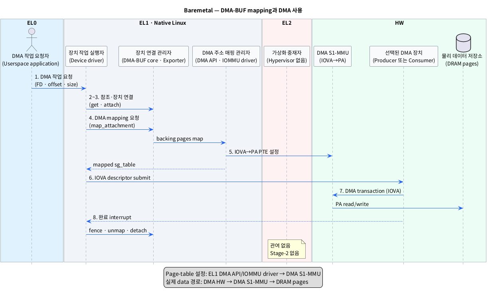

# Baremetal Linux에서 DMA-BUF를 DMA HW가 사용하도록 매핑하는 단계

## 1. 범위와 핵심 결론

이 문서는 **이미 생성된 DMA-BUF**를 baremetal Linux의 DMA HW가 사용할 수 있도록 page table을 설정하고, 실제 DMA를 수행한 뒤 해제하는 과정만 다룬다.

- `DMA-BUF`: 여러 프로세스와 장치가 같은 buffer memory를 공유할 수 있게 하는 Linux kernel 객체다.
- `DMA HW`: CPU 대신 DRAM을 직접 읽거나 쓰는 Camera, ISP, GPU, NPU, Display 등의 장치다.
- `baremetal Linux`: Hypervisor와 VM 없이 Linux가 SoC HW를 직접 관리하는 환경이다.
- `page table`: 입력 주소를 출력 주소와 접근 권한으로 변환하기 위해 MMU가 참조하는 표다.

시작 상태는 EL0 application이 DMA-BUF FD를 가지고 있고, DMA-BUF의 DRAM backing pages가 이미 할당된 상태다.

- `FD`: EL0 프로세스가 열린 DMA-BUF file을 가리키는 정수 번호다.
- `DRAM backing pages`: DMA-BUF의 실제 데이터가 저장되는 DRAM 영역이다.

핵심 흐름은 다음과 같다.

1. 장치 선택 (`dma_buf_attach()`)
2. DMA 주소 mapping (`dma_buf_map_attachment()`과 exporter의 mapping 동작)
3. 장치용 page table 설정 (`DMA API`와 `IOMMU` driver)
4. DMA HW에 IOVA 전달과 DMA 실행
5. 완료 후 unmap·detach

- `IOVA`: DMA HW가 transaction에 사용하는 장치용 가상 주소다.
- `IOMMU`: DMA HW의 IOVA를 DRAM 주소로 변환하고 접근 권한을 검사하는 MMU다.

DMA HW는 FD나 `struct dma_buf`를 이해하지 않는다. EL1 driver가 mapping 결과인 DMA address와 길이를 장치 descriptor에 기록해야 DMA HW가 backing pages에 접근할 수 있다.

- `descriptor`: DMA HW가 수행할 read/write의 주소, 길이와 속성을 담은 명령 정보다.

## 2. 레이어별 모듈

표기 형식은 **추상화한 모듈 (`실제 Linux 이름 또는 symbol`)**이다.

### 2.1 EL0

| 추상 모듈 (실제 이름) | 책임 |
|---|---|
| DMA 작업 요청자 (`Userspace application`) | DMA-BUF FD와 작업 정보를 장치 driver에 전달한다. |

### 2.2 EL1 — Native Linux kernel

| 추상 모듈 (실제 이름) | 책임 |
|---|---|
| 작업 요청 관문 (`Device driver ioctl`/subsystem queue API) | EL0 요청을 받고 대상 장치와 DMA 방향을 결정한다. |
| DMA-BUF 참조 관리자 (`DMA-BUF core`, `dma_buf_get()`) | FD를 기존 `struct dma_buf` 참조로 바꾼다. |
| 장치 연결 관리자 (`DMA-BUF core`, `dma_buf_attach()`) | DMA-BUF와 대상 `struct device` 사이의 attachment를 만든다. |
| Backing page 제공자 (`DMA-BUF exporter`, `map_dma_buf()`) | 장치가 접근할 backing pages를 scatter-gather 형식으로 제공한다. |
| DMA 주소 매핑 관리자 (`DMA API`, `IOMMU core`, `IOMMU/SMMU driver`) | IOVA를 할당하고 `IOVA → PA` page-table entry를 설정한다. |
| DMA 작업 실행자 (`Producer/Consumer device driver`) | mapping된 DMA address로 descriptor를 만들고 DMA HW를 시작·정지한다. |
| 동기화 관리자 (`dma_resv`, `dma_fence`) | 이전 작업 완료를 기다리고 새 DMA 작업의 완료 상태를 기록한다. |

- `struct dma_buf`: backing memory와 공유 동작을 관리하는 DMA-BUF의 kernel 표현이다.
- `struct device`: Linux kernel이 특정 HW 장치와 DMA/IOMMU 설정을 표현하는 객체다.
- `attachment`: 하나의 DMA-BUF가 특정 장치에 연결되었다는 DMA-BUF core의 객체다.
- `exporter`: backing memory를 소유하고 장치 mapping 방법을 제공하는 kernel 모듈이다.
- `scatter-gather`: 여러 DRAM page 조각을 주소와 길이의 목록으로 표현하는 방식이다.
- `dma_resv`: 한 DMA-BUF에 연결된 비동기 작업들의 완료 순서를 관리하는 객체다.
- `dma_fence`: 특정 DMA 작업의 완료를 알리는 kernel 동기화 객체다.

### 2.3 EL2

| 추상 모듈 (실제 이름) | 책임 |
|---|---|
| 가상화 중재자 (`Hypervisor`: baremetal에서는 없음) | DMA mapping과 실행에 관여하지 않는다. HVC와 Stage-2 mapping도 없다. |

- `HVC`: EL1이 EL2 Hypervisor 기능을 요청할 때 사용하는 호출이다.
- `Stage-2 mapping`: VM의 중간 물리 주소를 실제 물리 주소로 변환하는 가상화용 2차 mapping이다.

### 2.4 HW

이 문서의 HW는 다음 주소 변환기, DMA 장치와 DRAM으로 한정한다.

| 추상 모듈 (실제 이름) | Baremetal에서의 역할 |
|---|---|
| CPU 주소 변환기 (`CPU S1-MMU`, VA→PA) | EL0·EL1의 제어 코드와 page-table update용 CPU access를 변환한다. DMA transaction에는 사용되지 않는다. |
| CPU 2차 주소 변환기 (`CPU S2-MMU`) | Hypervisor가 없으므로 사용되지 않는다. |
| DMA 주소 변환기 (`DMA S1-MMU`, `IOMMU/SMMU`, IOVA→PA) | 장치 IOVA를 실제 DRAM PA로 변환하고 R/W 권한을 검사한다. |
| DMA 2차 주소 변환기 (`DMA S2-MMU`) | Hypervisor가 없으므로 사용되지 않는다. |
| 데이터 생성 장치 (`Producer DMA HW`) | Camera/ISP/GPU처럼 backing pages에 데이터를 쓴다. |
| 데이터 소비 장치 (`Consumer DMA HW`) | NPU/GPU/Display처럼 backing pages에서 데이터를 읽는다. |
| 물리 데이터 저장소 (`DRAM pages`) | DMA-BUF의 backing data와 DMA page table을 저장한다. |

- `VA`: CPU가 application과 kernel을 실행할 때 사용하는 Virtual Address다.
- `PA`: 실제 DRAM에 도달할 때 사용하는 Physical Address다.
- `CPU S1-MMU`: baremetal에서는 CPU VA를 바로 PA로 변환하는 1차 CPU 주소 변환 HW다.
- `DMA S1-MMU`: baremetal에서는 장치 IOVA를 바로 PA로 변환하는 DMA 주소 변환 HW다.

## 3. 단계별 동작

| 단계 | 모듈 이동 | 동작 | 결과 |
|---|---|---|---|
| 1. DMA 작업 요청 | **EL0** DMA 작업 요청자 → **EL1** 작업 요청 관문 | DMA-BUF FD, offset, size와 read/write 방향을 장치 driver에 전달한다. | 사용할 DMA-BUF와 대상 장치가 정해진다. |
| 2. DMA-BUF 참조 | **EL1** 작업 요청 관문 → **EL1** DMA-BUF 참조 관리자 | FD에서 기존 DMA-BUF를 얻는다 (`dma_buf_get(fd)`). | Driver가 `struct dma_buf` 참조를 가진다. |
| 3. 장치 연결 | **EL1** 장치 연결 관리자 → **EL1** Backing page 제공자 | 대상 장치를 연결한다 (`dma_buf_attach(dmabuf, dev)`). Exporter가 필요하면 장치별 attachment 상태를 준비한다. | 어떤 `struct device`의 DMA/IOMMU context를 사용할지 결정된다. |
| 4. DMA 주소 mapping | **EL1** DMA 작업 실행자 → **EL1** Backing page 제공자 → **EL1** DMA 주소 매핑 관리자 | Mapping을 요청한다 (`dma_buf_map_attachment()`). Exporter의 `map_dma_buf()`가 backing pages를 장치 DMA domain에 map한다 (`dma_map_sgtable()` 또는 동등 동작). | 장치가 사용할 DMA address가 기록된 `sg_table`이 반환된다. |
| 5. Page table 반영 | **EL1** DMA 주소 매핑 관리자 → **HW** DMA S1-MMU | IOVA를 할당하고 page별 `IOVA → PA + R/W 속성`을 page table에 기록한 뒤 필요한 IOTLB invalidation을 완료한다. | DMA S1-MMU가 새 mapping을 사용할 수 있다. |
| 6. 동기화와 submit | **EL1** 동기화 관리자 → **EL1** DMA 작업 실행자 → **HW** Producer 또는 Consumer DMA HW | 이전 fence와 CPU access 종료를 확인한 뒤 `sg_dma_address()`와 길이로 descriptor를 만들고 장치를 시작한다. | DMA HW가 IOVA로 transaction을 발생시킨다. |
| 7. DMA address 사용 | **HW** DMA HW → **HW** DMA S1-MMU → **HW** DRAM pages | DMA S1-MMU가 transaction마다 IOVA를 PA로 변환한다. Producer는 write, Consumer는 read한다. | 같은 backing pages에서 데이터가 생성되거나 소비된다. |
| 8. 완료·해제 | **HW** DMA HW → **EL1** DMA 작업 실행자 → **EL1** DMA-BUF/매핑 관리자 | 완료 interrupt를 처리하고 fence를 signal한다. Mapping을 유지하지 않을 경우 `dma_buf_unmap_attachment()`, `dma_buf_detach()`, `dma_buf_put()` 순서로 정리한다. | 장치 접근이 끝나고 IOVA/PTE와 참조가 안전하게 해제된다. |

- `sg_table`: backing pages를 scatter-gather entry 목록으로 표현하는 Linux 구조체다.
- `sg_dma_address()`: mapping 후 각 entry에서 장치에 전달할 DMA address를 얻는 API다.
- `IOTLB`: IOMMU가 최근 주소 변환 결과를 보관하는 cache다.
- `IOTLB invalidation`: 변경된 page table을 사용하도록 오래된 IOMMU 변환 cache를 지우는 동작이다.
- `interrupt`: DMA HW가 완료나 오류를 CPU에 알리는 신호다.

`sg_table`은 page table 자체가 아니다. Exporter page 목록을 DMA API에 입력하고, DMA API가 설정한 mapping의 결과 주소를 driver에 돌려주는 전달 객체다.

## 4. 주소 정보가 만들어지고 사용되는 모습

| 시점 | 주소 정보 | 소유·관리 주체 | 사용 주체 |
|---|---|---|---|
| DMA-BUF 생성 후 | backing page의 PA 목록 | DMA-BUF exporter | DMA mapping 입력 |
| `dma_buf_attach()` 후 | DMA-BUF ↔ 대상 `struct device` 관계 | DMA-BUF core/exporter | 후속 map/unmap |
| `dma_buf_map_attachment()` 후 | IOVA와 길이가 담긴 mapped `sg_table` | DMA API·IOMMU domain | Device driver |
| DMA submit 후 | Descriptor의 IOVA와 길이 | Device driver/DMA HW | DMA S1-MMU |
| DMA transaction 중 | `IOVA → PA` PTE | IOMMU driver/DMA S1-MMU | DRAM 접근 변환 |

- `PTE`: page table 한 항목으로, 입력 page를 출력 page와 접근 속성에 연결한다.
- `IOMMU domain`: 한 장치 또는 장치 그룹이 공유하는 DMA address space와 page table 관리 단위다.

같은 DMA-BUF라도 서로 다른 장치에 attach하면 각 장치의 IOMMU domain에서 서로 다른 IOVA를 받을 수 있다. Driver는 backing page의 CPU PA가 아니라 **자기 attachment에서 반환된 DMA address**를 사용해야 한다.

## 5. PlantUML Sequence Diagram

CPU S1-MMU는 driver 코드 실행과 page-table memory update를 지원한다. 그러나 실제 DMA transaction은 CPU S1-MMU를 거치지 않고 DMA S1-MMU로 들어간다.

## 6. 예외와 수명 규칙

- IOMMU가 없는 장치는 DMA API가 DMA address를 bus/physical address로 제공할 수 있다. 이 경우 `dma_buf_map_attachment()`은 필요하지만 DMA page table 설정은 없다.
- Exporter마다 실제 mapping helper와 mapping cache 정책은 다를 수 있다. 표준 계약은 importer가 `dma_buf_map_attachment()`의 반환값만 사용한다는 것이다.
- Mapping은 job마다 해제하지 않고 attachment 수명 동안 유지할 수 있다. 그 경우에도 device가 완전히 멈춘 뒤에만 unmap해야 한다.
- `DMA_TO_DEVICE`, `DMA_FROM_DEVICE`, `DMA_BIDIRECTIONAL` 방향은 page-table 권한과 cache 동기화에 영향을 주므로 실제 DMA 방향과 맞아야 한다.
- Producer 완료 전 Consumer가 읽지 않도록 fence 또는 subsystem의 명시적 동기화 계약이 필요하다.

## 7. 근거

### 로컬 조사

- [`survey/dmabuf.md`](./dmabuf.md): DMA-BUF 생성과 장치 attach/map 시점의 구분.
- [`survey/dmabuf_baremetal_creation.md`](./dmabuf_baremetal_creation.md): 이 문서의 시작 상태인 DMA-BUF와 backing pages 생성 과정.
- [`survey/dmabuf_inter_vm_cc.md`](./dmabuf_inter_vm_cc.md): CPU 경로와 DMA 경로, attach/map connector 구분.

### 웹 자료

- [Linux DMA-BUF 공식 문서](https://docs.kernel.org/driver-api/dma-buf.html): attachment, `map_dma_buf()`, `dma_buf_map_attachment()`과 fence 계약.
- [Linux DMA API HOWTO](https://docs.kernel.org/core-api/dma-api-howto.html): scatter-gather mapping, DMA address와 direction 사용 규칙.
- [Linux Dynamic DMA mapping Guide](https://docs.kernel.org/core-api/dma-api.html): `dma_map_sgtable()`, `dma_unmap_sgtable()`과 DMA mapping API.
- [Linux IOMMU subsystem](https://docs.kernel.org/driver-api/iommu.html): IOMMU domain과 device DMA address-space 관리.

