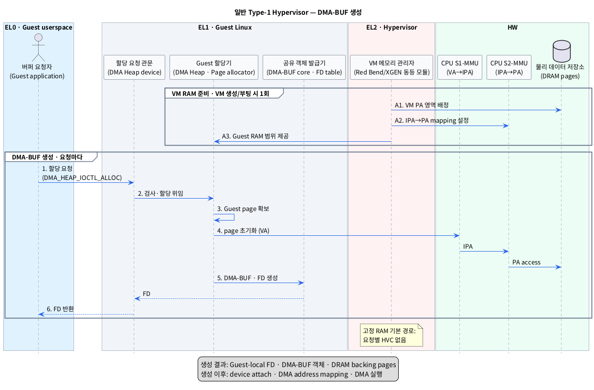

# 일반 Type-1 Hypervisor 환경의 DMA-BUF 생성 단계

## 1. 범위와 핵심 결론

이 문서는 Red Bend/HARMAN 또는 XGEN과 같은 **일반 Type-1 Hypervisor** 위에서 Linux Guest VM이 자기 RAM으로 DMA-BUF를 생성하는 과정만 다룬다. pKVM과 pVM의 protected-memory 절차는 전제하지 않는다.

- `Type-1 Hypervisor`: Host OS를 거치지 않고 HW 위의 EL2에서 여러 VM을 실행하고 격리하는 소프트웨어다.
- `Guest VM`: Hypervisor가 제공한 가상 HW 위에서 독립된 OS를 실행하는 VM이다.
- `DMA-BUF`: 같은 Linux kernel 안에서 여러 프로세스와 장치가 같은 버퍼를 공유할 수 있게 하는 kernel 객체다.
- `DRAM backing page`: DMA-BUF의 실제 데이터가 저장되는 DRAM 메모리 영역이다.

생성 과정은 두 시점으로 나누어야 한다.

1. **VM RAM 준비 — VM 생성·부팅 시 1회:** EL2 Hypervisor가 VM에 DRAM 영역을 배정하고 CPU Stage-2 mapping을 설정한다.
2. **DMA-BUF 생성 — 버퍼 요청마다:** Guest EL0·EL1이 이미 배정된 VM RAM에서 page와 DMA-BUF 객체를 만들고 FD를 반환한다.

- `CPU Stage-2 mapping`: Hypervisor가 VM의 IPA를 실제 DRAM의 PA에 연결하고 접근 권한을 검사하는 주소 변환이다.
- `IPA`: Guest가 물리 주소처럼 사용하는 Intermediate Physical Address다.
- `PA`: 실제 DRAM에 도달할 때 사용하는 Physical Address다.
- `FD`: EL0 프로세스가 열린 DMA-BUF file을 가리키는 정수 번호다.

따라서 **고정 RAM이 미리 배정된 일반적인 VM에서는 DMA-BUF 하나를 생성할 때마다 EL2 호출이나 page grant가 발생하지 않는다.** EL2는 미리 설정한 CPU Stage-2 mapping으로 Guest의 메모리 접근을 계속 검사한다.

- `page grant`: 한 VM의 memory page를 다른 VM이나 별도 주체가 접근하도록 Hypervisor가 권한을 부여하는 기능이다.

## 2. 레이어별 모듈

표기 형식은 **추상화한 모듈 (`실제 이름 또는 symbol`)**이다.

### 2.1 EL0 — Guest userspace

| 추상 모듈 (실제 이름) | 책임 |
|---|---|
| 버퍼 요청자 (`Guest userspace application`) | DMA Heap을 열고 크기와 FD 속성을 지정하여 DMA-BUF 할당을 요청한다. |

- `DMA Heap`: 사용자가 메모리 종류와 할당 정책을 선택해 DMA-BUF를 요청하는 Linux 인터페이스다.

### 2.2 EL1 — Guest Linux kernel

| 추상 모듈 (실제 이름) | 책임 |
|---|---|
| 할당 요청 관문 (`VFS`, `DMA Heap character device`) | EL0의 `open()`과 `ioctl()`을 Guest kernel 내부로 전달한다. |
| Heap 조정기 (`DMA Heap core`) | 요청을 검사하고 선택한 Heap의 allocator를 호출한다. |
| Backing memory 제공자 (`System Heap` 또는 `CMA Heap`) | Heap 정책에 맞는 Guest page를 확보하고 exporter 정보를 구성한다. |
| Guest page 관리자 (`Page Pool`/`Buddy Allocator` 또는 `CMA`) | Hypervisor가 VM에 배정한 RAM 범위에서 사용할 page를 고른다. |
| 공유 버퍼 객체 관리자 (`DMA-BUF core`) | backing page를 `struct dma_buf`로 감싸고 file과 동기화 객체를 만든다. |
| FD 발급기 (`dma_buf_fd()`, Guest process FD table) | DMA-BUF file을 요청 프로세스의 FD table에 설치한다. |

- `VFS`: EL0의 file·device system call을 알맞은 Guest kernel 모듈로 연결하는 계층이다.
- `ioctl`: EL0가 device별 명령과 인자를 kernel에 전달하는 system call이다.
- `Heap`: 여기서는 일반 프로그램 heap이 아니라 DMA-BUF의 메모리 종류와 할당 정책을 뜻한다.
- `CMA`: 물리적으로 연속된 page 묶음을 확보하는 Linux 메모리 할당 방식이다.
- `exporter`: backing memory를 소유하며 DMA-BUF 객체와 관련 동작을 제공하는 kernel 모듈이다.
- `struct dma_buf`: 크기, exporter 동작, file과 동기화 상태를 연결하는 DMA-BUF의 kernel 표현이다.

### 2.3 EL2 — Hypervisor

| 추상 모듈 (제품 대응 이름) | 책임 |
|---|---|
| VM 메모리 분할 관리자 (`Red Bend/HARMAN VM memory configuration`, `XGEN 동등 모듈`) | VM이 사용할 실제 DRAM PA 범위를 VM 생성·부팅 시 배정한다. |
| CPU Stage-2 관리자 (`Hypervisor Stage-2 MMU manager`) | Guest IPA와 배정된 PA 사이의 mapping과 R/W 권한을 설정한다. |
| 동적 메모리 중재자 (`vendor memory grant/page provisioning`, 선택 사항) | 제품이 RAM을 demand 방식으로 제공할 때만 page 추가 배정이나 mapping 변경을 처리한다. |

- `demand 방식`: VM RAM 전체를 미리 연결하지 않고 실제 필요 시점에 memory를 추가 제공하는 방식이다.
- `HVC`: Guest EL1이 EL2 Hypervisor의 기능을 명시적으로 요청할 때 사용하는 호출이다.

Red Bend/HARMAN과 XGEN의 실제 설정 파일, API와 모듈 이름은 공급사 BSP에서 확인해야 한다. 특히 공개 기술 사양이 확인되지 않은 XGEN을 Xen과 같은 제품으로 간주하지 않는다.

- `BSP`: 특정 SoC에서 Hypervisor, Guest OS와 HW가 동작하도록 제공되는 플랫폼 지원 소프트웨어다.

### 2.4 HW

| 추상 모듈 (실제 이름) | 책임 |
|---|---|
| Guest 주소 변환기 (`CPU S1-MMU`, VA→IPA) | Guest EL0·EL1이 사용하는 VA를 Guest IPA로 변환한다. Guest EL1이 변환표를 관리한다. |
| VM 주소 변환기 (`CPU S2-MMU`, IPA→PA) | IPA를 실제 PA로 변환하고 EL2가 설정한 VM 접근 권한을 검사한다. |
| 물리 데이터 저장소 (`DRAM pages`) | DMA-BUF backing data와 관련 kernel metadata를 저장한다. |

- `VA`: CPU가 Guest application과 kernel을 실행하며 사용하는 Virtual Address다.
- `CPU S1-MMU`: Guest OS가 관리하는 VA→IPA 1차 CPU 주소 변환 HW다.
- `CPU S2-MMU`: Hypervisor가 관리하는 IPA→PA 2차 CPU 주소 변환 HW다.

DMA S1-MMU, DMA S2-MMU, Producer DMA HW와 Consumer DMA HW는 장치를 attach/map한 뒤에 사용되므로 생성 단계에는 관여하지 않는다.

- `DMA S1-MMU`: DMA 장치의 IOVA를 Guest IPA로 변환하는 HW다.
- `DMA S2-MMU`: DMA 요청의 IPA를 PA로 변환하고 Hypervisor의 DMA 접근 권한을 검사하는 HW다.
- `Producer DMA HW`: Camera/ISP/GPU처럼 frame을 DRAM에 쓰는 장치다.
- `Consumer DMA HW`: NPU/GPU/Display처럼 DRAM의 frame을 읽어 처리하는 장치다.

## 3. 단계별 동작

### 3.1 VM RAM 준비 — VM 생성·부팅 시 1회

| 단계 | 모듈 이동 | 동작 | 결과 |
|---|---|---|---|
| A1. DRAM 영역 배정 | **EL2** VM 메모리 분할 관리자 → **HW** DRAM pages | VM 설정에 따라 Guest가 사용할 PA 범위를 예약·배정한다. | VM별 실제 DRAM 범위가 정해진다. |
| A2. Stage-2 설정 | **EL2** CPU Stage-2 관리자 → **HW** CPU S2-MMU | Guest IPA 범위를 배정된 PA 범위에 연결하고 접근 권한을 설정한다. | Guest가 사용할 `IPA → PA` 경로가 준비된다. |
| A3. Guest RAM 공개 | **EL2** Hypervisor → **EL1** Guest Linux | Guest가 자신의 RAM으로 관리할 IPA 범위를 device tree 또는 동등한 VM 설정으로 제공한다. | Guest page 관리자가 해당 범위를 관리한다. |

이 단계는 특정 DMA-BUF 요청이 아니라 VM의 메모리 실행 환경을 준비하는 단계다.

### 3.2 DMA-BUF 생성 — 요청마다

| 단계 | 모듈 이동 | 동작 | 결과 |
|---|---|---|---|
| 1. 할당 요청 | **EL0** 버퍼 요청자 → **EL1** 할당 요청 관문 | Heap을 열고 (`open("/dev/dma_heap/<heap>")`) 크기와 FD 속성을 담은 요청을 보낸다 (`ioctl(DMA_HEAP_IOCTL_ALLOC)`). | 요청이 Guest EL1로 들어간다. |
| 2. 요청 검사 | **EL1** 할당 요청 관문 → **EL1** Heap 조정기 | 길이와 flag를 검사하고 선택한 Heap에 할당을 위임한다 (`dma_heap_buffer_alloc()`, `heap->ops->allocate()`). | 사용할 allocation 정책이 결정된다. |
| 3. Guest page 확보 | **EL1** Backing memory 제공자 → **EL1** Guest page 관리자 | Guest가 자신의 RAM으로 알고 있는 IPA 범위에서 page를 확보한다 (`System Heap` 또는 `CMA Heap`). | DMA-BUF의 backing page가 준비된다. |
| 4. Page 접근·초기화 | **EL1** Guest page 관리자 → **HW** CPU S1-MMU → **HW** CPU S2-MMU → **HW** DRAM pages | page 초기화와 관리 정보 갱신에 필요한 CPU access가 `VA → IPA → PA`로 변환된다. | 실제 DRAM page가 Guest buffer로 사용된다. |
| 5. DMA-BUF와 FD 생성 | **EL1** Backing memory 제공자 → **EL1** 공유 버퍼 객체 관리자 → **EL1** FD 발급기 | page와 exporter 동작을 공유 객체로 감싸고 (`dma_buf_export()`), anonymous file과 기본 `dma_resv`를 연결한 뒤 FD를 설치한다 (`dma_buf_fd()`). | Guest-local `struct dma_buf`와 FD가 생긴다. |
| 6. 결과 반환 | **EL1** 할당 요청 관문 → **EL0** 버퍼 요청자 | 생성된 FD를 사용자 메모리에 돌려준다 (`copy_to_user()`). | Guest application이 DMA-BUF FD를 받는다. |

- `anonymous file`: 실제 경로 없이 kernel 객체의 수명과 FD를 연결하는 file 객체다.
- `dma_resv`: 한 DMA-BUF를 사용하는 비동기 작업들의 완료 순서를 관리하는 동기화 객체다.

여기서 생성된 FD, `struct file`, `struct dma_buf`와 `dma_resv`는 모두 **해당 Guest Linux kernel 내부 객체**다. Hypervisor는 IPA→PA mapping과 권한을 관리하지만, vendor 연동 기능이 별도로 등록하지 않는 한 Linux DMA-BUF 객체 자체를 알지 못한다.

## 4. PlantUML Sequence Diagram

## 5. 생성 결과와 비관여 요소

생성 완료 후의 참조 관계는 다음과 같다.

**Guest EL0 FD → Guest EL1 DMA-BUF file → Guest EL1 `struct dma_buf` → exporter private data → Guest IPA pages → EL2의 기존 Stage-2 mapping → DRAM PA pages**

다음 동작은 DMA-BUF 생성에 포함되지 않는다.

- 장치 연결 (`dma_buf_attach()`): DMA-BUF를 사용할 장치가 결정된 뒤 수행한다.
- DMA 주소 mapping (`dma_buf_map_attachment()`): attach된 장치가 사용할 DMA 주소를 만드는 후속 단계다.
- DMA S1/S2 설정과 Producer/Consumer DMA HW 실행: 장치가 buffer를 실제로 사용할 때 수행한다.
- Process 간 FD passing (`SCM_RIGHTS`): DMA-BUF 생성 후 같은 Guest kernel의 다른 프로세스에 넘길 때 수행한다.
- VM 간 page grant와 proxy DMA-BUF 생성: 다른 Guest kernel과 backing page를 공유할 때 필요한 별도 절차다.

- `SCM_RIGHTS`: 같은 kernel 안에서 열린 file 참조를 다른 프로세스의 FD table에 복제하는 Unix socket 기능이다.
- `proxy DMA-BUF`: 다른 VM에서 공유받은 memory를 수신 VM의 local DMA-BUF로 표현한 객체다.

## 6. 제품별 확인 경계

| 항목 | Red Bend/HARMAN | XGEN |
|---|---|---|
| VM RAM 배정 | 공개 매뉴얼 사본에서 VM memory partition과 Stage-2 mapping 개념 확인 | 공급사 VM memory 설정 확인 필요 |
| Guest CPU Stage-1 | Guest Linux가 관리 | Guest Linux 제어 방식 확인 필요 |
| CPU Stage-2 | Hypervisor가 IPA→PA mapping 관리 | 구현 이름과 mapping 단위 확인 필요 |
| 요청별 EL2 호출 | 고정 RAM의 표준 Linux DMA Heap 생성에 필요하다는 근거 없음 | vendor-specific allocator 사용 여부 확인 필요 |
| 동적 page 제공 | memory grant 기능은 확인되나 local DMA-BUF 생성과의 직접 연동은 별도 확인 필요 | grant/page provisioning API 확인 필요 |

제품이 고정 VM RAM 대신 동적 page 제공, ballooning, memory hotplug 또는 전용 secure heap을 사용한다면 3.2절의 3~4단계 사이에 **EL1 → EL2 요청과 Stage-2 mapping 추가**가 들어갈 수 있다. 이는 일반 Linux DMA Heap의 필수 동작이 아니라 제품별 확장이다.

## 7. 근거

### 로컬 조사

- [`survey/dmabuf.md`](./dmabuf.md): DMA Heap allocation 시에는 device가 정해지지 않으며 attach/map이 생성 이후라는 기존 조사.
- [`survey/dmabuf_baremetal_creation.md`](./dmabuf_baremetal_creation.md): Guest 내부와 동일한 Linux DMA Heap, `dma_buf_export()`와 `dma_buf_fd()` 기본 흐름.
- [`survey/dmabuf_inter_vm_cc.md`](./dmabuf_inter_vm_cc.md): 일반 Red Bend/HARMAN·XGEN 환경의 EL1/EL2 책임과 제품별 공개 정보 경계.

### 웹 자료

- [Linux DMA-BUF Heaps 공식 문서](https://docs.kernel.org/userspace-api/dma-buf-heaps.html): userspace가 Heap을 선택하여 DMA-BUF FD를 할당받는 표준 API.
- [Linux DMA-BUF 공식 문서](https://docs.kernel.org/driver-api/dma-buf.html): `dma_buf_export()`, `dma_buf_fd()`, exporter와 importer의 책임.
- [Arm Memory Management](https://developer.arm.com/-/media/Arm%20Developer%20Community/PDF/Learn%20the%20Architecture/LearnTheArchitecture-MemoryManagement-101811_0100_00_en.pdf): CPU Stage 1의 VA→IPA와 Stage 2의 IPA→PA 변환.
- [HARMAN Device Virtualization](https://car.harman.com/solutions/device-virtualization): Type-1 virtualization, second-stage MMU와 VM 격리 개요.
- [2021 HARMAN/Red Bend 매뉴얼 공개 사본](https://www.scribd.com/document/752680019/Hypervisor-Overview-Application-Note-Hypervisor-Description-ALL-REV-0-00): VM memory partition, Stage-2 mapping과 memory grant. 현재 공식 배포본이 아닌 제3자 호스팅 사본이므로 납품 버전과 대조가 필요하다.

2026-09-04 기준 `XGEN hypervisor`라는 정확한 제품명에 대응하는 공개 기술 사양은 확인하지 못했다. 따라서 XGEN 고유 API와 module 이름은 추정하지 않고 공급사 문서 확인 항목으로 남겼다.
