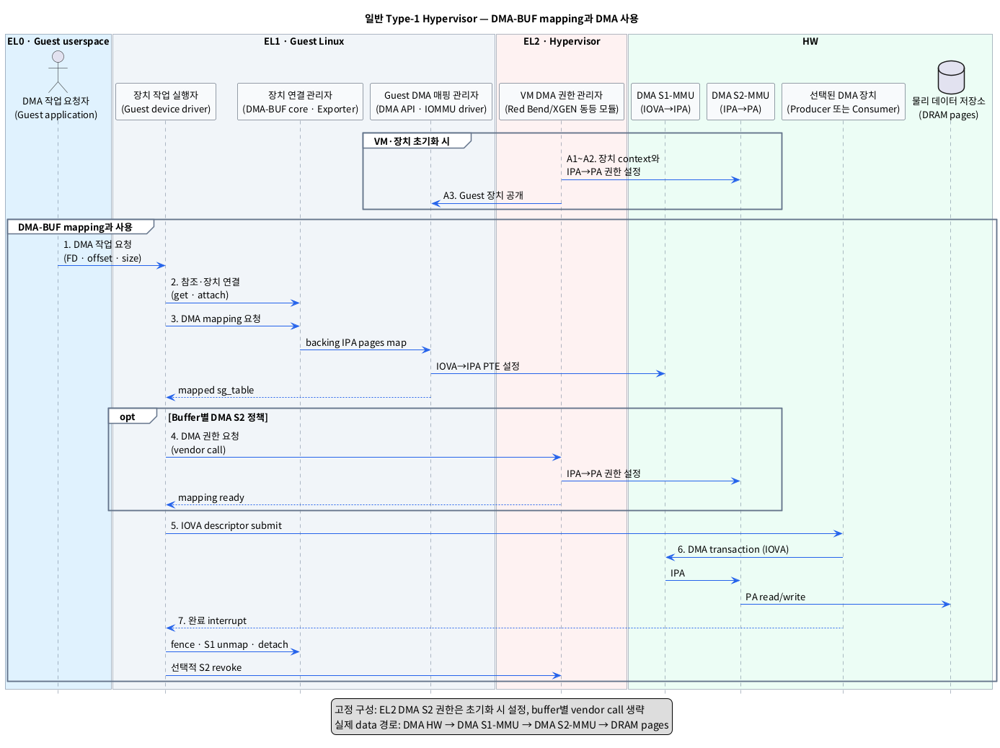

# 일반 Type-1 Hypervisor에서 DMA-BUF를 DMA HW가 사용하도록 매핑하는 단계

## 1. 범위와 핵심 결론

이 문서는 Red Bend/HARMAN 또는 XGEN과 같은 **일반 Type-1 Hypervisor** 위의 Linux Guest가 이미 생성한 DMA-BUF를 할당된 DMA HW에서 사용하는 과정을 다룬다. pKVM과 pVM은 전제하지 않는다.

- `Type-1 Hypervisor`: Host OS를 거치지 않고 HW 위의 EL2에서 여러 VM과 장치를 격리하는 소프트웨어다.
- `DMA-BUF`: 여러 프로세스와 장치가 같은 buffer memory를 공유할 수 있게 하는 Linux kernel 객체다.
- `DMA HW`: CPU 대신 DRAM을 직접 읽거나 쓰는 Camera, ISP, GPU, NPU, Display 등의 장치다.

시작 상태는 Guest EL0가 DMA-BUF FD를 가지고 있고, EL2가 Guest RAM의 `IPA → PA` CPU Stage-2 mapping을 준비한 상태다.

- `FD`: Guest EL0 프로세스가 열린 DMA-BUF file을 가리키는 정수 번호다.
- `IPA`: Guest가 물리 주소처럼 사용하는 Intermediate Physical Address다.
- `PA`: 실제 DRAM에 도달할 때 사용하는 Physical Address다.
- `CPU Stage-2 mapping`: Hypervisor가 CPU access의 IPA를 PA에 연결하고 VM 접근 권한을 검사하는 mapping이다.

장치가 buffer를 사용하려면 CPU용 Stage-2와 별도로 DMA 주소 경로가 준비되어야 한다.

**DMA HW IOVA → DMA S1-MMU → Guest IPA → DMA S2-MMU → DRAM PA**

- `IOVA`: DMA HW가 transaction에 사용하는 장치용 가상 주소다.
- `DMA S1-MMU`: Guest EL1이 관리하며 IOVA를 Guest IPA로 변환하는 DMA 주소 변환 HW다.
- `DMA S2-MMU`: EL2 Hypervisor가 관리하며 DMA 요청의 IPA를 PA로 변환하고 접근 권한을 검사하는 HW다.

고정 RAM과 고정 device assignment를 사용하는 기본 구성에서는 EL2가 VM/device 초기화 시 DMA Stage-2 범위를 미리 허용할 수 있다. 이 경우 DMA-BUF마다 새로 설정되는 것은 주로 Guest의 DMA Stage-1 `IOVA → IPA` mapping이다. 제품이 buffer별 최소 권한을 적용하면 map 시점에 EL1→EL2 vendor 요청과 DMA Stage-2 갱신이 추가된다.

- `device assignment`: 특정 DMA HW와 그 DMA address context를 한 VM이 사용하도록 배정하는 설정이다.

## 2. 두 종류의 page table

| 구분 | 설정 주체 | Mapping | 설정 시점 | 목적 |
|---|---|---|---|---|
| DMA Stage-1 page table | Guest EL1 (`DMA API`, Guest IOMMU driver) | `IOVA → IPA` | `dma_buf_map_attachment()` 경로 | 장치가 scatter-gather pages를 연속된 DMA address처럼 사용하도록 구성 |
| DMA Stage-2 page/permission table | EL2 (`Hypervisor/BSP`) | `IPA → PA` | VM/device 초기화 또는 buffer별 vendor 요청 | VM·장치가 허가된 실제 DRAM만 접근하도록 격리 |

- `scatter-gather`: 여러 DRAM page 조각을 주소와 길이의 목록으로 표현하는 방식이다.
- `BSP`: 특정 SoC에서 Hypervisor, Guest OS와 HW가 동작하도록 제공되는 플랫폼 지원 소프트웨어다.

CPU S1/S2와 DMA S1/S2는 역할이 다르다. Guest driver가 실행되며 page-table 정보를 준비하는 CPU access는 `CPU S1 → CPU S2`를 거치지만, DMA data transaction은 `DMA S1 → DMA S2`를 거친다.

## 3. 레이어별 모듈

표기 형식은 **추상화한 모듈 (`실제 이름 또는 symbol`)**이다.

### 3.1 EL0 — Guest userspace

| 추상 모듈 (실제 이름) | 책임 |
|---|---|
| DMA 작업 요청자 (`Guest userspace application`) | DMA-BUF FD와 작업 정보를 Guest device driver에 전달한다. |

### 3.2 EL1 — Guest Linux kernel

| 추상 모듈 (실제 이름) | 책임 |
|---|---|
| 작업 요청 관문 (`Guest device driver ioctl`/subsystem queue API) | 요청을 받고 대상 DMA HW와 DMA 방향을 결정한다. |
| DMA-BUF 참조 관리자 (`DMA-BUF core`, `dma_buf_get()`) | Guest-local FD를 `struct dma_buf` 참조로 바꾼다. |
| 장치 연결 관리자 (`DMA-BUF core`, `dma_buf_attach()`) | DMA-BUF와 Guest에 할당된 `struct device` 사이의 attachment를 만든다. |
| Backing page 제공자 (`DMA-BUF exporter`, `map_dma_buf()`) | Guest IPA backing pages를 scatter-gather 형식으로 제공한다. |
| Guest DMA 주소 매핑 관리자 (`DMA API`, `IOMMU core`, Guest `SMMU` driver) | IOVA를 할당하고 DMA Stage-1의 `IOVA → IPA` PTE를 설정한다. |
| DMA 작업 실행자 (`Producer/Consumer device driver`) | Mapping된 IOVA로 descriptor를 만들고 DMA HW를 시작·정지한다. |
| 동기화 관리자 (`dma_resv`, `dma_fence`) | 이전 사용자 완료를 기다리고 새 DMA 작업의 완료를 기록한다. |

- `struct dma_buf`: backing memory와 공유 동작을 관리하는 Guest kernel 객체다.
- `struct device`: Guest Linux가 자신에게 할당된 HW와 DMA/IOMMU 설정을 표현하는 객체다.
- `attachment`: 하나의 DMA-BUF가 특정 장치에 연결되었다는 DMA-BUF core의 객체다.
- `exporter`: backing memory를 소유하고 장치 mapping 방법을 제공하는 Guest kernel 모듈이다.
- `PTE`: page table 한 항목으로 입력 page를 출력 page와 접근 속성에 연결한다.
- `dma_resv`: 한 DMA-BUF에 연결된 비동기 작업들의 완료 순서를 관리하는 객체다.
- `dma_fence`: 특정 DMA 작업의 완료를 알리는 Guest kernel 동기화 객체다.

### 3.3 EL2 — Hypervisor

| 추상 모듈 (제품 대응 이름) | 책임 |
|---|---|
| 장치 배정 관리자 (`Red Bend/HARMAN device configuration`, `XGEN 동등 모듈`) | 장치의 Stream ID와 DMA address context를 대상 VM에 연결한다. |
| VM 메모리 권한 관리자 (`Hypervisor memory partition/grant service`) | DMA 대상 IPA가 해당 VM 소유인지, 장치에 허용된 범위인지 검증한다. |
| DMA Stage-2 관리자 (`Hypervisor SMMU/S2MPU manager`) | `IPA → PA` mapping·R/W 권한을 설정하고 DMA Stage-2 TLB를 갱신한다. |
| 동적 mapping 요청 관문 (`HVC`/vendor call, 선택 사항) | Buffer별 DMA Stage-2 정책일 때 Guest의 map/unmap 요청을 받는다. |

- `Stream ID`: SMMU가 DMA 요청을 어느 장치와 변환 context에 연결할지 구분하는 식별자다.
- `SMMU`: DMA 주소 변환과 접근 제어를 제공하는 Arm System MMU다.
- `S2MPU`: 일부 SoC에서 DMA Stage-2의 memory permission을 집행하는 보호 HW다.
- `TLB`: MMU가 최근 주소 변환 결과를 보관하는 cache다.
- `HVC`: Guest EL1이 EL2 Hypervisor 기능을 요청할 때 사용하는 호출이다.

Red Bend/HARMAN과 XGEN의 실제 module, hypercall과 SMMU/S2MPU 구성 이름은 공급사 BSP에서 확인해야 한다. 이 문서는 공개 근거가 부족한 XGEN을 Xen으로 간주하지 않는다.

### 3.4 HW

이 문서의 HW는 다음 7개 논리 구성요소로 한정한다.

| 추상 모듈 (실제 이름) | 책임 |
|---|---|
| Guest CPU 주소 변환기 (`CPU S1-MMU`, VA→IPA) | Guest application·kernel의 VA를 Guest IPA로 변환한다. |
| VM CPU 주소 변환기 (`CPU S2-MMU`, IPA→PA) | CPU access의 IPA를 PA로 변환하고 VM 권한을 검사한다. |
| Guest DMA 주소 변환기 (`DMA S1-MMU`, IOVA→IPA) | DMA HW의 IOVA를 Guest가 관리하는 IPA로 변환한다. |
| VM DMA 주소 변환기 (`DMA S2-MMU`, IPA→PA) | DMA 요청의 IPA를 PA로 변환하고 EL2의 장치 권한을 검사한다. |
| 데이터 생성 장치 (`Producer DMA HW`) | Camera/ISP/GPU처럼 DRAM backing pages에 데이터를 쓴다. |
| 데이터 소비 장치 (`Consumer DMA HW`) | NPU/GPU/Display처럼 DRAM backing pages에서 데이터를 읽는다. |
| 물리 데이터 저장소 (`DRAM pages`) | DMA-BUF backing data와 CPU/DMA page table을 저장한다. |

- `CPU S1-MMU`: Guest EL1이 관리하는 VA→IPA 1차 CPU 주소 변환 HW다.
- `CPU S2-MMU`: EL2가 관리하는 IPA→PA 2차 CPU 주소 변환 HW다.
- `Producer DMA HW`: Buffer data를 생성하여 DRAM에 write하는 장치다.
- `Consumer DMA HW`: Buffer data를 DRAM에서 read하여 사용하는 장치다.
- `DRAM backing pages`: DMA-BUF의 실제 data가 저장되는 DRAM 영역이다.

## 4. 설정 시점 분리

### 4.1 VM·장치 준비 — 초기화 시

| 단계 | 모듈 이동 | 동작 | 결과 |
|---|---|---|---|
| A1. 장치 배정 | **EL2** 장치 배정 관리자 → **HW** DMA S1/S2-MMU | 장치 Stream ID를 Guest용 DMA 변환 context에 연결한다. | 장치 DMA 요청이 올바른 VM의 S1/S2 표를 사용한다. |
| A2. Guest RAM 권한 준비 | **EL2** VM 메모리 권한 관리자 → **HW** DMA S2-MMU | 고정 구성에서는 Guest RAM 또는 device 전용 pool의 `IPA → PA`와 DMA R/W 권한을 미리 설정한다. | 허용된 Guest IPA가 DMA로 DRAM에 도달할 수 있다. |
| A3. Guest device 공개 | **EL2** Hypervisor/BSP → **EL1** Guest Linux | 할당된 장치와 Guest가 제어할 DMA Stage-1 context를 device tree 또는 동등 설정으로 제공한다. | Guest driver와 IOMMU driver가 장치를 초기화한다. |

이 초기 설정은 DMA-BUF마다 반복되는 Linux API 동작이 아니다.

### 4.2 DMA-BUF mapping과 사용 — buffer/job마다

| 단계 | 모듈 이동 | 동작 | 결과 |
|---|---|---|---|
| 1. DMA 작업 요청 | **EL0** DMA 작업 요청자 → **EL1** 작업 요청 관문 | DMA-BUF FD, offset, size와 read/write 방향을 전달한다. | 사용할 DMA-BUF와 할당 장치가 정해진다. |
| 2. 참조·장치 연결 | **EL1** DMA-BUF/장치 연결 관리자 → **EL1** Backing page 제공자 | `dma_buf_get(fd)`와 `dma_buf_attach(dmabuf, dev)`로 Guest-local DMA-BUF를 장치에 연결한다. | 대상 장치의 DMA context가 선택된다. |
| 3. DMA Stage-1 설정 | **EL1** DMA 작업 실행자 → **EL1** Backing page 제공자 → **EL1** Guest DMA 주소 매핑 관리자 → **HW** DMA S1-MMU | `dma_buf_map_attachment()` 경로에서 IOVA를 할당하고 backing page별 `IOVA → IPA + 속성` PTE를 설정한다. | IOVA가 기록된 mapped `sg_table`이 driver에 반환된다. |
| 4. DMA Stage-2 확인·설정 | **EL1** Guest driver → **EL2** DMA Stage-2 관리자 → **HW** DMA S2-MMU | 고정 구성은 기존 권한을 확인한다. Buffer별 정책은 vendor call로 IPA 범위와 권한을 검증한 후 `IPA → PA` PTE/permission을 추가한다. | 같은 buffer의 S1과 S2 경로가 모두 유효해진다. |
| 5. 동기화와 submit | **EL1** 동기화 관리자 → **EL1** DMA 작업 실행자 → **HW** Producer 또는 Consumer DMA HW | 이전 fence와 CPU access 종료를 확인한 뒤 mapped IOVA와 길이로 descriptor를 만들고 장치를 시작한다. | DMA HW가 IOVA transaction을 발생시킨다. |
| 6. DMA address 사용 | **HW** DMA HW → **HW** DMA S1-MMU → **HW** DMA S2-MMU → **HW** DRAM pages | Transaction마다 `IOVA → IPA → PA` 변환과 R/W 권한 검사를 수행한다. | Producer write 또는 Consumer read가 backing pages에 도달한다. |
| 7. 완료·회수 | **HW** DMA HW → **EL1** DMA 작업 실행자 → **EL1/EL2** mapping 관리자 | 완료 interrupt와 fence를 처리한다. 장치를 정지한 뒤 S1 unmap을 수행하고, buffer별 S2 정책이면 EL2가 S2 권한을 회수한다. | IOVA와 선택적 S2 권한이 안전하게 해제된다. |

- `sg_table`: backing pages와 mapping된 DMA address를 scatter-gather entry 목록으로 전달하는 Linux 구조체다.
- `descriptor`: DMA HW에 전달할 IOVA, 길이와 read/write 속성을 담은 명령 정보다.
- `interrupt`: DMA HW가 완료나 오류를 CPU에 알리는 신호다.

`sg_table`과 DMA-BUF FD는 Guest-local 정보다. Hypervisor에는 raw FD나 Guest kernel pointer를 넘기지 않고, 제품 계약에 따라 검증 가능한 IPA range 또는 opaque mapping handle을 사용해야 한다.

- `opaque mapping handle`: 내부 주소나 kernel pointer 대신 Hypervisor가 검증·조회하는 mapping 식별자다.

## 5. PlantUML Sequence Diagram

CPU S1-MMU와 CPU S2-MMU는 Guest driver 실행, page-table memory update와 device register 제어를 지원한다. 실제 DMA data transaction은 CPU MMU를 거치지 않는다.

## 6. Mapping 정보와 제어 주체

| 정보 | 위치 | 생성·검증 주체 | 비고 |
|---|---|---|---|
| DMA-BUF backing page 목록 | Guest EL1 exporter | Guest Linux | Guest 관점의 IPA pages |
| Attachment | Guest EL1 DMA-BUF core | Guest Linux | DMA-BUF와 `struct device` 연결 |
| IOVA와 mapped `sg_table` | Guest EL1 DMA API/IOMMU domain | Guest Linux | Device driver가 descriptor에 사용 |
| `IOVA → IPA` PTE | HW DMA S1-MMU용 page table | Guest EL1 IOMMU driver | 장치·domain별로 다를 수 있음 |
| `IPA → PA` PTE/permission | HW DMA S2-MMU용 table | EL2 Hypervisor/BSP | VM·Stream ID·R/W 권한 검증 |
| PA backing pages | HW DRAM | EL2가 소유·격리, Guest exporter가 IPA로 관리 | Guest driver가 raw PA를 신뢰해서는 안 됨 |

- `IOMMU domain`: 한 장치 또는 장치 그룹이 공유하는 DMA address space와 page table 관리 단위다.

같은 DMA-BUF를 Producer와 Consumer가 각각 attach하면 서로 다른 IOVA와 DMA Stage-1 mapping을 가질 수 있다. 두 장치 모두 같은 backing pages에 접근하려면 각 장치의 Stream ID와 DMA Stage-2 권한도 유효해야 한다.

## 7. 정적 구성과 동적 구성 비교

| 항목 | 고정 RAM·장치 구성 | Buffer별 최소 권한 구성 |
|---|---|---|
| DMA S2 설정 시점 | VM/device 초기화 시 | DMA-BUF map 후, submit 전 |
| 요청별 EL2 호출 | 일반적으로 없음 | Vendor HVC/SMC/API 필요 |
| EL1 map의 핵심 | 매번 또는 attachment 수명별 DMA S1 설정 | DMA S1 설정 후 EL2 승인 추가 |
| 장점 | 짧고 단순한 fast path | Buffer 단위 least privilege |
| 주의점 | 넓은 DMA 허용 범위가 될 수 있음 | 실패 rollback과 revoke 순서 필요 |

- `SMC`: EL1 또는 EL2가 Secure Monitor의 기능을 요청할 때 사용하는 호출이다. 실제 제품이 HVC, SMC 또는 다른 IPC 중 무엇을 쓰는지는 BSP 계약에 따른다.
- `least privilege`: 장치에 현재 작업에 필요한 최소 memory 범위와 권한만 허용하는 원칙이다.

동적 구성의 해제 순서는 **새 submit 차단 → DMA HW 정지·완료 확인 → DMA S1 unmap → DMA S2 revoke → backing page 재사용**이어야 한다. 실행 중인 장치보다 먼저 mapping을 지우면 DMA fault 또는 잘못된 memory access가 발생할 수 있다.

## 8. 제품별 확인 경계

| 확인 항목 | Red Bend/HARMAN | XGEN |
|---|---|---|
| Device assignment와 Stream ID 연결 | 공개 개요에서 device virtualization/SMMU 사용 확인, 실제 설정명은 BSP 확인 필요 | 공급사 문서 확인 필요 |
| DMA S1/S2 구현 | SMMU 기반 격리는 확인되나 S1/S2의 실제 HW 분리는 확인 필요 | SMMU/S2MPU 구성 확인 필요 |
| 고정 DMA permission 범위 | VM/device memory 설정 확인 필요 | 설정 단위 확인 필요 |
| Buffer별 map/revoke API | Memory grant는 확인되나 DMA-BUF 전용 API는 확인되지 않음 | Hypercall/API 확인 필요 |
| TLB invalidation과 완료 보장 | 공급사 API 계약 확인 필요 | 공급사 API 계약 확인 필요 |

Red Bend/HARMAN의 공개 자료만으로는 표준 Linux `dma_buf_map_attachment()`이 EL2 vendor API를 직접 호출한다고 결론낼 수 없다. XGEN도 공개 기술 사양이 확인되지 않았으므로, 두 제품 모두 BSP driver에서 Guest IOMMU map과 Hypervisor DMA permission 요청의 연결 지점을 확인해야 한다.

## 9. 근거

### 로컬 조사

- [`survey/dmabuf.md`](./dmabuf.md): DMA-BUF 생성 이후 attach/map과 SysMMU/S2MPU의 기존 조사. 제품별 미확인 사항은 그대로 확정하지 않고 경계로 표시했다.
- [`survey/dmabuf_hypervisor_creation.md`](./dmabuf_hypervisor_creation.md): 이 문서의 시작 상태인 Guest DMA-BUF와 CPU Stage-2 준비 과정.
- [`survey/dmabuf_inter_vm_cc.md`](./dmabuf_inter_vm_cc.md): CPU/DMA S1·S2 역할과 Red Bend/HARMAN·XGEN 공개 정보 경계.

### 웹 자료

- [Linux DMA-BUF 공식 문서](https://docs.kernel.org/driver-api/dma-buf.html): attachment, `map_dma_buf()`, `dma_buf_map_attachment()`과 fence 계약.
- [Linux DMA API HOWTO](https://docs.kernel.org/core-api/dma-api-howto.html): scatter-gather mapping, DMA address와 direction 사용 규칙.
- [Linux Dynamic DMA mapping Guide](https://docs.kernel.org/core-api/dma-api.html): `dma_map_sgtable()`, `dma_unmap_sgtable()`과 DMA mapping API.
- [Linux IOMMU subsystem](https://docs.kernel.org/driver-api/iommu.html): IOMMU domain과 device DMA address-space 관리.
- [Arm SMMU Architecture Specification](https://documentation-service.arm.com/static/66c5c097882fec713ef4a8ff): Stream ID와 DMA Stage-1/Stage-2 translation 구조.
- [HARMAN Device Virtualization](https://car.harman.com/solutions/device-virtualization): Type-1 virtualization, second-stage MMU, SMMU와 device 격리 개요.
- [2021 HARMAN/Red Bend 매뉴얼 공개 사본](https://www.scribd.com/document/752680019/Hypervisor-Overview-Application-Note-Hypervisor-Description-ALL-REV-0-00): VM memory partition과 memory grant. 공식 최신 배포본이 아니므로 실제 납품 BSP와 대조가 필요하다.

2026-09-04 기준 `XGEN hypervisor`에 대응하는 공개 기술 사양은 확인하지 못했다. XGEN 고유 module과 API 이름은 추정하지 않고 공급사 확인 항목으로 남겼다.
