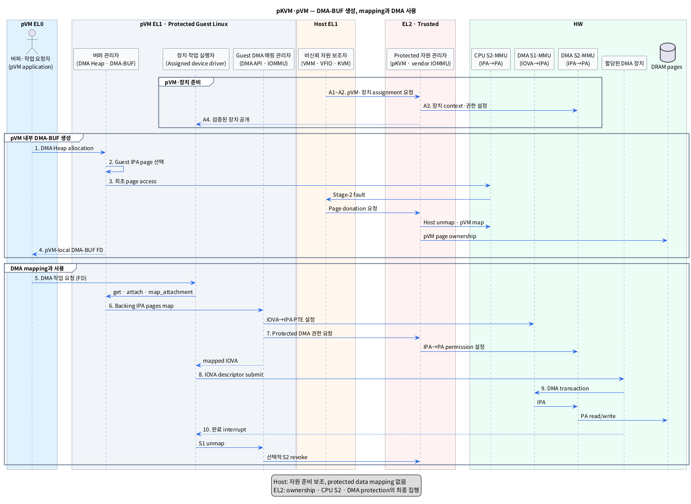

# pKVM·pVM에서 DMA-BUF를 생성하고 DMA HW에서 사용하는 단계

## 1. 범위와 선행 조건

이 문서는 pKVM이 보호하는 pVM 안에서 DMA-BUF를 생성하고, pVM에 할당된 DMA HW가 해당 buffer를 사용하도록 CPU/DMA page table을 설정하는 과정을 다룬다.

- `pKVM`: 비신뢰 Host보다 높은 EL2에서 pVM의 memory와 CPU state를 보호하는 KVM/arm64 보호 모드다.
- `pVM`: pKVM이 Host의 접근으로부터 memory와 실행 상태를 격리하는 Protected VM이다.
- `DMA-BUF`: 여러 프로세스와 장치가 같은 buffer memory를 공유할 수 있게 하는 Linux kernel 객체다.
- `DMA HW`: CPU 대신 DRAM을 직접 읽거나 쓰는 Camera, ISP, GPU, NPU, Display 등의 장치다.
- `page table`: 입력 주소를 출력 주소와 접근 권한으로 변환하기 위해 MMU가 참조하는 표다.

이 문서의 DMA 경로에는 중요한 선행 조건이 있다.

> **대상 SoC가 pVM device assignment와 EL2에서 집행되는 DMA isolation을 제공해야 한다.**

- `device assignment`: 특정 DMA HW, MMIO, interrupt와 DMA address context를 한 pVM이 직접 사용하도록 배정하는 기능이다.
- `DMA isolation`: 할당 장치가 허가받은 pVM memory만 DMA로 접근하도록 IOMMU/S2MPU가 강제하는 기능이다.

2026-09-04 기준 upstream pKVM 문서는 CPU memory isolation은 설명하지만, IOMMU를 이용한 DMA isolation은 `Unimplemented`로 표시한다. 따라서 아래 DMA 경로는 표준 DMA-BUF만으로 성립하지 않으며 Android downstream 또는 SoC vendor의 pKVM IOMMU/S2MPU 확장이 확인된 플랫폼을 전제로 한다.

## 2. 핵심 결론

DMA-BUF 생성과 DMA 사용은 세 단계로 나뉜다.

1. **pVM memory·장치 준비:** Host가 자원을 준비하고 pKVM EL2가 ownership, CPU Stage-2와 DMA protection을 설정한다.
2. **pVM 내부 DMA-BUF 생성:** pVM EL0·EL1이 Guest IPA page를 확보하고 local DMA-BUF와 FD를 만든다. Page가 아직 donate되지 않았다면 최초 access 시 Host→pVM ownership 전환이 발생한다.
3. **DMA mapping·실행:** pVM driver가 DMA-BUF를 장치에 attach하고 DMA S1/S2 mapping을 준비한 뒤 IOVA로 장치를 실행한다.

- `ownership`: 어떤 protection domain이 특정 physical page를 배타적으로 소유하거나 공유할 수 있는지를 나타내는 EL2 상태다.
- `CPU Stage-2`: pKVM이 CPU access의 IPA를 PA로 변환하고 Host/pVM 권한을 검사하는 2차 주소 변환이다.
- `IPA`: pVM이 물리 주소처럼 사용하는 Intermediate Physical Address다.
- `PA`: 실제 DRAM에 도달할 때 사용하는 Physical Address다.
- `IOVA`: DMA HW가 transaction에 사용하는 장치용 가상 주소다.

최종 data 경로는 다음과 같다.

**DMA HW IOVA → DMA S1-MMU → pVM IPA → DMA S2-MMU → DRAM PA**

- `DMA S1-MMU`: IOVA를 pVM IPA로 변환하는 DMA 주소 변환 HW다.
- `DMA S2-MMU`: DMA 요청의 IPA를 PA로 변환하고 EL2가 정한 장치 접근 권한을 검사하는 HW다.

Host는 pVM 생성과 device assignment의 control path에 참여할 수 있지만, 보호된 DMA-BUF의 data를 CPU 또는 Host-owned DMA HW로 읽을 수 없어야 한다.

## 3. 레이어별 모듈

표기 형식은 **추상화한 모듈 (`실제 이름 또는 symbol`)**이다.

### 3.1 pVM EL0

| 추상 모듈 (실제 이름) | 책임 |
|---|---|
| 버퍼·작업 요청자 (`pVM userspace application`) | DMA Heap으로 DMA-BUF를 만들고 FD를 pVM device driver에 전달한다. |

- `DMA Heap`: 사용자가 memory 종류와 allocation 정책을 선택해 DMA-BUF를 요청하는 Linux 인터페이스다.
- `FD`: pVM EL0 프로세스가 열린 DMA-BUF file을 가리키는 정수 번호다.

### 3.2 pVM EL1 — Protected Guest Linux

| 추상 모듈 (실제 이름) | 책임 |
|---|---|
| 버퍼 할당 관문 (`VFS`, `DMA Heap character device`) | EL0의 DMA-BUF allocation 요청을 Guest kernel로 전달한다. |
| Protected page 관리자 (`System/CMA Heap`, Guest page allocator) | pVM IPA 범위에서 backing page를 고르고 초기화한다. |
| 공유 객체 발급기 (`DMA-BUF core`, `dma_buf_export()`, `dma_buf_fd()`) | Backing pages를 Guest-local `struct dma_buf`와 FD로 만든다. |
| 장치 작업 실행자 (`Assigned device driver`) | FD를 import하고 장치 attach/map, descriptor submit과 완료 처리를 수행한다. |
| Guest DMA 매핑 관리자 (`DMA API`, Guest IOMMU/pvIOMMU driver) | 장치용 IOVA와 DMA Stage-1 mapping을 준비한다. |
| 동기화 관리자 (`dma_resv`, `dma_fence`) | 이전 사용자 완료를 기다리고 새 DMA 작업 완료를 기록한다. |

- `CMA`: 물리적으로 연속된 page 묶음을 확보하는 Linux memory allocation 방식이다.
- `struct dma_buf`: Backing memory와 공유 동작을 관리하는 pVM kernel 객체다.
- `pvIOMMU`: Guest의 DMA mapping 요청을 EL2 또는 backend IOMMU 구현과 연결하는 para-virtualized IOMMU다.
- `dma_resv`: 한 DMA-BUF에 연결된 비동기 작업들의 완료 순서를 관리하는 객체다.
- `dma_fence`: 특정 DMA 작업의 완료를 알리는 pVM kernel 동기화 객체다.

### 3.3 Host EL0·EL1 — Non-secure Host

| 추상 모듈 (실제 이름) | 책임 |
|---|---|
| pVM 실행 관리자 (`VMM`, `KVM userspace`) | pVM을 생성하고 Guest memory slot과 vCPU 실행을 준비한다. |
| 장치 양도 관리자 (`VFIO`/Host device-assignment stack) | Host driver를 장치에서 분리하고 pVM assignment를 요청한다. |
| Stage-2 fault 보조자 (`Host KVM fault path`) | 아직 backing되지 않은 pVM IPA fault에 대해 Host page를 pin하고 EL2 donation을 요청한다. |

- `VMM`: VM 생성, vCPU 실행과 가상 장치 구성을 담당하는 Virtual Machine Monitor다.
- `memory slot`: VMM이 Guest IPA 범위와 Host backing memory를 연결해 KVM에 등록한 영역이다.
- `VFIO`: 장치 ownership과 interrupt·DMA 격리를 VM assignment 경로에 연결하는 Linux framework다.

Host는 자원 요청과 실행을 보조하지만 최종 page ownership과 protected mapping을 결정하지 않는다. Donate가 끝난 pVM private page의 정상 data path에는 Host mapping이 없어야 한다.

### 3.4 EL2 — pKVM과 vendor protection

| 추상 모듈 (실제 이름 또는 후보) | 책임 |
|---|---|
| Protected ownership 관리자 (`pKVM memory ownership`) | Host page를 pVM에 donate하고 Host CPU Stage-2 mapping을 제거한다. |
| pVM CPU mapping 관리자 (`pKVM Guest Stage-2`) | pVM IPA를 PA에 연결하고 CPU R/W/X 권한을 강제한다. |
| Protected 장치 관리자 (`pKVM device-assignment path`, vendor extension) | 장치 identity, Stream ID, reset 상태와 pVM ownership을 검증한다. |
| Protected DMA 관리자 (`pKVM vendor IOMMU module`, `SMMU/S2MPU manager`) | 장치가 pVM pages만 DMA하도록 Stage-2 permission을 설정한다. |
| Guest DMA 요청 관문 (`HVC`/vendor pvIOMMU ABI, 제품별) | Guest의 DMA map/unmap 요청을 검증하고 필요한 HW mapping을 갱신한다. |

- `donate`: Source의 mapping과 ownership을 제거하고 page ownership을 다른 protection domain으로 이전하는 동작이다.
- `Stream ID`: SMMU가 DMA 요청을 장치와 변환 context에 연결할 때 쓰는 식별자다.
- `SMMU`: DMA 주소 변환과 접근 제어를 제공하는 Arm System MMU다.
- `S2MPU`: 일부 SoC에서 DMA Stage-2 memory permission을 집행하는 보호 HW다.
- `HVC`: pVM EL1이 EL2 Hypervisor 기능을 요청할 때 사용하는 호출이다.
- `ABI`: 서로 다른 SW 계층이 호출 번호, 인자와 결과 형식을 합의한 binary interface다.

### 3.5 HW

이 문서의 HW는 다음 7개 논리 구성요소로 한정한다.

| 추상 모듈 (실제 이름) | 책임 |
|---|---|
| pVM CPU 주소 변환기 (`CPU S1-MMU`, VA→IPA) | pVM application·kernel의 VA를 pVM IPA로 변환한다. |
| Protected CPU 주소 변환기 (`CPU S2-MMU`, IPA→PA) | pVM CPU access의 IPA를 PA로 변환하고 EL2 ownership을 검사한다. |
| pVM DMA 주소 변환기 (`DMA S1-MMU`, IOVA→IPA) | 할당 장치의 IOVA를 pVM IPA로 변환한다. |
| Protected DMA 주소 변환기 (`DMA S2-MMU`, IPA→PA) | DMA 요청의 IPA를 PA로 변환하고 EL2의 장치 권한을 검사한다. |
| 데이터 생성 장치 (`Producer DMA HW`) | Camera/ISP/GPU처럼 protected backing pages에 데이터를 쓴다. |
| 데이터 소비 장치 (`Consumer DMA HW`) | NPU/GPU/Display처럼 protected backing pages에서 데이터를 읽는다. |
| 물리 데이터 저장소 (`DRAM pages`) | DMA-BUF data와 CPU/DMA page table을 저장한다. |

- `CPU S1-MMU`: pVM EL1이 관리하는 VA→IPA 1차 CPU 주소 변환 HW다.
- `CPU S2-MMU`: pKVM EL2가 관리하는 IPA→PA 2차 CPU 주소 변환 HW다.
- `Producer DMA HW`: Buffer data를 생성하여 DRAM에 write하는 장치다.
- `Consumer DMA HW`: Buffer data를 DRAM에서 read하여 사용하는 장치다.
- `DRAM backing pages`: DMA-BUF의 실제 data가 저장되는 DRAM 영역이다.

## 4. 단계별 동작

### 4.1 pVM과 장치 준비

| 단계 | 모듈 이동 | 동작 | 결과 |
|---|---|---|---|
| A1. pVM 생성 | **Host EL1/EL0** pVM 실행 관리자 → **EL2** pKVM | Protected VM type과 memory slot을 등록하고 pVM 생성을 요청한다. | pKVM이 pVM identity와 Stage-2 context를 만든다. |
| A2. 장치 회수·초기화 | **Host EL1** 장치 양도 관리자 → **EL2** Protected 장치 관리자 | Host driver를 unbind하고 DMA를 정지한 뒤 장치 reset과 assignment를 요청한다. | 이전 Host DMA mapping과 stale device state가 제거된다. |
| A3. 장치·DMA context 배정 | **EL2** Protected 장치/DMA 관리자 → **HW** DMA S1/S2-MMU | Stream ID와 DMA context를 pVM에 연결하고 Host·제3 장치의 접근을 차단한다. | pVM용 protected DMA 경로가 준비된다. |
| A4. Guest 장치 공개 | **EL2/Host VMM** → **pVM EL1** | 검증된 device tree 또는 동등한 virtual device description을 제공한다. | pVM driver가 할당 장치를 probe한다. |

이 단계의 실제 VFIO, device tree, pvIOMMU와 vendor call 규약은 플랫폼별이다.

### 4.2 pVM 내부 DMA-BUF 생성

| 단계 | 모듈 이동 | 동작 | 결과 |
|---|---|---|---|
| 1. Allocation 요청 | **pVM EL0** 버퍼 요청자 → **pVM EL1** 버퍼 할당 관문 | Heap을 열고 (`open("/dev/dma_heap/<heap>")`) allocation을 요청한다 (`DMA_HEAP_IOCTL_ALLOC`). | 요청이 pVM Guest kernel로 들어간다. |
| 2. Guest page 선택 | **pVM EL1** Protected page 관리자 | Guest가 자기 RAM으로 보는 IPA 범위에서 page를 선택한다. | Backing할 Guest IPA pages가 정해진다. |
| 3. Page donation·mapping | **pVM EL1/HW** 최초 page access → **Host KVM** → **EL2** ownership·CPU mapping 관리자 → **HW** CPU S2-MMU | Page가 아직 pVM에 donate되지 않았다면 Stage-2 fault를 계기로 Host page를 pin하고 Host Stage-2에서 제거한 뒤 pVM Stage-2에 `IPA → PA`로 map한다. | Host가 읽을 수 없는 pVM private page가 된다. |
| 4. DMA-BUF와 FD 생성 | **pVM EL1** Protected page 관리자 → **pVM EL1** 공유 객체 발급기 → **pVM EL0** | Backing pages를 `dma_buf_export()`로 감싸고 `dma_buf_fd()`로 FD를 발급한다. | pVM-local DMA-BUF와 FD가 생긴다. |

Page가 이미 pVM에 donate되어 Stage-2 mapping이 있다면 3단계는 새 ownership 전환 없이 기존 mapping을 사용한다. `struct dma_buf`, FD와 `dma_resv`는 pVM kernel 내부에만 존재하며 Host와 pKVM은 해당 Linux 객체를 직접 사용하지 않는다.

### 4.3 DMA page table 설정과 사용

| 단계 | 모듈 이동 | 동작 | 결과 |
|---|---|---|---|
| 5. 작업 요청·attach | **pVM EL0** 작업 요청자 → **pVM EL1** 장치 작업 실행자/DMA-BUF core | FD를 `dma_buf_get()`으로 얻고 할당 장치에 연결한다 (`dma_buf_attach()`). | 대상 `struct device`와 DMA context가 정해진다. |
| 6. DMA Stage-1 mapping | **pVM EL1** 장치 driver → **pVM EL1** exporter/DMA 매핑 관리자 → **HW** DMA S1-MMU | `dma_buf_map_attachment()` 경로에서 IOVA를 할당하고 backing page별 `IOVA → IPA` PTE를 설정한다. | Mapped `sg_table`과 IOVA가 driver에 반환된다. |
| 7. Protected DMA 권한 설정 | **pVM EL1** Guest DMA 매핑 관리자 → **EL2** Protected DMA 관리자 → **HW** DMA S2-MMU | Vendor ABI가 필요한 구성은 pVM ownership, Stream ID와 R/W 방향을 검증하고 `IPA → PA` permission을 설정한다. 정적 구성은 기존 permission을 확인한다. | DMA S1과 S2 경로가 모두 유효해진다. |
| 8. 동기화·submit | **pVM EL1** 동기화 관리자/장치 driver → **HW** Producer 또는 Consumer DMA HW | 이전 fence와 CPU access 종료를 확인하고 IOVA descriptor를 장치에 submit한다. | 할당 장치가 DMA transaction을 시작한다. |
| 9. Protected DMA 실행 | **HW** DMA HW → **HW** DMA S1-MMU → **HW** DMA S2-MMU → **HW** DRAM pages | Transaction마다 `IOVA → IPA → PA` 변환과 permission 검사를 수행한다. | Host에 노출하지 않고 protected backing pages를 읽거나 쓴다. |
| 10. 완료·해제 | **HW** DMA HW → **pVM EL1** 장치 driver → **pVM EL1/EL2** mapping 관리자 | 완료 interrupt와 fence를 처리한다. 장치를 정지한 뒤 S1 unmap하고, 동적 S2 정책이면 EL2 permission을 revoke한다. | IOVA와 장치 권한이 안전하게 회수된다. |

- `PTE`: page table 한 항목으로 입력 page를 출력 page와 접근 속성에 연결한다.
- `sg_table`: backing pages와 mapping된 DMA address를 scatter-gather 목록으로 전달하는 Linux 구조체다.
- `descriptor`: DMA HW에 전달할 IOVA, 길이와 read/write 속성을 담은 명령 정보다.
- `revoke`: 이전에 부여한 mapping이나 접근 권한을 제거하는 동작이다.

## 5. PlantUML Sequence Diagram

그림은 아직 donate되지 않은 page의 최초 access를 표시한다. 미리 populate된 pVM page라면 Stage-2 fault와 donation 화살표는 생략된다. 정적 DMA S2 permission을 쓰는 제품에서는 buffer별 7단계 EL2 요청도 생략될 수 있다.

## 6. Page table별 정보와 제어 주체

| Page table·상태 | Mapping 또는 상태 | 설정 주체 | 사용 시점 |
|---|---|---|---|
| pVM CPU S1 | `VA → IPA` | pVM EL1 | Application/kernel CPU access |
| Host CPU S2 | pVM private PA는 `unmapped/owned-by-pVM` | pKVM EL2 | Host CPU 접근 차단 |
| pVM CPU S2 | `pVM IPA → PA + R/W/X` | pKVM EL2 | pVM CPU access |
| pVM DMA S1 | `IOVA → pVM IPA + DMA direction` | pVM EL1 또는 vendor pvIOMMU 계약 | Assigned DMA HW address translation |
| pVM DMA S2 | `pVM IPA → PA + device/Stream ID/RW` | pKVM EL2·vendor module | Assigned DMA HW 접근 허용·차단 |

CPU S2 mapping만으로 DMA가 보호되지는 않는다. DMA HW는 CPU page table을 거치지 않으므로 DMA S2/IOMMU/S2MPU가 별도로 Host와 제3 장치의 DMA를 차단해야 한다.

## 7. 구현 변형과 금지사항

### 7.1 DMA Stage-1 제어 위치

- Guest-managed 방식: pVM EL1 IOMMU driver가 DMA S1 PTE를 설정하고 EL2가 DMA S2만 집행한다.
- EL2-managed pvIOMMU 방식: pVM EL1은 para-virtual request를 보내고 EL2 vendor module이 DMA S1/S2 HW를 함께 설정한다.
- 과도기 방식: Guest가 EL2에 IPA→PA 조회나 IOMMU page allocation을 요청해 물리 PTE를 구성할 수 있다. 이는 표준 pKVM ABI가 아니라 vendor 구현이다.

어느 방식이든 pVM driver가 임의 PA를 신뢰하거나 Host가 protected page를 map해서 PTE를 대신 만드는 구조는 피해야 한다.

### 7.2 반드시 지켜야 할 규칙

- Device assignment 전에 Host driver DMA를 drain하고 장치를 reset한다.
- pVM private page는 Host CPU Stage-2와 Host-owned DMA context에서 접근 불가여야 한다.
- DMA S1과 S2 mapping이 모두 완료된 뒤에만 descriptor를 submit한다.
- DMA 완료·정지 전에 S1 unmap이나 S2 revoke를 수행하지 않는다.
- DMA direction과 최소 R/W permission을 일치시킨다.
- pVM 종료 또는 crash 시 EL2가 장치를 reset하고 DMA mapping을 강제 회수한 뒤 page를 zeroize하여 Host로 돌려준다.

- `zeroize`: 이전 소유자의 data가 남지 않도록 memory나 device state를 지우는 동작이다.

## 8. 지원 여부 판정

| 기능 | Upstream pKVM | Vendor/downstream에서 필요한 것 |
|---|---|---|
| pVM CPU memory isolation | 공개 문서에 구현 상태 설명 | Target kernel에서 활성화·검증 |
| pVM private page donation | 공개 문서에 Host→pVM 흐름 설명 | Memory lifecycle과 fault test |
| DMA-BUF 생성 | Guest Linux 표준 기능 | pVM image의 DMA Heap/exporter |
| pVM device assignment | Upstream pKVM 일반 보장으로 간주할 수 없음 | VFIO/device lifecycle, MMIO, IRQ |
| IOMMU DMA isolation | Upstream 문서상 `Unimplemented` | pKVM vendor IOMMU/S2MPU module |
| DMA S1/S2 map ABI | 표준 DMA-BUF가 제공하지 않음 | Guest IOMMU/pvIOMMU와 EL2 ABI |

따라서 target board에서 마지막 세 항목이 확인되지 않으면 “pVM에서 DMA-BUF 생성”까지만 가능하고, “pVM에 직접 할당된 DMA HW가 protected page에 접근”하는 경로는 성립하지 않는다.

## 9. 근거

### 로컬 조사

- [`survey/dmabuf_baremetal_creation.md`](./dmabuf_baremetal_creation.md): 표준 Linux DMA Heap과 DMA-BUF 생성 흐름.
- [`survey/dmabuf_hypervisor_dma_mapping.md`](./dmabuf_hypervisor_dma_mapping.md): DMA S1/S2 mapping과 장치 사용의 일반 흐름.
- [`survey/host_pvm_communication.md`](./host_pvm_communication.md): pVM private memory와 device assignment의 trust boundary 조사.
- [`survey/pc28x_aicore_pvm_sdd.md`](./pc28x_aicore_pvm_sdd.md): Guest IOMMU, pKVM vendor module과 S2MPU를 연결하는 vendor 구현 사례. 일반 pKVM 동작으로 확대하지 않았다.

### 웹 자료

- [Linux Protected KVM 공식 문서](https://docs.kernel.org/virt/kvm/arm/pkvm.html): pVM 생성, Host→pVM page donation, CPU memory isolation과 upstream DMA isolation 구현 상태.
- [Android Virtualization Framework Architecture](https://source.android.com/docs/core/virtualization/architecture): pKVM EL2, pVM 격리와 HW-specific pKVM vendor module의 역할.
- [Android pKVM vendor modules](https://source.android.com/docs/core/virtualization/pkvm-modules): EL2에서 HW-specific security 기능을 확장하는 module 구조.
- [Android Virtualization Framework Security](https://source.android.com/docs/core/virtualization/security): pVM page ownership, Stage-2 mapping과 Host 위협 모델.
- [Linux DMA-BUF 공식 문서](https://docs.kernel.org/driver-api/dma-buf.html): DMA-BUF 생성, attachment, mapping과 fence 계약.
- [Arm SMMU Architecture Specification](https://documentation-service.arm.com/static/66c5c097882fec713ef4a8ff): Stream ID와 DMA Stage-1/Stage-2 translation 구조.
