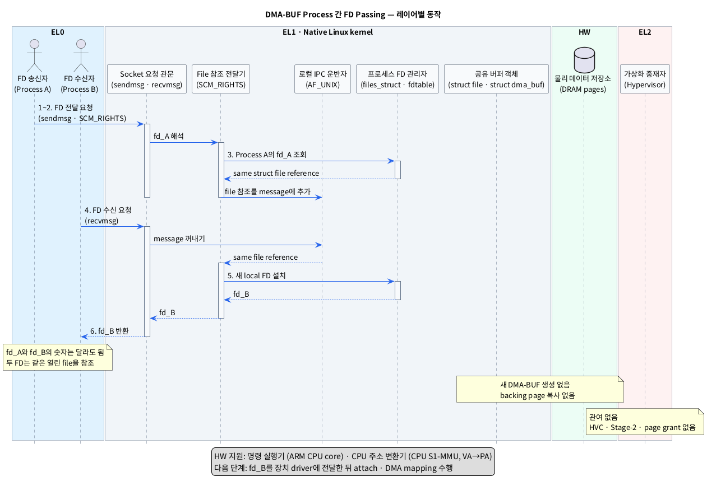

# DMA-BUF를 다른 프로세스로 FD Passing하는 단계

## 1. 범위와 결론

이 문서는 같은 baremetal Linux에서 Process A가 이미 생성한 DMA-BUF를 Process B에 전달하는 과정만 다룬다. 두 프로세스는 같은 Linux kernel을 사용하며, 연결된 Unix domain socket이 준비되어 있다고 가정한다.

- `Unix domain socket`: 같은 kernel 안의 프로세스끼리 데이터를 주고받는 로컬 IPC 통로다.
- `IPC`: 서로 다른 프로세스가 데이터나 상태를 교환하는 통신 방식이다.

FD passing에는 Unix domain socket의 `SCM_RIGHTS`를 사용한다.

- `FD`: 각 프로세스가 열린 kernel file을 가리키는 데 사용하는 정수 번호다.
- `SCM_RIGHTS`: 한 프로세스의 열린 file 참조를 다른 프로세스의 FD table에 복제하는 socket 기능이다.

핵심은 **Process A의 FD 숫자 자체가 Process B로 복사되는 것이 아니라, 같은 열린 file을 가리키는 새 FD가 Process B에 만들어진다**는 점이다. 따라서 두 FD의 숫자는 달라도 같은 `struct dma_buf`와 같은 DRAM backing pages를 가리킨다.

- `struct dma_buf`: backing memory와 공유 동작을 관리하는 DMA-BUF의 kernel 객체다.
- `DRAM backing pages`: DMA-BUF의 실제 데이터가 저장되어 있는 DRAM 영역이다.

## 2. 레이어별 모듈

표기 형식은 **추상화한 모듈 (`실제 Linux 이름 또는 symbol`)**이다.

### 2.1 EL0

| 추상 모듈 (실제 이름) | 책임 |
|---|---|
| FD 송신자 (`Process A`, `sendmsg()`) | 자신이 가진 DMA-BUF FD를 control message에 넣어 전송한다. |
| FD 수신자 (`Process B`, `recvmsg()`) | control message를 받고 자신의 새 DMA-BUF FD를 꺼낸다. |

- `control message`: 일반 socket payload와 함께 전달하는 부가 정보 영역이다.

### 2.2 EL1

| 추상 모듈 (실제 이름) | 책임 |
|---|---|
| Socket 요청 관문 (`socket syscall layer`, `sendmsg()`/`recvmsg()`) | EL0의 송신·수신 요청과 control message를 kernel로 전달한다. |
| 로컬 IPC 운반자 (`AF_UNIX`) | message와 file 참조를 Process A의 socket에서 Process B의 socket으로 운반한다. |
| File 참조 전달기 (`SCM_RIGHTS handler`) | 송신 FD를 열린 file 참조로 바꾸고 수신 측에 전달한다. |
| 프로세스 FD 관리자 (`files_struct`, `fdtable`) | Process B에서 비어 있는 FD 번호를 확보하고 file 참조를 설치한다. |
| 공유 버퍼 객체 보관자 (`DMA-BUF core`, `struct file`, `struct dma_buf`) | 기존 DMA-BUF 객체와 backing pages의 수명을 reference count로 유지한다. |

- `AF_UNIX`: Unix domain socket을 구현하는 Linux kernel의 로컬 socket 계층이다.
- `struct file`: kernel이 열린 file의 상태와 참조 횟수를 관리하는 객체다.
- `fdtable`: 프로세스별 FD 번호와 `struct file`을 연결하는 kernel table이다.
- `reference count`: 객체를 사용하는 참조 수를 세어 마지막 참조가 없어질 때만 해제하는 방식이다.

### 2.3 EL2

| 추상 모듈 (실제 이름) | 책임 |
|---|---|
| 가상화 중재자 (`Hypervisor`: baremetal에서는 없음) | FD passing에 관여하지 않는다. HVC, Stage-2 mapping과 page grant도 발생하지 않는다. |

- `HVC`: EL1이 EL2의 Hypervisor 기능을 요청할 때 사용하는 호출이다.
- `Stage-2 mapping`: Hypervisor가 VM의 주소를 실제 물리 주소에 연결하는 2차 주소 변환이다.
- `page grant`: 한 VM의 memory page를 다른 VM이 접근하도록 Hypervisor가 허용하는 기능이다.

### 2.4 HW

| 추상 모듈 (실제 이름) | 책임 |
|---|---|
| 명령 실행기 (`ARM CPU core`) | Process A/B의 EL0 코드와 socket·FD 처리용 EL1 코드를 실행한다. |
| CPU 주소 변환기 (`CPU S1-MMU`) | EL0/EL1의 VA를 PA로 변환한다. |
| 물리 데이터 저장소 (`DRAM pages`) | 기존 DMA-BUF backing data를 그대로 유지한다. FD passing 중 frame data는 복사되지 않는다. |

- `VA`: CPU가 프로그램을 실행하며 사용하는 가상 주소다.
- `PA`: DRAM에 실제로 접근할 때 사용하는 물리 주소다.

## 3. 단계별 동작

표기 형식은 **추상화한 동작 (`실제 Linux 이름 또는 symbol`)**이다.

| 단계 | 모듈 이동 | 동작 | 결과 |
|---|---|---|---|
| 1. 전달 정보 구성 | **EL0** FD 송신자 (`Process A`) | DMA-BUF FD를 부가 정보에 넣는다 (`struct msghdr`, `struct cmsghdr`, `SOL_SOCKET`, `SCM_RIGHTS`). | `fd_A`를 포함한 control message가 준비된다. |
| 2. FD 송신 | **EL0** FD 송신자 → **EL1** Socket 요청 관문 (`sendmsg()`) | stream socket에서는 일반 데이터 최소 1 byte와 control message를 함께 보낸다. | 요청이 EL0에서 EL1로 들어간다. |
| 3. File 참조 전달 | **EL1** File 참조 전달기 (`SCM_RIGHTS handler`) → **EL1** 프로세스 FD 관리자 (`files_struct`, `fdtable`) → **EL1** 로컬 IPC 운반자 (`AF_UNIX`) | Process A의 `fd_A`를 기존 `struct file` 참조로 바꾸고 reference count를 유지한 채 socket message에 넣는다. | DMA-BUF data 복사 없이 file 참조가 대기열로 이동한다. |
| 4. FD 수신 요청 | **EL0** FD 수신자 (`Process B`) → **EL1** Socket 요청 관문 (`recvmsg()`) | FD를 받을 충분한 control buffer를 제공하고 message를 수신한다. 필요하면 close-on-exec를 함께 요청한다 (`MSG_CMSG_CLOEXEC`). | kernel이 Process B에 전달할 file 참조를 꺼낸다. |
| 5. 새 FD 설치 | **EL1** File 참조 전달기 → **EL1** 프로세스 FD 관리자 (`files_struct`, `fdtable`) | Process B의 비어 있는 FD 번호 `fd_B`에 같은 `struct file` 참조를 설치한다. | `fd_A`와 번호가 다를 수 있는 `fd_B`가 생성된다. |
| 6. 결과 반환 | **EL1** Socket 요청 관문 → **EL0** FD 수신자 (`Process B`) | 새 FD를 control message로 반환한다 (`recvmsg()`, `CMSG_FIRSTHDR()`, `CMSG_DATA()`). | Process B가 같은 DMA-BUF를 가리키는 `fd_B`를 얻는다. |

- `struct msghdr`: `sendmsg()`와 `recvmsg()`가 일반 데이터와 control message 위치를 전달하는 구조체다.
- `struct cmsghdr`: control message의 종류와 크기를 나타내는 header다.
- `MSG_CMSG_CLOEXEC`: 수신한 FD가 새 프로그램 실행 시 자동으로 닫히도록 설정하는 `recvmsg()` flag다.

## 4. PlantUML Sequence Diagram

## 5. 전달 후 상태와 주의점

전달이 끝나면 참조 관계는 다음과 같다.

**Process A `fd_A` → 같은 `struct file` ← Process B `fd_B`; 같은 `struct file` → 같은 `struct dma_buf` → 같은 DRAM backing pages**

- Process A가 `fd_A`를 닫아도 Process B의 `fd_B`가 남아 있으면 DMA-BUF와 backing pages는 유지된다.
- 마지막 file 참조가 닫힐 때 DMA-BUF exporter의 release 동작이 호출되어 backing memory가 해제될 수 있다.
- `recvmsg()`의 control buffer가 작으면 `MSG_CTRUNC`가 설정되고 FD가 누락될 수 있으므로 반드시 검사해야 한다.
- FD passing은 같은 kernel 안에서만 가능하다. 다른 VM의 kernel로 `SCM_RIGHTS`를 직접 전달할 수 없다.
- 이 과정은 FD 전달까지만 다룬다. Process B가 장치 DMA를 사용하려면 이후 driver가 `dma_buf_get(fd_B)`, `dma_buf_attach()`와 `dma_buf_map_attachment()`를 수행해야 한다.

## 6. 근거

- [`survey/dmabuf.md`](./dmabuf.md): 동일 kernel의 process 간 DMA-BUF FD 전달과 후속 attach에 대한 기존 조사.
- [Linux unix(7)](https://man7.org/linux/man-pages/man7/unix.7.html): `SCM_RIGHTS`가 열린 file description 참조를 다른 process FD table로 복제하는 의미.
- [Linux cmsg(3)](https://man7.org/linux/man-pages/man3/cmsg.3.html): `msghdr`, `cmsghdr`와 `CMSG_*` macro 사용 방법.
- [Linux DMA-BUF 문서](https://docs.kernel.org/driver-api/dma-buf.html): DMA-BUF FD, `struct dma_buf`와 file reference의 수명 관리.
