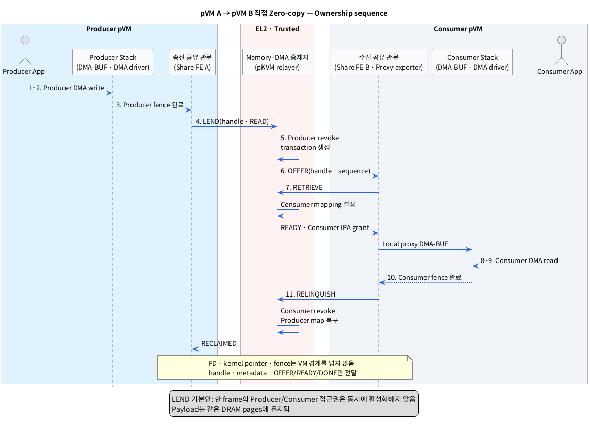
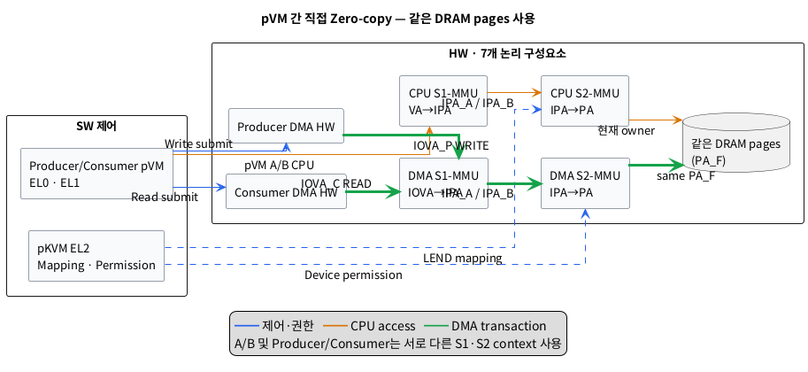

# pVM 간 DMA-BUF 직접 Zero-copy 공유 설계안

## 1. 목표와 현재 지원 경계

이 문서는 Producer pVM의 DMA-BUF를 Consumer pVM에 전달하고, **같은 DRAM backing pages**를 Consumer DMA HW가 읽도록 하는 직접 zero-copy 설계안이다.

- `Producer pVM`: Camera/ISP/GPU 등의 DMA HW로 frame을 생성하는 Protected VM이다.
- `Consumer pVM`: NPU/GPU/Display 등의 DMA HW로 frame을 소비하는 Protected VM이다.
- `DMA-BUF`: 여러 프로세스와 장치가 같은 buffer memory를 공유할 수 있게 하는 Linux kernel 객체다.
- `DRAM backing pages`: DMA-BUF의 실제 frame data가 저장되는 DRAM 영역이다.
- `zero-copy`: Frame payload를 다른 DRAM buffer로 복사하지 않고 같은 physical pages를 이어서 사용하는 방식이다.

여기서 **직접**은 payload가 Host Linux나 Secure Partition의 buffer를 경유하지 않는다는 뜻이다. pKVM EL2는 두 pVM의 identity, memory ownership과 CPU/DMA Stage-2 mapping을 중재해야 한다.

- `pKVM`: 비신뢰 Host보다 높은 EL2에서 pVM memory와 실행 상태를 보호하는 KVM/arm64 보호 모드다.
- `pVM`: pKVM이 Host의 접근으로부터 memory와 실행 상태를 격리하는 Protected VM이다.
- `Stage-2 mapping`: EL2가 VM의 IPA를 실제 PA에 연결하고 접근 권한을 강제하는 mapping이다.
- `IPA`: 각 pVM이 물리 주소처럼 사용하는 Intermediate Physical Address다.
- `PA`: 실제 DRAM에 도달할 때 사용하는 Physical Address다.

### 1.1 현재 공개 구현에 대한 판정

2026-09-04 공개 자료 기준으로 다음을 구분해야 한다.

| 계층 | 공개 확인 상태 |
|---|---|
| FF-A 규격 | VM→VM message와 `DONATE`/`LEND`/`SHARE` memory transaction 모델을 정의한다. |
| Upstream pKVM Guest hypercall | pVM이 memory를 Host와 share/unshare하는 ABI는 있으나 pVM peer용 ABI가 아니다. |
| 공개 AVF pVM API | pVM이 다른 VM으로 connection을 시작하는 경로를 제공하지 않는다. |
| Upstream pKVM DMA isolation | 공식 pKVM 문서에서 IOMMU DMA isolation은 `Unimplemented` 상태다. |
| Target SoC vendor 기능 | pVM↔pVM relayer, borrower와 protected DMA mapping을 별도로 확인해야 한다. |

- `FF-A`: Arm partition 사이의 message, notification과 memory transaction을 정의하는 Firmware Framework for A-profile이다.
- `memory transaction`: Page의 ownership과 접근 권한을 sender, receiver와 relayer 사이에서 상태에 맞게 변경하는 절차다.
- `Guest hypercall`: Guest EL1이 EL2 Hypervisor 기능을 요청하는 ABI다.
- `relayer`: Sender와 receiver의 권한을 검증하고 memory mapping과 message 전달을 중재하는 Hypervisor 역할이다.

따라서 이 문서는 **현재 upstream pKVM/AVF에서 바로 실행되는 사용법이 아니라, target pKVM과 SoC vendor가 추가해야 할 조건부 설계**다. 9절의 capability gate를 통과하지 못하면 direct zero-copy 경로를 선택할 수 없다.

## 2. 설계 결정

### 2.1 FD가 아니라 page 권한과 handle을 전달한다

Producer pVM의 FD, `struct dma_buf`, `dma_resv`와 `dma_fence`는 Producer kernel에서만 유효하다. VM 경계에서는 이를 전달하지 않는다.

- `FD`: 한 Linux process가 열린 kernel file을 가리키는 정수 번호다.
- `struct dma_buf`: Backing memory와 공유 동작을 관리하는 각 Guest kernel의 DMA-BUF 객체다.
- `dma_resv`: 한 DMA-BUF에 연결된 비동기 작업들의 완료 순서를 관리하는 객체다.
- `dma_fence`: 특정 DMA 작업의 완료를 알리는 kernel 동기화 객체다.

VM 경계에서는 pKVM이 발급한 opaque buffer handle, frame metadata와 상태 message만 전달한다. Consumer pVM은 grant된 pages를 감싸는 **새 local proxy DMA-BUF**를 만든다.

- `opaque buffer handle`: PA나 kernel pointer를 노출하지 않고 pKVM만 해석·검증할 수 있는 buffer 식별자다.
- `frame metadata`: Size, plane offset, stride와 pixel format처럼 frame을 해석하는 정보다.
- `proxy DMA-BUF`: 다른 pVM에서 grant받은 pages를 Consumer kernel의 local DMA-BUF로 표현하는 객체다.

### 2.2 기본 memory transaction은 `LEND`로 한다

순환 frame buffer에는 배타적 handoff 의미의 `LEND`를 기본안으로 사용한다.

- `LEND`: Producer의 접근을 임시로 제거하고 Consumer에 page 사용권을 넘긴 뒤 반환받는 transaction이다.
- `SHARE`: Producer와 Consumer가 같은 pages의 mapping을 동시에 유지하는 transaction이다.
- `DONATE`: Page ownership을 영구적으로 넘기는 transaction으로, 반복 재사용하는 frame에는 부적합하다.

Producer DMA 완료 후 buffer 하나를 Consumer에 lend하고, Consumer 완료 후 relinquish/reclaim하여 Producer가 재사용한다. 여러 buffer로 ring을 구성하면 Consumer가 frame N을 읽는 동안 Producer가 다른 pages의 frame N+1을 만들 수 있다.

- `ring`: 여러 buffer를 순환 사용하여 Producer와 Consumer 작업을 겹치는 구조다.
- `relinquish`: Consumer가 빌린 page 사용을 끝내고 권한을 반납하는 동작이다.
- `reclaim`: Producer가 반환된 page의 ownership과 mapping을 다시 얻는 동작이다.

장기 shared pool용 `SHARE`도 선택할 수 있지만 Producer write와 Consumer read가 겹치지 않도록 별도 ownership protocol이 필요하고, 두 pVM의 mapping 노출 시간이 길어진다.

### 2.3 Data path와 control path를 분리한다

- Data path: `Producer DMA HW → same PA pages → Consumer DMA HW`; Host나 EL2가 frame bytes를 복사하지 않는다.
- Control path: `OFFER`, `RETRIEVE`, `READY`, `DONE`, `RECLAIMED` message와 opaque handle만 pKVM-mediated channel로 전달한다.

- `pKVM-mediated channel`: pKVM이 endpoint identity와 route를 검증하여 두 pVM 사이의 작은 message·notification을 전달하는 통로다.

FF-A를 쓴다면 pKVM은 Normal-world VM↔VM relayer와 receiver delivery를 구현해야 한다. Vendor 전용 ABI를 쓰더라도 아래 ownership state와 보안 조건은 같아야 한다.

## 3. 레이어별 모듈

표기 형식은 **추상화한 모듈 (`실제 이름 또는 구현 후보`)**이다.

### 3.1 Producer pVM EL0·EL1

| 레이어 | 추상 모듈 (실제 이름 또는 후보) | 책임 |
|---|---|---|
| EL0 | Frame 생성 요청자 (`Producer application`) | Shareable DMA-BUF를 할당하고 Producer job을 요청한다. |
| EL1 | 공유 가능 buffer 제공자 (`Protected shareable DMA Heap`, DMA-BUF exporter) | Lend 가능한 page-aligned backing pages와 local DMA-BUF를 만든다. |
| EL1 | Producer 작업 실행자 (`Camera/ISP/GPU driver`) | DMA-BUF를 attach/map하고 Producer DMA HW에 write job을 submit한다. |
| EL1 | 송신 공유 관문 (`pVM Share Frontend A`) | Page를 pin하고 pKVM에 lend, reclaim과 handle lifecycle을 요청한다. |
| EL1 | 송신 동기화 변환기 (`dma_resv`/`dma_fence` bridge) | Producer fence가 끝난 뒤 lend를 요청하고 reclaim 전 접근을 막는다. |

- `shareable DMA Heap`: Pin, grant, revoke와 재사용이 보장되는 protected page만 할당하는 전용 Heap이다.
- `page-aligned`: 주소와 크기가 pKVM protection granule 또는 page 경계에 맞는 상태다.
- `pin`: Transaction 동안 backing page가 이동·회수되지 않도록 고정하는 동작이다.
- `sequence`: 같은 buffer의 여러 사용 차례를 구분하는 증가 번호다.

### 3.2 Consumer pVM EL0·EL1

| 레이어 | 추상 모듈 (실제 이름 또는 후보) | 책임 |
|---|---|---|
| EL0 | Frame 소비 요청자 (`Consumer application`) | Local proxy DMA-BUF FD로 AI/Display 등의 작업을 요청한다. |
| EL1 | 수신 공유 관문 (`pVM Share Frontend B`, FF-A borrower 또는 vendor client) | Handle을 retrieve하고 grant된 IPA pages와 metadata를 검증한다. |
| EL1 | Proxy buffer 제공자 (`Proxy DMA-BUF exporter`) | Grant된 pages를 Consumer-local DMA-BUF와 FD로 만든다. |
| EL1 | Consumer 작업 실행자 (`NPU/GPU/Display driver`) | Proxy DMA-BUF를 attach/map하고 Consumer DMA HW에 read job을 submit한다. |
| EL1 | 수신 동기화 변환기 (`local dma_fence`, `DONE(sequence)`) | `READY`를 local dependency로 바꾸고 Consumer 완료 후 `DONE`을 만든다. |

- `borrower`: LEND transaction에서 임시 page 권한을 받아 사용하는 receiver다.
- `retrieve`: Borrower가 handle을 제시해 lend된 pages와 권한을 자기 IPA space에 받는 동작이다.

### 3.3 Host EL0·EL1

| 추상 모듈 (실제 이름 또는 후보) | 책임 |
|---|---|---|
| Pipeline 설정자 (`Management application`/VMM) | 두 pVM과 device assignment를 시작하고 peer policy의 identifier를 전달한다. |
| 비신뢰 lifecycle 보조자 (`Host KVM/VFIO`) | vCPU scheduling과 장치 assignment 요청을 보조한다. Payload PA mapping은 받지 않는다. |

Host는 pVM을 중지하거나 scheduling을 지연하여 availability를 방해할 수 있지만 frame content를 읽거나 바꾸지 못해야 한다.

- `availability`: 허가된 사용자가 필요한 시점에 system이나 data를 사용할 수 있는 성질이다.

### 3.4 EL2 — pKVM trusted relayer

| 추상 모듈 (실제 이름 또는 후보) | 책임 |
|---|---|---|
| Peer 신원 관리자 (`pVM endpoint registry`) | Producer/Consumer identity, VM generation과 허용 peer를 연결한다. |
| 공유 정책 집행자 (`pKVM capability/ACL enforcement`) | Source, target, Heap, size와 R/W 권한을 검증한다. |
| Memory transaction 관리자 (`FF-A VM relayer` 또는 vendor grant manager) | Lend/retrieve/relinquish/reclaim 상태와 동일 PA pages의 CPU Stage-2 mapping을 관리한다. |
| Protected DMA 권한 관리자 (`pKVM vendor IOMMU/S2MPU module`) | Producer/Consumer device별 DMA Stage-2 mapping을 전환한다. |
| 알림 중재자 (`FF-A notification`/vendor vIRQ) | Handle과 `OFFER`/`READY`/`DONE` 상태 변경을 올바른 peer에 전달한다. |
| 강제 회수 관리자 (`pVM lifecycle cleanup`) | pVM crash·reset 시 장치를 멈추고 orphan mapping과 handle을 회수한다. |

- `VM generation`: 같은 VM 구성을 다시 실행했을 때 이전 instance와 새 instance를 구분하는 값이다.
- `ACL`: 어떤 pVM과 장치가 어떤 buffer 권한을 가질 수 있는지 정한 Access Control List다.
- `orphan mapping`: Owner나 borrower가 종료됐는데 남아 있는 주소 mapping이다.

### 3.5 HW

이 설계의 HW는 다음 7개 논리 구성요소로 한정한다. 각 pVM과 장치는 서로 다른 translation context를 사용한다.

| 추상 모듈 (실제 이름) | 책임 |
|---|---|
| pVM CPU 1차 변환기 (`CPU S1-MMU`, VA→IPA) | 각 pVM의 VA를 해당 pVM IPA로 변환한다. |
| Protected CPU 2차 변환기 (`CPU S2-MMU`, IPA→PA) | LEND 상태에 따라 Producer 또는 Consumer IPA를 같은 PA pages에 연결한다. |
| pVM DMA 1차 변환기 (`DMA S1-MMU`, IOVA→IPA) | 각 assigned device의 IOVA를 해당 pVM IPA로 변환한다. |
| Protected DMA 2차 변환기 (`DMA S2-MMU`, IPA→PA) | 현재 owner/borrower의 assigned device만 같은 PA pages에 접근하게 한다. |
| 데이터 생성 장치 (`Producer DMA HW`) | Producer pVM에서 frame을 같은 PA pages에 write한다. |
| 데이터 소비 장치 (`Consumer DMA HW`) | Consumer pVM에서 같은 PA pages의 frame을 read한다. |
| 물리 데이터 저장소 (`DRAM pages`) | 복사 없이 양쪽 DMA 단계가 차례로 사용하는 frame data를 저장한다. |

- `CPU S1-MMU`: 각 pVM EL1이 관리하는 VA→IPA 1차 CPU 주소 변환 HW다.
- `CPU S2-MMU`: pKVM EL2가 관리하는 IPA→PA 2차 CPU 주소 변환 HW다.
- `DMA S1-MMU`: 각 pVM 또는 pvIOMMU 계약이 관리하는 IOVA→IPA 1차 DMA 주소 변환 HW다.
- `DMA S2-MMU`: pKVM vendor module이 관리하는 IPA→PA 2차 DMA 주소 변환·보호 HW다.
- `Producer DMA HW`: Frame을 DRAM에 write하는 assigned 장치다.
- `Consumer DMA HW`: Frame을 DRAM에서 read하는 assigned 장치다.

## 4. 주소 mapping 설계

같은 physical frame pages에 pVM마다 다른 local 주소를 연결한다.

| 사용 단계 | Stage-1 mapping | Stage-2 mapping | 실제 대상 |
|---|---|---|---|
| Producer CPU 준비 | `VA_A → IPA_A` | `IPA_A → PA_F` | Frame PA pages |
| Producer DMA write | `IOVA_P → IPA_A` | `IPA_A → PA_F`, Producer device WRITE | 같은 Frame PA pages |
| Consumer CPU metadata/access | `VA_B → IPA_B` | `IPA_B → PA_F`, Consumer pVM READ | 같은 Frame PA pages |
| Consumer DMA read | `IOVA_C → IPA_B` | `IPA_B → PA_F`, Consumer device READ | 같은 Frame PA pages |
| Host/제3 pVM·장치 | Mapping 없음 | `NO_ACCESS` | 접근 차단 |

- `PA_F`: 한 frame의 실제 data가 저장된 동일 DRAM physical pages를 뜻하는 표기다.

`LEND` 기본안에서는 Producer와 Consumer mapping을 동시에 활성화하지 않는다. Producer DMA가 완전히 끝난 뒤 Producer CPU/DMA Stage-2 권한을 제거하고 Consumer mapping을 만든다. 반환 시에는 반대 순서로 처리한다.

Consumer의 `IPA_B`는 Producer의 `IPA_A`와 같을 필요가 없다. pKVM이 둘을 같은 `PA_F`에 연결하며, 각 Guest는 자기 local DMA S1 page table만 관리한다.

## 5. Handle과 message 계약

VM 사이에는 raw FD, PA, kernel pointer나 raw `sg_table`을 보내지 않는다. 최소 control 정보는 다음과 같다.

| 필드 | 목적 |
|---|---|
| `handle_id` | pKVM이 memory transaction을 찾는 opaque identifier |
| `generation` | VM 재시작 후 이전 handle 재사용 차단 |
| `pipeline_epoch` | Pipeline 재설정 전후의 frame 혼동 방지 |
| `buffer_generation` | 같은 buffer가 회수·재사용된 차례 구분 |
| `sequence` | Frame 처리 순서와 중복 message 검출 |
| `size`, `planes`, `offset`, `stride`, `format` | Consumer가 frame layout 검증 |
| `rights` | Consumer CPU/DMA READ 또는 필요한 최소 권한 |
| `producer_done` | Producer fence 완료 이후에만 설정되는 상태 |

- `pipeline_epoch`: Pipeline을 새로 연결할 때 증가시켜 이전 실행의 message를 무효화하는 값이다.
- `buffer_generation`: 같은 physical buffer가 새 frame에 재사용될 때 이전 handle과 구분하는 값이다.

권장 message·transaction 순서는 다음과 같다.

**OFFER → RETRIEVE → READY → DONE/RELINQUISH → RECLAIMED**

`OFFER`는 Producer DMA fence가 signal되고 Producer 접근이 revoke된 뒤에 보낸다. `READY`는 Consumer의 `RETRIEVE` 요청을 검증하고 Consumer Stage-2 mapping까지 완료한 뒤에만 보낸다. `DONE`은 Consumer DMA fence가 signal되고 새 submit이 차단된 뒤에만 보낸다.

## 6. 단계별 Zero-copy 동작

### 6.1 초기화 — Pipeline 시작 시

| 단계 | 동작 | 결과 |
|---|---|---|
| A1. Peer 등록 | Pipeline 설정자가 Producer/Consumer pVM identity, generation과 허용 방향을 pKVM policy에 연결한다. | 허가된 두 endpoint만 서로 handle을 교환할 수 있다. |
| A2. 장치 assignment | pKVM이 Producer와 Consumer DMA HW를 각 pVM에 배정하고 Stream ID와 DMA S2 context를 설정한다. | Host·제3 device의 DMA 접근이 차단된다. |
| A3. Shareable ring 생성 | Producer pVM이 protected shareable DMA Heap에서 N개의 DMA-BUF를 만든다. | LEND/reclaim 가능한 backing pages가 준비된다. |
| A4. Channel 준비 | pKVM-mediated message/notification channel과 timeout·reset handler를 준비한다. | Payload와 분리된 control path가 생긴다. |

- `Stream ID`: SMMU가 DMA 요청을 어느 device와 translation context에 연결할지 구분하는 식별자다.

### 6.2 Frame별 data handoff

| 단계 | 모듈 이동 | 동작 | 결과 |
|---|---|---|---|
| 1. Producer mapping | **Producer EL1** Producer driver → **HW** DMA S1/S2-MMU | Local DMA-BUF를 attach/map하여 `IOVA_P → IPA_A → PA_F` write path를 만든다. | Producer DMA HW가 쓸 수 있다. |
| 2. Frame 생성 | **Producer EL1** driver → **HW** Producer DMA HW → **HW** DRAM pages | Producer descriptor를 submit하고 frame을 `PA_F`에 쓴다. | Frame payload가 backing pages에 생성된다. |
| 3. Producer 완료 고정 | **HW** Producer DMA HW → **Producer EL1** fence bridge/Share FE A | Fence 완료를 기다리고 cache ownership을 device에서 넘긴다. 새 Producer access를 막고 필요하면 DMA S1을 unmap한다. | Pages를 lend해도 안전한 상태가 된다. |
| 4. LEND 요청 | **Producer EL1** Share FE A → **EL2** Memory transaction 관리자 | Page list, target pVM, READ 권한과 generation을 pKVM에 제출한다. | pKVM이 source ownership과 buffer eligibility를 검증한다. |
| 5. Producer revoke | **EL2** pKVM → **HW** CPU/DMA S2-MMU | Producer CPU/DMA 권한을 revoke하고 TLB invalidation을 완료한 뒤 transaction handle을 만든다. | Host와 Producer가 pages에 접근하지 못한다. |
| 6. OFFER 전달 | **EL2** 알림 중재자 → **Consumer EL1** Share FE B | Opaque handle, metadata와 `OFFER(sequence)`를 전달한다. | Consumer가 retrieve를 요청할 수 있다. |
| 7. Retrieve·local proxy 생성 | **Consumer EL1** Share FE B → **EL2** retrieve → **HW** CPU/DMA S2-MMU → **Consumer EL1** Proxy exporter | pKVM이 Consumer identity와 READ 권한을 검증하고 같은 `PA_F`를 Consumer `IPA_B`에 map한다. Mapping 완료 후 `READY`를 반환하고 Consumer가 local DMA-BUF와 FD를 만든다. | Consumer만 grant된 pages에 접근할 수 있다. |
| 8. Consumer mapping | **Consumer EL1** Consumer driver → **HW** DMA S1-MMU | Proxy DMA-BUF를 attach/map하고 `IOVA_C → IPA_B` PTE를 설정한다. | Consumer DMA address가 준비된다. |
| 9. Zero-copy consume | **Consumer EL1** driver → **HW** Consumer DMA HW → **HW** DMA S1/S2-MMU → **HW** DRAM pages | IOVA descriptor를 submit하고 `IOVA_C → IPA_B → 같은 PA_F`로 frame을 읽는다. | Copy 없이 Producer가 쓴 frame을 소비한다. |
| 10. Consumer 완료 | **HW** Consumer DMA HW → **Consumer EL1** fence bridge/Share FE B | Fence 완료 후 새 Consumer access를 막고 DMA S1 unmap·detach를 수행한다. | Consumer mapping을 회수해도 안전하다. |
| 11. 반납·회수 | **Consumer EL1** Share FE B → **EL2** relinquish → **Producer EL1** Share FE A | pKVM이 Consumer CPU/DMA S2를 revoke하고 handle을 무효화한 뒤 Producer `IPA_A` mapping을 복구한다. | Producer가 같은 pages를 다음 frame에 재사용한다. |

- `TLB invalidation`: Page-table 변경 후 MMU가 오래된 주소 변환 cache를 쓰지 않도록 지우는 동작이다.
- `cache ownership`: CPU 또는 DMA device 중 누가 최신 data를 보유·사용하는지 정하고 cache maintenance 순서를 지키는 계약이다.
- `revoke`: 이전에 부여한 mapping이나 접근 권한을 제거하는 동작이다.

## 7. PlantUML 설계 View

### 7.1 Control·ownership sequence

### 7.2 HW address path

두 DMA 화살표는 같은 frame에 동시에 접근한다는 뜻이 아니라, LEND 전 Producer write와 LEND 후 Consumer read가 같은 physical pages를 차례로 사용한다는 뜻이다.

## 8. 동기화·보안·복구 규칙

### 8.1 동기화와 cache

- Producer fence가 signal되기 전에는 `READY`와 Consumer Stage-2 mapping을 만들지 않는다.
- Non-coherent platform은 Producer 완료 시 clean, Consumer 시작 전 invalidate 등 vendor DMA/cache contract를 지킨다.
- 양 pVM은 동일한 memory type과 shareability attribute를 사용해야 한다.
- Raw `dma_fence *`는 전달하지 않고 `READY(sequence)`와 `DONE(sequence)`를 각 Guest의 local fence로 변환한다.
- Consumer `DONE` 전에 Producer가 같은 buffer를 overwrite하지 않는다.

- `non-coherent`: CPU와 DMA HW의 cache가 자동으로 같은 최신 data를 보장하지 않는 HW 특성이다.

### 8.2 보안

- Handle을 source/target identity, VM generation, pipeline epoch, size와 권한에 binding한다.
- Consumer에는 기본적으로 CPU/DMA READ만 허용하고 필요한 경우에만 WRITE를 추가한다.
- Producer revoke와 TLB invalidation이 끝나기 전 Consumer mapping을 활성화하지 않는다.
- Host CPU Stage-2, Host-owned DMA HW와 제3 pVM/device는 전체 lifecycle에서 `NO_ACCESS`여야 한다.
- Consumer가 제출한 offset, size, plane metadata와 page count를 pKVM/Guest 양쪽에서 검증한다.
- Handle generation을 재사용하지 않고 stale·duplicate message를 거부한다.

### 8.3 Crash·timeout 복구

| 실패 | EL2/Guest 조치 |
|---|---|
| Producer crash, LEND 전 | Producer device reset → S1/S2 revoke → buffer zeroize 또는 폐기 |
| Producer crash, LEND 후 | Consumer 사용을 정책에 따라 완료 또는 중단 → Consumer revoke → orphan handle 회수 |
| Consumer crash | Consumer device reset → Consumer DMA S2 revoke → handle relinquish 강제 처리 → Producer reclaim |
| READY/DONE 유실 | Generation·sequence 기반 timeout 후 장치 정지와 EL2 강제 회수 |
| pKVM mapping 실패 | 부분 mapping rollback, 양 pVM에 ERROR 전달, buffer 재사용 금지 |

- `zeroize`: 이전 workload의 data가 남지 않도록 memory나 device state를 지우는 동작이다.

## 9. Capability gate와 PoC 순서

다음 항목이 모두 확인되어야 설계를 구현 단계로 넘길 수 있다.

1. 두 pVM endpoint를 등록·인증하고 direct message/notification을 전달하는 pKVM route
2. pVM→pVM `LEND` 또는 `SHARE`, receiver `RETRIEVE`/`RELINQUISH`, sender `RECLAIM` ABI
3. Consumer Guest에서 grant page를 local `struct page`/`sg_table`과 proxy DMA-BUF로 만드는 bridge
4. Producer와 Consumer DMA HW의 protected device assignment
5. 두 장치의 Stream ID별 DMA S2 map/revoke와 완료 보장
6. Host CPU, Host DMA와 제3 pVM/device의 negative-access test
7. Crash 상태별 강제 revoke, device reset과 orphan handle cleanup
8. Cache maintenance, fence ordering과 stale generation test

권장 PoC 순서는 다음과 같다.

1. Page 한 개를 pVM A에서 pVM B로 lend/retrieve/relinquish/reclaim하고 CPU S2 mapping을 trace한다.
2. Host와 제3 pVM의 CPU access가 전 단계에서 실패하는지 확인한다.
3. Producer 없이 pVM A page를 Consumer DMA HW가 read하도록 DMA S1/S2를 검증한다.
4. Producer DMA write → LEND → Consumer DMA read를 단일 buffer로 검증한다.
5. Receiver crash와 timeout을 모든 ownership 상태에 주입한다.
6. 마지막에 N-buffer ring의 fps, latency, S2/TLB update 비용을 측정한다.

다음 중 하나라도 불가능하면 direct zero-copy를 지원한다고 판정하면 안 된다.

- pKVM이 같은 protected PA pages를 두 pVM 사이에서 안전하게 lend/share할 수 없음
- Consumer borrower/Proxy DMA-BUF bridge가 없음
- 두 assigned DMA HW의 Stage-2 isolation을 EL2가 제어할 수 없음
- Host mapping을 제거한 상태로 control과 recovery를 완성할 수 없음

이 경우 fallback은 Host-shared staging buffer, payload encryption을 사용한 Host relay 또는 trusted service를 통한 copy다. 이들은 기능 대안이지만 **직접 zero-copy와 동일한 보안·성능 특성은 아니다.**

## 10. 근거

### 로컬 조사

- [`survey/dmabuf_pkvm_pvm_dma_mapping.md`](./dmabuf_pkvm_pvm_dma_mapping.md): 각 pVM 내부의 DMA-BUF 생성, device assignment와 DMA S1/S2 사용 경로.
- [`survey/ff_a_pvm_direct_communication_roadmap.md`](./ff_a_pvm_direct_communication_roadmap.md): FF-A VM↔VM memory transaction의 규격 가능성과 현재 공개 pKVM/AVF 구현 공백.
- [`survey/host_pvm_communication.md`](./host_pvm_communication.md): Host 비신뢰 경계, pVM private page와 assigned device data path.
- [`survey/dmabuf_inter_vm_cc.md`](./dmabuf_inter_vm_cc.md): VM-local DMA-BUF, opaque handle, proxy exporter와 READY/DONE lifecycle.

### 웹 자료

- [Linux Protected KVM 공식 문서](https://docs.kernel.org/virt/kvm/arm/pkvm.html): pVM memory donation·CPU isolation과 upstream DMA isolation 구현 상태.
- [KVM/arm64 Guest hypercall 공식 문서](https://docs.kernel.org/virt/kvm/arm/hypercalls.html): 현재 pVM→Host memory share/unshare ABI.
- [Android Virtualization Framework Architecture](https://source.android.com/docs/core/virtualization/architecture): pKVM과 vendor EL2 module의 역할.
- [Android Virtualization Framework Security](https://source.android.com/docs/core/virtualization/security): pVM page ownership과 Stage-2 기반 Host 격리.
- [AVF framework-virtualization README](https://android.googlesource.com/platform/packages/modules/Virtualization/+/HEAD/libs/framework-virtualization/README.md): 공개 application-facing pVM connection과 FD 전달 범위.
- [Arm FF-A Memory Management Protocol v1.2](https://developer.arm.com/documentation/den0140/d): VM sender/receiver/Hypervisor relayer의 donate/lend/share lifecycle.
- [Linux DMA-BUF 공식 문서](https://docs.kernel.org/driver-api/dma-buf.html): Guest-local attachment, mapping, reservation과 fence 계약.
- [Arm SMMU Architecture Specification](https://documentation-service.arm.com/static/66c5c097882fec713ef4a8ff): Stream ID와 DMA Stage-1/Stage-2 translation 구조.

2026-09-04 기준 공개 upstream pKVM/AVF에는 이 설계 전체를 제공하는 pVM↔pVM data path가 확인되지 않았다. 실제 채택은 target SoC vendor의 relayer, borrower, protected DMA와 recovery 증거를 기준으로 판단해야 한다.
