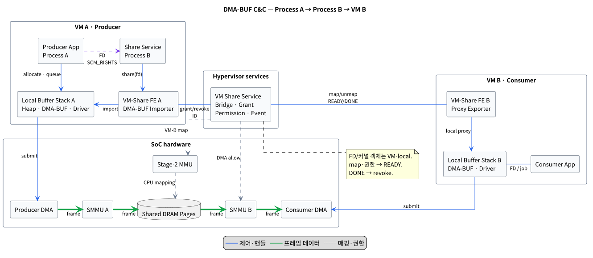

# DMA-BUF 프로세스·VM 간 공유 C&C View

## 1. 범위와 결론

- 대상은 Red Bend/HARMAN 계열 Type-1 또는 XGEN 계열 하이퍼바이저의 일반 Linux VM 두 개다. pVM은 전제하지 않는다.
- VM A의 Process A가 만든 DMA-BUF를 Process B가 받은 뒤, VM B의 장치가 같은 DRAM backing page에 DMA 접근하는 zero-copy 경로를 다룬다.
  - **용어 설명:** DRAM backing page는 쉽게 말해 DMA-BUF의 실제 데이터가 저장되어 있는 DRAM 메모리 영역이다.
- 그림의 HW 경로는 ARM virtualization과 양 VM이 접근 가능한 동일 SoC DRAM을 가정한다.
- 같은 VM에서는 `SCM_RIGHTS`가 같은 커널의 open-file 참조를 복제한다.
- 다른 VM에는 FD, `struct dma_buf`, `dma_resv`, `dma_fence` 포인터가 전달되지 않는다. VM 경계에서는 page grant와 opaque buffer ID를 전달하고, VM B가 별도의 local DMA-BUF를 만든다.
- [PlantUML C&C 원본](./dmabuf_inter_vm_cc.puml)은 제품 API 이름을 추정하지 않고 필수 계약을 표현한다.

## 2. C&C 해석

### 2.1 런타임 SW 컴포넌트

| 컴포넌트 | 위치 | 책임 |
|---|---|---|
| Producer App | VM A / Process A | 버퍼 할당, producer 장치에 FD queue |
| Share Service | VM A / Process B | `SCM_RIGHTS`로 FD 수신, 공유 요청과 메타데이터 관리 |
| Buffer Allocator/Exporter | VM A kernel | DMA Heap 또는 장치 allocator로 backing page와 local DMA-BUF 생성 |
| DMA-BUF Core A | VM A kernel | local `dma_buf`, attachment, reservation과 fence 수명 관리 |
| Producer Driver | VM A kernel | local DMA-BUF importer, producer DMA용 attach/map과 submit |
| VM-Share FE A | VM A kernel | local DMA-BUF importer, page pin/register, buffer ID 생성 |
| Inter-VM Bridge | VM 경계 | ID, `READY`, `DONE`, 오류와 수명 메시지 전달 |
| Memory Grant/Mapper | Hypervisor | 같은 backing page를 VM B에 map하고 권한을 회수 |
| DMA Permission Manager | Hypervisor/BSP | consumer 장치의 SMMU/IOMMU 접근 허용과 차단 |
| Notification Router | Hypervisor/BSP | doorbell, cross-interrupt 또는 vIRQ 전달 |
| VM-Share FE B / Proxy Exporter | VM B kernel | grant를 받아 VM B의 새 local DMA-BUF 생성 |
| DMA-BUF Core B | VM B kernel | VM B의 attachment, reservation과 local fence 관리 |
| Consumer Driver | VM B kernel | proxy DMA-BUF importer, consumer DMA용 attach/map과 submit |
| Consumer App | VM B user | local FD로 처리 job 요청 |

`VM-Share FE A`는 DMA-BUF **importer**이고, `VM-Share FE B`는 grant의 수신자이면서 VM B local DMA-BUF의 **exporter**다. Consumer Driver는 그 proxy DMA-BUF의 **importer**다.

DMA Heap을 쓰는 그림에서는 Buffer Allocator가 exporter이고 Producer Driver가 importer다. 장치 드라이버가 직접 버퍼를 할당하는 제품에서는 exporter 역할만 그 드라이버로 이동한다.

### 2.2 설정 시점 SW 컴포넌트

다음 모듈은 필요하지만 frame별 fast path에는 넣지 않았다.

| 컴포넌트 | 책임 |
|---|---|
| Hypervisor Configuration | VM memory, shared channel, IRQ와 peer 관계 정의 |
| Device Assignment/BSP | DMA master, IRQ와 SMMU context의 VM 소유권 설정 |
| Grant Policy/ACL | source/target VM identity와 R/W/DMA 권한 제한 |
| Lifecycle/Diagnostics | VM reset 시 회수, fault, timeout과 stale ID 추적 |

### 2.3 HW 컴포넌트

| 컴포넌트 | 필요도 | 책임 |
|---|---|---|
| Shared DRAM pages | 필수 | 복사하지 않는 실제 frame payload 저장 |
| Producer DMA master | 필수 | Camera/ISP/GPU 등의 frame write |
| Consumer DMA master | 필수 | NPU/GPU/Display 등의 frame read/write |
| CPU Stage-2 MMU | 필수 | VM별 IPA→PA 변환과 CPU 접근 격리 |
| SMMU/IOMMU 또는 동등 보호 HW | 직접 DMA 시 필수 | 장치별 IOVA 변환과 DMA 접근 제한 |
| GIC/vGIC | 이벤트 기반 구현 시 필수 | physical IRQ 및 VM 간 notification 전달 |
| Cache/coherency fabric | 플랫폼 의존 | 비일관성 장치의 ownership 전환 지원 |
| S2MPU 등 SoC 방화벽 | 선택 | SoC에 존재할 때 추가 PA 접근 통제 |

Stage-2 MMU는 CPU 접근 경로이고 SMMU/IOMMU는 장치 DMA 경로다. 일반 C&C에서 S2MPU를 모든 제품의 필수 모듈로 두지 않는다.

### 2.4 Connector와 전달 데이터

| Connector | 전달 내용 |
|---|---|
| DMA Heap/subsystem ioctl | allocation 요청과 local DMA-BUF FD |
| Unix socket + `SCM_RIGHTS` | 같은 VM 커널의 open-file 참조 |
| Driver ioctl | local FD와 device job |
| `dma_buf_attach()` + `dma_buf_map_attachment()` | local device attachment와 device address mapping |
| VM-share ioctl | local FD, frame metadata, 접근 권한 |
| Hypercall/vendor grant API | page grant/map/revoke 요청 |
| Inter-VM channel | buffer ID, generation, `READY`/`DONE`/`ERROR` |
| Shared page mapping | frame payload가 있는 동일 DRAM page |
| Doorbell/cross-interrupt/vIRQ | 상태 변경 알림 |
| DMA transaction | producer/consumer 장치와 DRAM 사이 payload |

FD, `struct dma_buf`, SG table, IOVA/GPA/HPA, grant handle, fence는 컴포넌트가 아니라 local object 또는 전달 데이터다.

## 3. 동작 순서

1. Process A가 DMA-BUF를 할당하고 Producer Driver에 queue한다.
2. Process A가 Unix socket의 `SCM_RIGHTS`로 Process B에 같은 file object의 참조를 전달한다.
3. FE A가 backing page를 pin/register하고 Hypervisor에 VM B의 page grant와 CPU/DMA 권한을 요청한다.
4. Hypervisor가 grant, Stage-2 mapping과 DMA permission을 완료한다.
5. Producer DMA 완료와 4단계 완료를 모두 확인한 뒤 FE A가 `buffer ID + metadata + READY(sequence)`를 보낸다.
6. FE B가 grant된 page를 감싼 새 local DMA-BUF를 만들고, Consumer Driver가 attach/map하여 DMA를 실행한다.
7. Consumer DMA와 local 사용이 끝나면 FE B가 `DONE(sequence)`를 보낸다. 이후에만 mapping을 revoke하고 VM A가 버퍼를 재사용한다.

이 순서는 같은 physical page를 양 VM에 map할 수 있을 때만 zero-copy다. Hypervisor가 동적 grant를 지원하지 않으면 미리 공유한 pool을 allocator로 쓰거나 staging copy 경로가 필요하다.

## 4. 동기화와 수명 계약

- Source의 `dma_fence *` 또는 sync-file FD를 VM B로 보내지 않는다. FE A가 producer 완료를 기다린 뒤 `READY(sequence)`를 보내고, FE B가 이를 local completion/fence로 바꾼다.
- 임의의 DMA-BUF가 항상 grant 가능한 것은 아니다. page pin과 revoke가 보장되는 heap/exporter 또는 처음부터 공유된 pool을 사용한다.
- VM channel에는 raw SG table, IOVA/GPA/HPA를 싣지 않는다. Hypervisor가 검증하는 opaque buffer ID만 노출한다.
- VM A는 같은 buffer generation의 `DONE(sequence)` 전에 overwrite, free 또는 revoke하지 않는다.
- revoke 순서는 새 job 차단 → consumer DMA quiesce → local detach/unmap → SMMU/Stage-2 revoke와 TLB invalidate → source unpin이다.
- `DMA_BUF_IOCTL_SYNC`는 CPU `mmap()` 접근의 cache coherency 구간 표시다. device-device 배타 동기화를 대신하지 않는다.
- metadata에는 최소한 size, plane offset, stride, format/modifier, R/W 권한, buffer generation과 sequence가 필요하다.
- VM reset, timeout, 중복 ID, stale generation과 부분 실패를 정리하는 recovery 책임은 양 FE와 Bridge에 있어야 한다.

## 5. 제품별 매핑

| 일반 C&C 요소 | Red Bend/HARMAN에서 확인된 대응 | XGEN |
|---|---|---|
| Type-1 hypervisor | HARMAN 공개 페이지에서 확인 | 제품 문서 확인 필요 |
| CPU memory isolation | Stage-2 MMU | API/구성 확인 필요 |
| DMA device isolation | SMMU | IOMMU 모델 확인 필요 |
| Inter-VM Bridge | 공개 페이지의 bridge component | peer channel 확인 필요 |
| Inter-VM resource link | 2021 매뉴얼 공개 사본의 vLink | 이름과 ABI 확인 필요 |
| Event | 같은 사본의 XIRQ/cross-interrupt | doorbell/vIRQ 확인 필요 |
| Shared control memory | 같은 사본의 PMEM; PDEV는 hypervisor 전용 metadata | shared-memory 영역 확인 필요 |
| Dynamic payload share | 같은 사본의 page-aligned R/W/DMA memory grant | grant/map/revoke 확인 필요 |

현재 HARMAN 공개 페이지는 Stage-2 MMU, SMMU, bridge 기반 inter-VM channel을 확인해 주지만 Linux DMA-BUF 전용 bridge나 proxy exporter의 존재까지 보장하지 않는다. vLink/XIRQ/PMEM/PDEV와 동적 memory grant 명칭은 제3자 사이트에 공개된 2021 HARMAN 매뉴얼 사본에서 확인했으므로, 현재 납품 버전의 API/ABI와 대조해야 한다.

2026-09-04 기준 `XGEN hypervisor`라는 정확한 제품명에 해당하는 공개 기술 사양은 찾지 못했다. Xen으로 간주하지 않았으며, 다음 계약을 공급사 문서로 확인해야 한다.

- 고정 shared pool 또는 동적 page grant 지원 여부와 scatter-gather 제약
- peer-to-peer channel인지 service VM/backend 경유인지
- grant의 R/W 및 DMA 권한, revoke 완료 보장
- notification primitive와 ordering 보장
- guest frontend/backend 또는 proxy DMA-BUF driver 제공 여부
- fence/ownership 전달 규약과 VM crash 시 회수 절차

## 6. `survey/dmabuf.md` 적용 시 보정점

[기존 조사](./dmabuf.md)는 allocation, 동일 커널의 FD 공유, VM 경계에 별도 중재가 필요하다는 출발점으로 사용했다. 공식 Linux 문서와 hypervisor 자료를 대조하면 다음처럼 보정해야 한다.

- `dma_buf_attach()`는 attachment를 만든다. device address mapping은 `dma_buf_map_attachment()`와 exporter의 `map_dma_buf()` 경로에서 수행된다.
- `DMA_BUF_IOCTL_SYNC`는 CPU 접근 cache coherency만 제공하며 다른 process/device의 동시 접근을 막지 않는다.
- vsock/serial은 bytes나 opaque handle을 운반할 수 있지만 다른 kernel에 file object를 복제하지 않는다.
- VirtIO 1.4에서 임의 Linux DMA-BUF를 VM 간 전달하는 범용 표준 protocol은 확인되지 않았다. `virtio-vdmabuf`를 존재가 보장된 표준 모듈로 모델링하지 않는다.
- S2MPU와 특정 SMC/eventfd 호출은 제품별 구현이다. 일반 C&C에는 Stage-2 MMU, SMMU/IOMMU, vendor grant와 event 계약을 둔다.

## 7. 근거

### 로컬 조사

- [`survey/dmabuf.md`](./dmabuf.md): DMA-BUF allocation, attach/map, 동일 커널 공유와 VM 경계 쟁점. 위 6절의 보정을 적용했다.
- `survey/` 전체에서 Red Bend, vLink, XIRQ 또는 XGEN의 직접 기술 자료는 발견되지 않았다. pVM 전용 설계는 이번 C&C의 구성 근거로 사용하지 않았다.

### 웹 자료

- [Linux DMA-BUF 공식 문서](https://docs.kernel.org/driver-api/dma-buf.html): exporter/importer, FD, attachment/map, fence와 CPU sync semantics.
- [Linux DMA Heap 공식 문서](https://docs.kernel.org/userspace-api/dma-buf-heaps.html): userspace allocation API.
- [Linux unix(7)](https://man7.org/linux/man-pages/man7/unix.7.html): `SCM_RIGHTS`가 open-file 참조를 전달하는 semantics.
- [HARMAN Device Virtualization](https://car.harman.com/solutions/device-virtualization): Type-1, Stage-2 MMU, SMMU, bridge 기반 inter-VM communication.
- [TI VirtualLogix VLX 교육자료](https://software-dl.ti.com/trainingTTO/trainingTTO_public_sw/dm643x1day/DM643x1day%20COLOR.pdf): 역사적 VLX의 shared memory와 cross-interrupt 구조.
- [2021 HARMAN/Red Bend 매뉴얼 공개 사본](https://www.scribd.com/document/752680019/Hypervisor-Overview-Application-Note-Hypervisor-Description-ALL-REV-0-00): memory grant, vLink, XIRQ, PMEM/PDEV. 현재 공식 배포본이 아닌 제3자 호스팅 사본이다.
- [OASIS VirtIO 1.4](https://docs.oasis-open.org/virtio/virtio/v1.4/virtio-v1.4.pdf): 표준 장치·object 정의를 확인하는 데 사용했다.

## 8. 확인 경계

이 문서는 구현의 논리적 C&C와 필수 계약을 식별한 것이다. 실제 설계 확정에는 Red Bend/HARMAN 또는 XGEN BSP에서 다음 이름과 동작을 확인해야 한다: grant/map/revoke API, DMA permission API, event primitive, page/SG 제한, cache policy, proxy exporter 제공 여부, VM reset cleanup.
