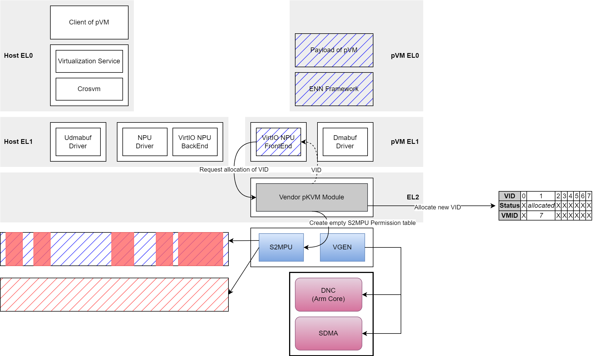
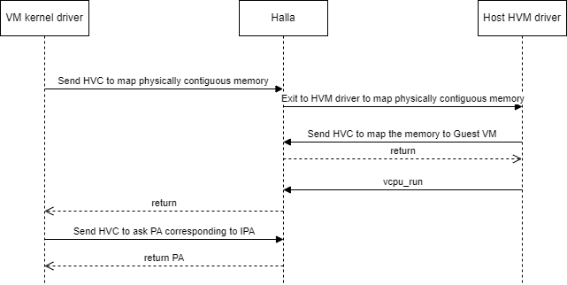
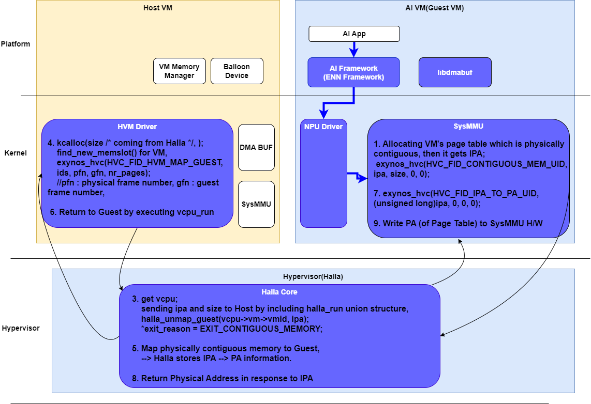
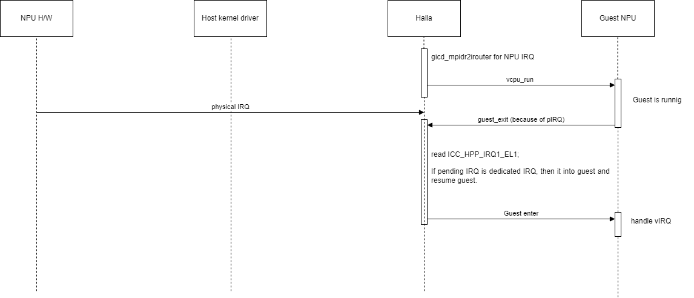
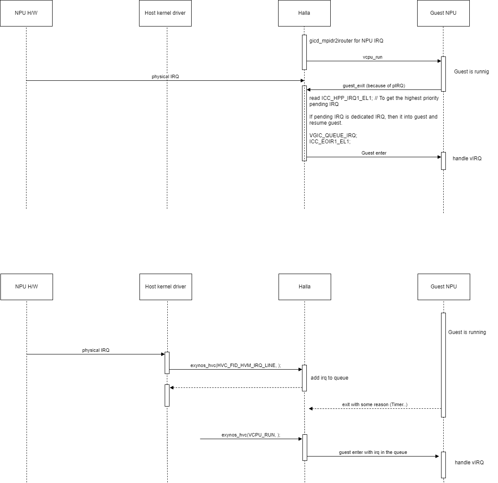

On-Device AI NPU 가상화(PV/PT 방식) 관련 Security Framework 아카이브 문서를 근거로 정리한 Q&A입니다. 출처가 있는 내용과, 아카이브에 없어 architect(Claude) 자체 분석으로 답변한 내용을 구분해서 표기했습니다.

**참고 자료 (로컬 아카이브)**
- `confluence_security_framework/` — `[5G][DU28-X] On-Device AI를 위한 Security Framework` (PV 방식, VID 기반)
- `confluence_du56x_pt_security_framework/` — `[3G][DU56-X] On-Device AI를 위한 PT 방식 기반 Security Framework`, 특히 `[3G][DU56-X-3][설계] Design Document`

---

## 1. VID를 allocation하는 이유

*출처: `confluence_security_framework` — `[5G][설계] Design Document`*

NPU(AI 가속기)를 여러 VM이 공유할 때, HW 수준에서 "지금 이 메모리 접근이 어느 VM의 요청인지" 구분하기 위해 VID(가상 ID)를 할당한다.

- NPU 자체는 VM ID(OS 레벨 식별자)를 이해하지 못하는 HW이므로, `Vendor pKVM Module`이 pVM 시작 시 **VMID ↔ VID 매핑**을 생성해 VID(0~7, 최대 8개)를 부여한다. VID `0`은 non-protected(일반 Android) NPU용으로 예약.
- NPU 동작 시 `VGEN`(HW)이 설정된 VID를 IO 요청에 실어 `S2MPU`(HW)로 전달하고, S2MPU는 그 VID에 매핑된 Access Control table을 참조해 **해당 VM에 허용된 메모리 영역만 NPU가 접근**하도록 제한한다.
- 목적: VM 단위 메모리 격리(Isolation) — 한 VM의 AI Model/데이터를 다른 VM이나 조작된 NPU FW를 통해 탈취당하지 않도록 하는 것이 이 프로젝트의 핵심 목표.
- 제약: VID가 8개로 제한되어 동시에 최대 8개 VM까지만 이 격리 기능 사용 가능 (`[5G][완료] Project Completion Report`).

*Design Document 3.1.1 "VID Allocation 과정" 절의 draw.io 다이어그램*

---

## 2. pVM에서 Physically Contiguous 메모리를 생성하는 방식

*출처: `confluence_du56x_pt_security_framework` — `[3G][DU56-X-3][설계] Design Document` 3.2절, 4.1.2.3절*

핵심 구조: **Guest VM(pVM)은 IPA만 알고, 실제 물리적으로 연속된 메모리 할당은 Host VM(HVM driver)이 대행**하며, Halla(EL2 하이퍼바이저)가 중개한다.

### 전체 시퀀스
1. Guest VM kernel driver가 필요한 IPA와 size를 Halla에 전달 (`halla_get_guest_contiguous_pa()`).
2. Halla는 해당 IPA에 대한 Guest의 기존 매핑을 Unmap하고, `exit_reason = HVM_EXIT_CONTIGUOUS_MEMORY`로 Host VM에 제어를 넘김 (VM Exit).
3. Host VM의 HVM driver가 `handle_guest_exit()`에서 이를 감지 → `kmalloc()`으로 물리적으로 연속된 메모리 할당 → `virt_to_phys()`로 PA 획득.
4. Host가 HVC call(`HVC_FID_HVM_MAP_GUEST`)로 ipa/size/PA를 Halla에 전달.
5. Halla가 새 PA를 Guest의 원래 IPA에 다시 Mapping하고 Guest로 복귀.
6. Guest는 처음 요청한 IPA를 그대로 쓰며, 이제 그 IPA는 물리적으로 연속된 실제 메모리에 매핑되어 있음.

*Design Document 3.2 "Physically Contiguous Memory Operation Design" 절의 시퀀스 다이어그램*

### 핵심 데이터 구조
`contiguous_memory` (Halla ↔ HVM 공유, `hvm_vcpu_run`의 union field): `requested_contig_ipa`(u64), `size`(u32), `error_code`(u32).

### 실제 활용 예 — SysMMU Page Table 메모리
1. Guest SysMMU Driver가 Physically Contiguous한 Page Table Memory 할당 요청
2. Host `exynos_hvm` driver가 `kcalloc`으로 할당
3. Halla가 Guest VM에 Mapping
4. Guest driver가 Mapping된 영역의 PA를 받아 SysMMU H/W 레지스터에 기록

SysMMU 같은 HW는 Page Table Base Address로 연속된 물리 메모리를 요구하지만, Guest 커널은 가상화 격리로 물리 메모리 할당자에 직접 접근할 수 없어 Host에 위임하고 Halla가 IPA-PA 매핑만 사후 연결해주는 구조.

*Design Document 4.1.2.3 "Memory Management (Physically Contiguous Memory)" 절의 다이어그램*

---

## 3. Guest VM에서 IRQ를 핸들링하는 방법

*출처: `confluence_du56x_pt_security_framework` — Design Document 3.3절, 4.1.2.2절*

### 배경 문제
기존 Exynos IRQ Handling Framework는 모든 IRQ를 Host kernel driver에서 처리. Guest VM 동작 중 NPU IRQ가 발생해도 원래는 Guest Exit → Host가 처리 → Host가 다시 Guest에 주입, 이라는 긴 경로를 거쳐야 했음.

*Design Document 3.3 "Handling VM Interrupt Operation Design" 절의 다이어그램*

### 개선된 방식 — Halla(EL2)에서 즉시 처리
1. **사전 등록**: NPU Plugin이 `exynos_plugin_guest_map_irq(vmid, int_id)`로 Guest VM이 쓸 NPU IRQ 번호를 Halla에 미리 등록 (`halla_vm` 구조체, `npu_device_irqs[IRQ_MAP_NUM]` 배열로 관리).
2. Guest VM 동작 중 IRQ 발생 → Guest Exit.
3. Halla가 `ICC_HPPIRQ1_EL1`(Highest Priority Pending Interrupt Register)을 read하여 pending IRQ 확인.
4. 등록된 NPU IRQ와 일치하면 **Host를 거치지 않고 Halla가 곧바로 Guest VM으로 Return**.
5. Guest 복귀 후 `ICC_IAR1_EL1`로 Ack → `vgic_queue_irq`로 vCPU의 vIRQ 큐 등록 → 처리 후 `ICC_EOIR1_EL1`로 EOI 통보.

핵심은 "등록된 NPU IRQ인지 여부를 Halla(EL2)가 직접 판단해 Host를 스킵하고 Guest에 즉시 되돌려주는 것" — NPU IRQ 처리 latency 절감이 목적.

*Design Document 4.1.2.2 "Exception Handler" 절의 비교 다이어그램*

### 관련 API
| API | 역할 |
|---|---|
| `exynos_plugin_guest_map_irq(vmid, int_id)` | 해당 vmid에 IRQ 번호 등록 |
| `exynos_plugin_guest_unmap_irq(vmid, int_id)` | 등록된 IRQ 번호 제거 |

둘 다 `NPU Plugin → Halla` 방향 호출. 성공 `0`, VM ID 오류 `0xF001`, IRQ 범위 초과 `-EINVAL`.

---

## 4. 왜 EL2(Halla)가 아니라 Host가 메모리를 할당하는가

> **주의**: 이 절은 아카이브 문서에 명시된 근거가 아니라, architect(Claude)의 하이퍼바이저 설계 관점 분석입니다. 실제 설계 의도는 문서에 남아있지 않아 확인 불가.

아카이브 14개 문서(Requirements Specification, Design Document, 전체 Review 회의록, Completion Report)를 모두 검토했으나, "EL2 직접 할당 vs Host 위임" 대안을 비교 검토했다는 기록은 없음. 확인된 사실:

- Requirements Specification 1.1.3.1: Halla의 역할은 "EL2 Layer 구현으로 VM에서 OS를 동작시키고, VGEN/S2MPU Control로 VM 간 Isolation을 보장"으로만 정의 — 메모리 할당 주체로 설계된 바 없음.
- SRS_PT_based_NPU_Virtualization_13: "VM 환경에서 Physically Contiguous한 Memory를 할당할 수 있게 지원해줘야 한다" — 처음부터 "Halla/Halla driver가 지원"하는 형태로만 기술.
- `[계획]` 문서 Potential Risk: "VM SysMMU Driver에서 Translation Table Mapping을 위한 Physical Address 할당을 위한 Latency (between Halla)" — 현재 방식의 latency 비용을 인지하고 있었다는 기록은 있으나 대안 검토 기록은 없음.
- Completion Report: 목표 5% 대비 실측 4.5% overhead로 성능 목표 달성 — 즉 이 latency가 실제 병목이었다는 근거는 없음.

### Claude의 분석 (일반 하이퍼바이저 설계 원칙 기반)
1. **물리 메모리 소유권은 Host에 있음**: Halla가 자체적으로 메모리를 떼어 사후 통보만 하면, Host kernel의 zone/`struct page` 정보와 실제 사용 현황이 어긋나는 이중 회계 문제 발생.
2. **EL2 코드베이스 최소화 원칙**: buddy allocator급 로직을 EL2에 넣는 것은 가장 민감한 권한 레벨의 공격 표면을 불필요하게 늘림.
3. **Contiguous 할당은 sleep 가능한 작업**: reclaim/compaction이 필요할 수 있어 EL2의 synchronous exception handler 컨텍스트에 부적합. Host의 일반 프로세스 컨텍스트에서 처리하는 게 적절.
4. 위 latency 리스크를 인지하면서도 이 구조를 채택 — "안전성/구조적 단순성 vs 약간의 latency" 트레이드오프에서 전자를 택한 것으로 추정.

---

## 5. pVM 메모리 부족 시 확장 방법 논의

> 이하 전체는 아카이브에 없는 architect의 설계 분석/제안입니다.

### 배경 질문
pVM 생성 시 지정하는 메모리 크기는 Host가 pVM에 위임(delegation)하는 메모리다. pVM 내에서 더 많은 메모리가 필요해지면 어떻게 확장할 수 있는가? (현재 구현: 4절 참조 — 필요 시마다 Halla를 거쳐 Host에 개별 요청)

### 검토한 대안들

**A. Guest RAM 자체를 처음부터 물리적으로 연속되게 백업 (가장 실용적으로 판단)**
VM 생성 시 부여하는 전체 RAM(`--mem`)을 CMA 기반으로 처음부터 통째로 물리 연속 블록으로 백업. IPA가 연속이면 선형 Stage2 매핑 하에서 그 안의 어떤 부분집합도 PA상 자동으로 연속이므로, SysMMU driver가 별도 요청 없이 자기 RAM 안에서 바로 연속 블록을 골라 쓸 수 있음. 큰 할당 비용을 부팅 시점(가장 단편화가 적은 때) 한 번만 지불 — 4절의 런타임 latency 문제가 구조적으로 사라짐. 단점은 VM에 부여하는 전체 RAM을 넉넉히 잡아야 한다는 것뿐 (기존에 이미 지정하는 값의 백업 방식만 바꾸는 것).

**B. 사전 예약 풀(정적, VM 생성 시 delegation)**
Host가 부팅 시 `reserved-memory`(CMA)로 물리 연속 영역을 미리 떼어놓고, pVM 생성 시 일반 Guest RAM과 별도의 고정 IPA 구간으로 매핑. 런타임 HVC/Host 왕복이 완전히 제거되고 EL2/Host 코드 경로가 단순해짐. 단점: 정적 사이징 문제(모델 크기가 가변적이라 미리 정하기 어려움), 사용 안 할 때도 다른 용도로 재활용 불가(단, C 참조 — CMA는 실제로는 유휴 시 movable 페이지로 재활용되다 필요 시 migration되므로 완전한 낭비는 아님), 다중 pVM 확장 시 합산 낭비.

**C. CMA의 "유휴 시 재활용, 필요 시 migration" 특성**
Linux CMA는 예약된 영역이 비어있을 때 일반 movable 페이지로 쓰이다가, 소유자가 `cma_alloc()`을 호출하면 그 안의 페이지들을 다른 곳으로 migration시켜 비워준 뒤 연속 블록을 넘겨준다 — "필요할 때 강제로 회수"를 이미 구현해놓은 표준 메커니즘. 단, 미리 정한 CMA 영역 내에서만 동작.

**D. 동적 메모리 hotplug (virtio-mem류) — 사용자가 제안한 "필요 시 강제로 뺏어와 VM 크기를 늘리는" 방식**
큰 요청이 발생하는 시점에 Host 메모리를 강제로 회수해 Guest IPA 공간에 새 영역으로 영구 편입, VM의 총 메모리 크기 자체를 늘림. 이후 요청은 Guest 내부에서 로컬로 sub-allocation.
- 장점: Host 왕복 비용을 요청마다가 아니라 hot-add 이벤트당 1회로 상각. 프로젝트 목표(Host 의존도 최소화)와 방향이 맞음.
- 단점(치명적):
  - "강제 회수" 자체는 이미 Host allocator의 kmalloc 내부에서 일어나는 일이라 새로운 능력이 아니고, 한 번에 크게 요청하면 그 순간의 reclaim 비용은 더 커질 수 있음(지연을 없애는 게 아니라 몰아서 지불).
  - Contiguity 문제 자체는 해결 안 됨 — hot-add된 풀을 Guest가 내부에서 계속 쪼개 쓰면 Guest 쪽에서 다시 단편화됨 (전용으로만 쓰면 사실상 B와 동일, 다만 지연 트리거).
  - **회수(hot-unplug) 문제**: Host가 나중에 되돌려 받으려면 Guest의 협조가 필요한데, 이 pVM은 격리·보호 대상이지 신뢰할 협력자가 아님. 오동작/공격받은 Guest가 반환을 거부하면 Host는 VM을 통째로 죽이는 것 외엔 회수 수단이 없음 — **DoS 벡터**.
  - 버퍼 단위(NCP/NCP_COPY/IOFM/IMB) Access Control 정밀도 약화 — 큰 풀을 통째로 넘기면 세밀한 권한 관리가 어려워지거나, 세밀하게 하려면 내부 sub-allocation마다 다시 Host/Halla에 알려야 해서 왕복 이득이 사라짐.
  - Guest 커널에 `CONFIG_MEMORY_HOTPLUG` 등 무거운 기능 필요 — 이 프로젝트가 추구하는 "최소화된 Guest(Microdroid)로 TCB를 줄이는" 방향과 역행.

**E. Ballooning으로 Guest 미사용 메모리를 Host에 반환**
`virtio-balloon`으로 Guest가 안 쓰는 페이지를 Host에 돌려줘 Host 전체의 여유를 늘림 — pVM 자신의 메모리를 늘리는 게 아니라 Host의 메모리 압박을 줄여 다른 요청의 성공률/속도를 간접적으로 높이는 방법.
- **inflate/deflate는 실제로 양방향**이지만, **VM 생성 시 정해진 원래 메모리 크기(IPA 범위) 안에서만** 동작 — deflate로 "돌려받는" 것도 원래 몫 중 잠시 내줬던 걸 되받는 것뿐이라, 원래 할당량을 초과하는 요청(D의 문제)은 해결하지 못함.
- D(hotplug)와 비용이 비슷하지 않음 — balloon은 `alloc_page`/`free_page` + virtio 알림뿐인 가벼운 기존 메커니즘이고, 반환도 그냥 페이지를 풀어주면 끝(migration 불필요). Hotplug는 새 physical range를 zone에 등록하는 무거운 서브시스템이 필요하고, 특히 unplug(제거)는 해당 영역 위 데이터를 migration해야 하는 어려운 작업(virtio-mem이 옛 ACPI hotplug remove의 이 문제를 풀기 위해 만들어진 것). 또한 balloon으로 돌려받는 페이지들은 물리적으로 이어져 있다는 보장이 없어 contiguity 문제는 애초에 풀지 못함.

**F. 사전/주기적 Compaction**
Host의 `kcompactd`처럼 평소에 백그라운드로 메모리를 정리해 연속 블록 확보 확률을 높이는 보조 기법. 근본적 구조 변경은 아니고 요청 성공률/속도 개선용.

**G. 연속성 요구 자체를 완화 (구조적 해법)**
SysMMU가 정말 하나의 큰 연속 블록을 요구하는지 재검토. Multi-level page table이나 scatter-gather(IOVA) 방식이 HW적으로 가능하다면, 큰 블록 하나 대신 구하기 쉬운 작은 연속 블록 여러 개를 체인으로 엮어 문제의 크기 자체를 줄이는 접근. HW 스펙 확인이 필요하지만 유일하게 근본 원인을 건드리는 방법.

**H. zram/swap으로 Host 실질 가용량 증대**
Contiguity를 직접 풀어주진 않지만 전반적인 메모리 부족을 완화하는 범용 대응.

**I. VM 재기동 (fallback)**
런타임 확장이 리스크가 크다고 판단되면 pVM을 더 큰 `--mem`으로 재생성. 구현은 단순하고, 런타임에 몰래 확장되는 경로가 없다는 보안상 이점도 있음.

### 종합 판단
이 프로젝트는 **AI 모델/데이터를 Host로부터도 격리·보호하는 것이 핵심 목표**인 보안 프레임워크이므로:
- D(동적 hotplug)는 latency 이득보다 Host의 메모리 회수 불가 시 DoS 위험, 버퍼 단위 보호 정밀도 약화, Guest TCB 증가라는 대가가 커서 이 프로젝트 맥락에는 부적합해 보임.
- 가장 현실적인 개선안은 **A(Guest RAM 자체를 CMA로 백업)** — 기존 요청/응답 경로를 새로 만들지 않고, 이미 있는 초기 RAM 할당 방식만 바꿔서 런타임 latency를 구조적으로 제거할 수 있음.
- SysMMU Page Table처럼 상대적으로 크기가 예측 가능한 용도에는 B/C(작은 전용 CMA 풀)와 A를 병행하는 것도 합리적.

이 5절 전체는 architect의 설계 분석이며, 실제 팀에서 검토된 적이 있는지는 문서에 없으므로 채택 여부는 Halla/SysMMU driver 담당자(최근홍 등) 및 Design Document 작성자(차동현)와 별도 확인이 필요합니다.
