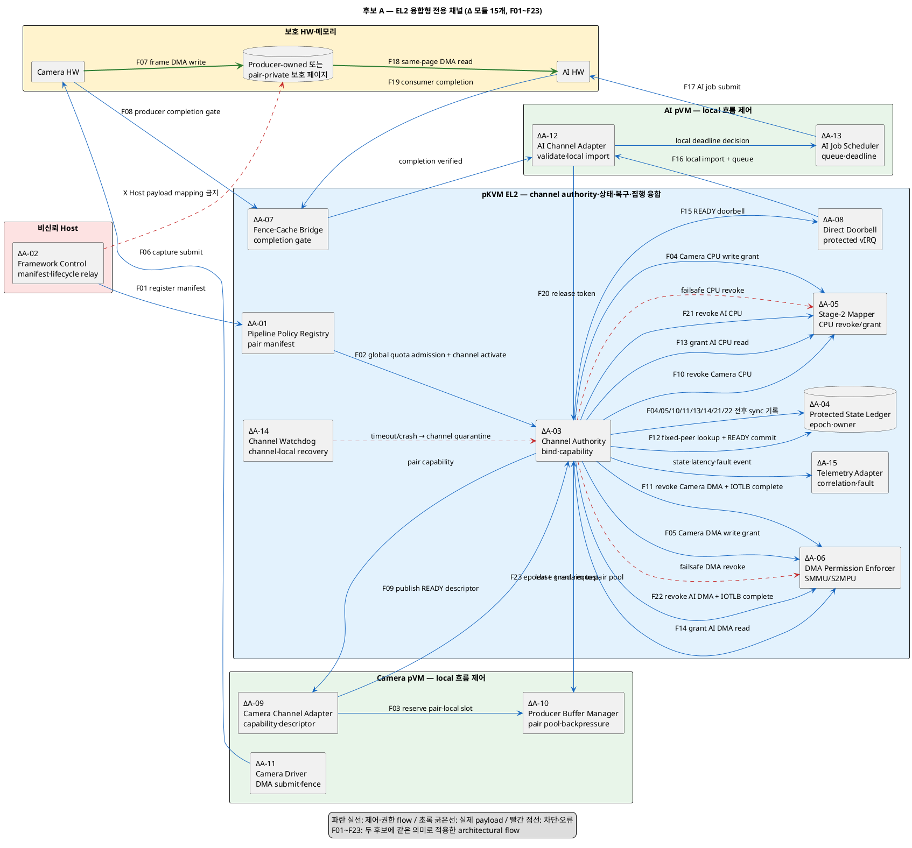
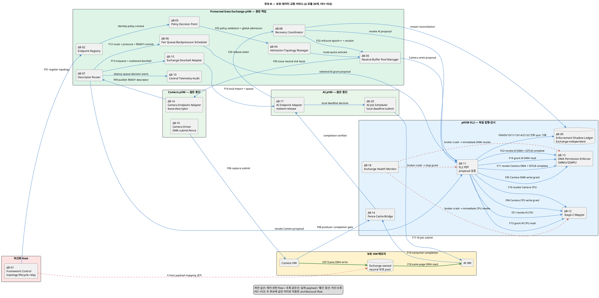

# 문제 1 후보 구조 상세 설계

## 1. 재설계 결론

기존의 `프레임별 페이지 전달`과 `공유 버퍼 풀`은 메모리 할당·매핑 방식의 차이이며, 그 자체로는 시스템 전체의
책임 배치와 장애 전파 범위를 결정하지 않는다. 따라서 두 방식은 상위 후보에서 제외하지 않고 **하위 메모리 전술**로
내린다.

이 문서의 상위 결정 질문은 다음과 같다.

> Camera→AI 보호 데이터 경로의 최종 채널 authority와 상태·복구 조정을 EL2에 융합할 것인가,
> 아니면 별도의 보호 데이터 교환 pVM에 위임하고 EL2는 독립 enforcement와 failsafe만 담당하게 할 것인가?

재구성한 후보는 정확히 두 개다.

| 후보 | 구조 결정 | 결정으로 달라지는 모듈 | 표준 E2E flow |
|---|---|---:|---:|
| A. EL2 융합형 전용 채널 | EL2가 pair별 정책·상태·복구 authority를 소유하고 pVM 종단은 local 흐름 제어를 담당한다. | 15개 | 23개 |
| B. 보호 데이터 교환 서비스 | 독립 Data Exchange pVM이 정책·풀·라우팅·흐름 제어·복구를 소유하고 EL2는 PEP·failsafe를 담당한다. | 20개 | 23개 |

두 후보는 단순 호출 경로나 자료구조만 다르지 않다. 최종 channel authority, 보호 메모리 소유자, 신뢰 경계, 장애 영향 범위,
신규 pVM 연결 방법과 운영 관측 지점이 달라진다.

## 2. 공통 범위와 불변조건

### 2.1 공통 시스템 범위

- 송신자: Secure Camera pVM과 Camera HW
- 수신자: Secure AI pVM과 AI HW
- 비신뢰 영역: Host Linux, Host Framework, Host daemon
- 최종 권한 집행자: pKVM EL2와 SMMU/S2MPU
- 전달 대상: 1080p RGB24 기준 약 6.22 MB/frame, 30 fps 기준 약 186.6 MB/s의 영상 payload
- 기존 상위 요구 추적: `FR-05`, `VOS-01`, `VOS-09`, `QS-01`, `QS-02`, `QS-04`, `QS-06`, `QS-07`

### 2.2 두 후보가 모두 지켜야 하는 gate

1. 정상 경로의 실제 프레임 `memcpy`는 0회여야 한다.
2. Host가 payload 페이지를 매핑하거나 읽을 수 있는 횟수는 0회여야 한다.
3. 허가되지 않은 pVM과 HW의 CPU·DMA 접근은 100% 차단해야 한다.
4. Camera 쓰기 권한 회수 완료 전 AI 읽기 권한을 열지 않는다.
5. CPU Stage-2와 SMMU/S2MPU 권한을 하나의 버퍼 상태 전이에 맞춰 변경한다.
6. owner, access mode, `pipeline_epoch`, `slot_epoch`, `job_seq`를 보호 원장에 기록한다.
7. fence 완료, cache 동기화와 IOTLB invalidation 완료를 다음 상태 진입 조건으로 둔다.
8. timeout, stale token, 중복 반환 또는 pVM 종료 시 fail-closed하고 버퍼를 격리·회수한다.
9. 보호 메모리는 상한을 가지며, 고갈 시 무한 할당 대신 backpressure 또는 승인된 drop 정책을 적용한다.
10. 신규 pVM 쌍은 endpoint·policy 등록으로 추가하며 Host Framework 코어의 분기 코드를 수정하지 않는다.

### 2.3 공통 상태 불변식

```text
FREE → CAMERA_WRITE → REVOKING_CAMERA → READY
     → AI_READ → REVOKING_AI → RECLAIMING → FREE
                         └─ 오류/시간 초과 ─▶ QUARANTINED

불변식 A: CAMERA_WRITE와 AI_READ가 동시에 활성화되지 않는다.
불변식 B: READY 진입 전 producer fence와 Camera CPU·DMA revoke가 완료된다.
불변식 C: 다음 slot_epoch 발급 전 AI CPU·DMA revoke와 정합성 검증이 완료된다.
불변식 D: 모든 CPU·DMA grant/revoke는 보호 원장에 intent를 먼저 기록하고, 집행 완료 응답 뒤 결과를 기록한다.
          crash 복구 시 intent, 완료 기록과 실제 Stage-2/SMMU 상태를 대조한다.
```

### 2.4 flow 계수 규칙

번호가 붙은 flow는 **모듈 간 제어·데이터·상태 책임이 이동하고, 수신 모듈의 완료가 다음 단계의 선행조건이 되는
architectural interaction 1개**다. 단순 함수 호출 수나 화살표 수를 늘려 세지 않는다. 두 후보 모두 아래의 같은
23개 의미 단계로 비교한다.

```text
등록 → admission → slot lease → Camera CPU grant → Camera DMA grant → capture submit
→ frame write → producer completion → READY publish → Camera CPU revoke → Camera DMA revoke
→ route/READY commit → AI CPU grant → AI DMA grant → notify → import/queue → AI submit
→ frame read → consumer completion → release → AI CPU revoke → AI DMA revoke → reclaim
```

## 3. 후보 A — EL2 융합형 전용 채널

### 3.1 구조적 핵심

Camera pVM과 AI pVM에 `Secure Channel Adapter`를 두고, Camera–AI 쌍마다 pair-private descriptor ring과
epoch capability를 만든다. Camera pVM이 producer pool의 수명과 local backpressure를, AI pVM이 import와 local
소비 순서를 담당한다. EL2의 Channel Authority가 최종 정책 판정, 보호 상태 원장, timeout 복구 transaction과
Stage-2·SMMU 권한 집행을 함께 소유한다.

정상 프레임마다 별도 service pVM이 라우팅·스케줄링하지 않는다. 신규 pVM 쌍은 EL2에 새 전용 채널과 quota를 생성해 확장한다.
한 채널의 ring 또는 종단 장애가 다른 채널의 상태를 직접 오염시키지 않는 것이 핵심이다.

기존 `프레임별 페이지 전달`은 producer pool의 페이지 lease 구현으로, `사전 등록 풀`은 pair-private pool의 슬롯
lease 구현으로 사용할 수 있다. 어느 것을 택할지는 후보 A 내부의 하위 결정이다.

### 3.2 구조결정으로 영향을 받는 모듈 15개

`Δ` 표시는 이 후보 선택 때문에 책임, 인터페이스 또는 실행 위치가 달라지는 모듈이다.

| ID | 모듈 / 실행 위치 | 후보 A에서 달라지는 책임 |
|---|---|---|
| ΔA-01 | Pipeline Policy Registry / EL2 보호 메타데이터 | pVM 쌍, 방향, quota, 만료와 허용 형식을 채널 manifest로 보관한다. |
| ΔA-02 | Host Framework Control / Host EL1·비신뢰 | manifest와 lifecycle 요청만 전달하고 frame fast path에서 빠진다. |
| ΔA-03 | EL2 Channel Authority / EL2 | 채널 생성·폐기, endpoint bind, epoch capability 발급과 상태 전이 검증을 담당한다. |
| ΔA-04 | Protected State Ledger / EL2 | 채널별 owner·epoch·job과 모든 grant/revoke의 write-ahead intent·집행 완료를 동기 기록한다. |
| ΔA-05 | Stage-2 Mapper / EL2 | 채널·슬롯 단위로 pVM CPU 접근권을 회수·부여한다. |
| ΔA-06 | DMA Permission Enforcer / EL2+SMMU/S2MPU | Camera/AI StreamID의 DMA 접근권을 슬롯 상태에 맞춰 전환한다. |
| ΔA-07 | Fence·Cache Bridge / EL2+guest adapter | producer/consumer fence, cache와 IOTLB 완료를 상태 전이와 결합한다. |
| ΔA-08 | Direct Doorbell / EL2 virtual IRQ | Host relay 없이 READY/COMPLETION event를 상대 pVM에 전달한다. |
| ΔA-09 | Camera Channel Adapter / Camera pVM | capability 사용, descriptor 발행, freeze와 timeout 처리를 수행한다. |
| ΔA-10 | Producer Buffer Manager / Camera pVM | 채널 전용 pool 수명, free-list, quota와 생산자 backpressure를 관리한다. |
| ΔA-11 | Camera Driver / Camera pVM | lease된 슬롯에만 DMA를 제출하고 producer fence를 발행한다. |
| ΔA-12 | AI Channel Adapter / AI pVM | descriptor 검증, local proxy import, stale token 거부와 release를 담당한다. |
| ΔA-13 | AI Job Scheduler / AI pVM | 입력 queue와 deadline을 기준으로 소비 순서와 consumer backpressure를 관리한다. |
| ΔA-14 | Channel Watchdog / EL2 | 채널별 timeout·pVM 종료를 감지하고 Channel Authority의 격리·회수를 trigger한다. |
| ΔA-15 | Channel Telemetry Adapter / 양 pVM+EL2 | 채널별 latency, queue depth, revoke와 fault event를 상관 ID로 기록한다. |

Camera HW, AI HW와 보호 물리 메모리는 실행 구성요소이지만 위 15개 변경 모듈 수에는 포함하지 않았다.

### 3.3 구조 및 23개 flow 다이어그램

두 후보 다이어그램은 왼쪽에서 오른쪽으로 `제어 설정 → 생산 → 권한 전환 → 소비 → 회수`의 같은 관점을 사용한다.



### 3.4 정상 flow 23단계

| Flow | 주체 | 동작과 완료 조건 |
|---|---|---|
| F01 | Host Framework → Policy Registry | 검증 대상인 pipeline manifest를 제안한다. Host 입력만으로 권한을 열지 않는다. |
| F02 | Registry → Channel Authority | endpoint 신원·정책을 검증하고 모든 pair quota 합이 전역 보호 메모리 상한 이내일 때 채널을 활성화한다. |
| F03 | Camera Adapter → Producer Buffer Manager | pair capability 범위에서 free slot을 예약한다. local pool 고갈 시 생산자를 늦추거나 승인된 drop 정책을 쓴다. |
| F04 | Channel Authority → Stage-2 Mapper | Camera pVM에 해당 세대의 CPU write lease만 연다. |
| F05 | Channel Authority → DMA Enforcer | Camera StreamID에 같은 슬롯의 DMA write lease만 연다. |
| F06 | Camera Driver → Camera HW | 슬롯 범위와 job sequence가 결합된 capture job을 제출한다. |
| F07 | Camera HW → 보호 페이지 | 실제 frame을 DMA write한다. payload는 Host나 다른 페이지를 거치지 않는다. |
| F08 | Camera HW → Fence·Cache Bridge | producer fence를 완료한다. bridge는 cache·DMA 완료를 확인한다. |
| F09 | Camera Adapter → Channel Authority | descriptor와 `pipeline_epoch + slot_epoch + job_seq`를 발행한다. |
| F10 | Channel Authority → Stage-2 Mapper | token·owner·fence 검증 후 Camera CPU 권한을 회수한다. |
| F11 | Channel Authority → DMA Enforcer | Camera DMA 권한과 IOTLB를 회수하고 완료를 기다린다. |
| F12 | Channel Authority → Protected State Ledger | capability에 고정된 AI peer를 확인한 뒤 READY 상태를 commit한다. |
| F13 | Channel Authority → Stage-2 Mapper | AI pVM에 같은 물리 페이지의 CPU read lease를 연다. |
| F14 | Channel Authority → DMA Enforcer | AI StreamID에 필요한 DMA read lease만 연다. |
| F15 | Channel Authority → Direct Doorbell | CPU·DMA grant 완료 뒤에만 READY event를 보낸다. |
| F16 | Direct Doorbell → AI Adapter | local proxy handle을 활성화하고 stale descriptor를 거부해 local queue에 넣는다. |
| F17 | AI Job Scheduler → AI HW | local deadline 정책에 따라 추론 job을 제출한다. |
| F18 | 보호 페이지 → AI HW | AI HW가 같은 물리 페이지를 DMA read한다. |
| F19 | AI HW → Fence·Cache Bridge | consumer completion과 장치 정지를 확인한다. |
| F20 | AI Adapter → Channel Authority | 완료된 세대의 release token을 제출한다. |
| F21 | Channel Authority → Stage-2 Mapper | AI pVM의 CPU read lease를 회수한다. |
| F22 | Channel Authority → DMA Enforcer | AI DMA lease와 IOTLB를 회수하고 완료를 기다린다. |
| F23 | Channel Authority → Producer Buffer Manager | ledger의 epoch를 증가시키고 정합성이 확인된 슬롯만 pair pool로 반환한다. |

### 3.5 장애·확장 flow

- **Camera timeout:** Channel Watchdog가 감지해 Channel Authority에 회수를 요청하고, Authority가 해당 채널의
  Camera CPU/DMA 권한만 회수한 뒤 슬롯을 `QUARANTINED`로 둔다.
- **AI pVM crash:** EL2가 AI lease를 강제 회수한 후 정합성이 확인된 페이지만 원 producer pool로 돌려보낸다.
- **stale/duplicate token:** Protected State Ledger가 세대 불일치 요청을 거부하며 현재 owner와 매핑은 바꾸지 않는다.
- **신규 AI pVM 추가:** 새 endpoint manifest, pair capability, private ring과 quota를 만든다. 기존 채널의 fast path는 유지된다.
- **채널별 과부하:** Camera 쪽 Buffer Manager와 AI Scheduler가 pair-local pressure를 처리하므로 다른 pair로 직접 전파되지 않는다.

### 3.6 장점과 단점

장점:

- 정상 frame 경로에서 중앙 service pVM scheduling과 추가 VM exit를 제거할 수 있다.
- 채널별 상태·ring·quota가 분리돼 한 pVM 쌍의 장애와 과부하를 국소화하기 쉽다.
- Camera와 AI 도메인이 자신의 driver/fence 의미를 직접 처리해 중앙 broker의 HW별 parser를 줄일 수 있다.
- pair-private 자원으로 최소 권한과 데이터 노출 범위를 설명하기 쉽다.

단점:

- 모든 Camera/AI pVM에 공통 protocol adapter, recovery와 telemetry 연동을 구현해야 한다.
- pVM 쌍이 늘면 채널, ring, capability와 reserved quota가 관계 수에 비례해 증가할 수 있다.
- 양 종단의 local 상태와 EL2 authoritative state를 함께 검증해야 하므로 protocol correctness와 버전 호환 시험이 어렵다.
- EL2 direct doorbell, protected ledger와 강제 회수 ABI의 실현 가능성을 확인해야 한다.

### 3.7 후보 A의 하위 결정

- producer-owned dynamic page lease vs pair-private pre-registered pool
- per-frame HVC vs setup-time epoch capability와 batched permission flip
- interrupt per frame vs empty→nonempty event suppression vs adaptive polling
- Camera 우선 block vs latest-frame drop vs deadline 기반 drop 정책
- guest local proxy DMA-BUF 생성 방식과 fence translation 방식

## 4. 후보 B — 보호 데이터 교환 서비스

### 4.1 구조적 핵심

Camera/AI pVM과 독립된 `Protected Data Exchange pVM`이 endpoint registry, neutral buffer pool, admission,
routing, backpressure, recovery transaction과 telemetry를 소유한다. 각 workload에는 얇은 endpoint adapter만 두며,
정책과 상태 기계는 Exchange pVM에서 한 번 구현한다. EL2 PEP(Policy Enforcement Point)는 Exchange pVM의 요청도
검증하고 실제 Stage-2·SMMU/S2MPU 권한만 집행한다.

Exchange pVM은 기본적으로 descriptor와 상태만 보고 payload를 CPU mapping하지 않는 **metadata-only broker**다.
payload inspection이나 CPU copy는 zero-copy·최소 TCB 조건과 충돌하므로 이 후보의 정상 경로에 포함하지 않는다.

기존 `공유 버퍼 풀`은 neutral pool의 구현 전술로 사용한다. 동적 page donation도 가능하지만, 어느 경우든 pool의
논리적 수명과 회수 책임은 endpoint pVM이 아니라 Exchange pVM에 있다.

### 4.2 구조결정으로 영향을 받는 모듈 20개

| ID | 모듈 / 실행 위치 | 후보 B에서 달라지는 책임 |
|---|---|---|
| ΔB-01 | Host Framework Control / Host EL1·비신뢰 | topology·정책·lifecycle 요청만 Exchange API로 전달한다. |
| ΔB-02 | Exchange Endpoint Registry / Exchange pVM | attested endpoint, format, policy version과 연결 관계를 중앙 등록한다. |
| ΔB-03 | Policy Decision Point / Exchange pVM | 송수신 권한, 세대, quota와 drop policy를 판정한다. |
| ΔB-04 | Admission·Topology Manager / Exchange pVM | 신규 pipeline의 자원 예약 가능성과 routing graph를 관리한다. |
| ΔB-05 | Neutral Buffer Pool Manager / Exchange pVM | pVM 수명과 독립된 보호 pool, slot lease와 free-list를 소유한다. |
| ΔB-06 | Fair Queue·Backpressure Scheduler / Exchange pVM | 여러 producer/consumer의 우선순위, deadline, quota와 pressure 전파를 조정한다. |
| ΔB-07 | Descriptor Router / Exchange pVM | READY frame을 정책에 맞는 AI endpoint queue로 전달한다. |
| ΔB-08 | Recovery Coordinator / Exchange pVM | endpoint timeout·종료를 회수하고, Exchange 재기동 뒤 EL2 원장과 논리 상태를 재조정한다. |
| ΔB-09 | Enforcement Shadow Ledger / EL2 보호 메모리 | Exchange 수명과 독립적으로 owner·epoch와 모든 grant/revoke의 intent·집행 완료를 동기 기록한다. |
| ΔB-10 | Central Telemetry·Audit / Exchange pVM | 모든 pipeline의 latency, pressure, policy decision과 fault를 한 지점에서 수집한다. |
| ΔB-11 | EL2 PEP / EL2 | Exchange의 요청과 실제 owner·mapping을 대조하고 우회 요청을 차단한다. |
| ΔB-12 | Stage-2 Mapper / EL2 | neutral slot별 pVM CPU lease를 회수·부여한다. |
| ΔB-13 | DMA Permission Enforcer / EL2+SMMU/S2MPU | neutral slot과 StreamID의 DMA lease를 전환한다. |
| ΔB-14 | Fence·Cache Bridge / EL2+Exchange pVM | 장치 completion과 cache·IOTLB 완료를 broker transaction에 join한다. |
| ΔB-15 | Exchange Doorbell Adapter / Exchange pVM+EL2 | 여러 endpoint의 event coalescing과 wake-up을 관리한다. |
| ΔB-16 | Camera Endpoint Adapter / Camera pVM | 중앙 slot lease 요청, capture descriptor와 completion만 교환한다. |
| ΔB-17 | AI Endpoint Adapter / AI pVM | 중앙 queue에서 local proxy를 redeem하고 release한다. |
| ΔB-18 | Exchange Health Monitor / 독립 EL2 watchdog | service pVM 정지 감지, 신규 grant 차단과 전체 in-flight 격리를 시작한다. |
| ΔB-19 | Camera Driver / Camera pVM | Exchange가 발급한 token 범위에만 capture DMA를 제출하고 fence를 연결한다. |
| ΔB-20 | AI Job Scheduler / AI pVM | Exchange route 결과를 local deadline과 자원 상태에 맞춰 제출하고 완료를 연결한다. |

Camera HW, AI HW와 neutral 보호 메모리는 실행 구성요소이지만 위 20개 변경 모듈 수에는 포함하지 않았다.

### 4.3 구조 및 23개 flow 다이어그램



### 4.4 정상 flow 23단계

| Flow | 주체 | 동작과 완료 조건 |
|---|---|---|
| F01 | Host Framework → Endpoint Registry | topology, endpoint와 policy 요청을 전달한다. Host 입력만으로 권한을 열지 않는다. |
| F02 | Registry·PDP → Admission·Topology Manager | endpoint 신원·정책을 검증하고 모든 quota 합이 전역 pool 상한 이내일 때 route를 활성화한다. |
| F03 | Pool Manager → Camera Adapter | neutral slot token, 범위와 deadline을 발급한다. |
| F04 | EL2 PEP → Stage-2 Mapper | 실제 endpoint·epoch·owner 검증 후 Camera CPU write를 연다. |
| F05 | EL2 PEP → DMA Enforcer | Camera StreamID에 같은 슬롯의 DMA write만 연다. |
| F06 | Camera Driver → Camera HW | token에 묶인 capture job을 제출한다. |
| F07 | Camera HW → neutral pool | Exchange-owned slot에 실제 frame을 DMA write한다. |
| F08 | Camera HW → Fence·Cache Bridge | producer completion을 알리고 cache·DMA 완료를 확인한다. |
| F09 | Camera Adapter → Descriptor Router | READY descriptor를 중앙 queue에 publish한다. |
| F10 | EL2 PEP → Stage-2 Mapper | Router 제안을 실제 상태와 대조한 뒤 Camera CPU 권한을 회수한다. |
| F11 | EL2 PEP → DMA Enforcer | Camera DMA 권한과 IOTLB를 회수하고 완료를 기다린다. |
| F12 | Router → Fair Queue Scheduler | route, deadline, quota와 consumer pressure를 판정한 뒤 READY를 commit한다. |
| F13 | EL2 PEP → Stage-2 Mapper | 선택된 AI pVM에 같은 물리 페이지의 CPU read lease를 연다. |
| F14 | EL2 PEP → DMA Enforcer | 선택된 AI StreamID에 필요한 DMA read lease만 연다. |
| F15 | Router → Exchange Doorbell Adapter | queue commit 뒤 coalesced READY event를 보낸다. |
| F16 | Doorbell Adapter → AI Adapter | local proxy handle을 redeem하고 local queue에 넣는다. |
| F17 | AI Job Scheduler → AI HW | local deadline 정책에 따라 추론 job을 제출한다. |
| F18 | neutral pool → AI HW | AI HW가 같은 물리 페이지를 DMA read한다. |
| F19 | AI HW → Fence·Cache Bridge | consumer completion과 장치 정지를 확인한다. |
| F20 | AI Adapter → Recovery Coordinator | 완료된 세대의 release token을 제출한다. |
| F21 | Recovery Coordinator·PEP → Stage-2 Mapper | PEP 검증 뒤 AI pVM의 CPU read lease를 회수한다. |
| F22 | Recovery Coordinator·PEP → DMA Enforcer | PEP 검증 뒤 AI DMA lease와 IOTLB를 회수하고 완료를 기다린다. |
| F23 | Recovery Coordinator → Pool Manager | shadow ledger 대조, refcount·epoch 증가와 scrub 확인 후 FREE로 만든다. |

### 4.5 장애·확장 flow

- **Camera/AI timeout:** Recovery Coordinator가 EL2 shadow ledger와 자신의 logical state를 대조해 해당 slot의 모든
  lease를 회수하고 route를 재조정한다.
- **Exchange pVM crash:** 독립 EL2 Health Monitor가 신규 grant를 막고 Stage-2/SMMU에서 모든 in-flight slot을 즉시
  무권한 격리한다. Exchange 재기동 뒤에만 Recovery Coordinator가 Exchange 수명과 독립된 EL2 shadow ledger와 실제
  mapping을 대조한다. 안전하게 재구성할 수 없는 slot은 폐기하며, 이 reconciliation은 필수 PoC gate다.
- **권한 전환 중 crash:** EL2는 shadow ledger의 write-ahead intent·완료 기록과 실제 Stage-2/SMMU 상태를 비교해
  미완료 전이를 `QUARANTINED`로 수렴시킨 뒤에만 Exchange 재연결을 허용한다.
- **pool 고갈:** Fair Queue Scheduler가 endpoint quota, priority와 deadline 정책에 따라 pressure를 생산자까지 전파한다.
- **신규 AI pVM 추가:** Registry에 endpoint와 format capability를 등록하고 Topology Manager가 route를 추가한다. 기존 Camera
  또는 AI workload module은 수정하지 않는다.
- **서비스 업그레이드:** 모든 endpoint protocol과 state journal의 backward compatibility, drain과 rollback 절차가 필요하다.

### 4.6 장점과 단점

장점:

- 정책, routing, quota, backpressure, 복구와 관측을 한 보호 서비스에 모아 모든 workload에 동일하게 적용할 수 있다.
- 신규 pVM과 N:M 연결을 endpoint·route 데이터 등록으로 추가하므로 관계 수가 늘어날 때 중복 코드를 줄일 수 있다.
- pVM 수명과 독립된 neutral pool을 사용해 endpoint 종료 후 자원 탐색과 회수 절차를 중앙화할 수 있다.
- EL2에는 bounded PEP와 매핑 집행만 두고 복잡한 scheduling·policy parser를 별도 보호 도메인에 둘 수 있다.

단점:

- Exchange pVM이 모든 pipeline의 공용 latency hop, 병목과 장애 영향 지점이 된다.
- metadata-only라도 policy와 전체 channel topology를 보는 새 trusted domain과 상주 vCPU·메모리가 필요하다.
- broker crash 시 모든 in-flight slot을 안전하게 재구성하는 journal·EL2 reconciliation protocol이 복잡하다.
- 중앙 queue의 우선순위 역전, noisy neighbor와 head-of-line blocking을 막는 공정성 검증이 필요하다.

### 4.7 후보 B의 하위 결정

- metadata-only broker 유지 vs payload inspection 허용 여부 — 후자는 별도 보안·성능 DP로 분리
- 고정 neutral pre-pool vs 동적 protected page donation
- single active Exchange pVM vs active-standby와 journal replication
- per-endpoint queue vs class-based fair queue, deadline/drop 정책
- per-frame doorbell vs batch/event coalescing vs adaptive polling

## 5. 두 후보의 구조 차이

### 5.1 책임·소유권 비교

| 영향 영역 | 후보 A: EL2 융합형 전용 채널 | 후보 B: 보호 데이터 교환 서비스 |
|---|---|---|
| 최종 channel authority | EL2 Channel Authority | Exchange PDP·Topology·Recovery; EL2는 독립 PEP·failsafe |
| 채널 상태 소유 | EL2 ledger가 pair별 authoritative state 소유 | Exchange가 logical state, EL2 shadow ledger가 enforce state 소유 |
| 보호 메모리 수명 | producer 또는 pair channel 수명에 결합 | endpoint와 독립된 Exchange 수명에 결합 |
| policy 판정 | setup 시 EL2 Channel Authority가 pair manifest 판정 | Exchange PDP가 매 admission/route를 판정, EL2 PEP가 재검증 |
| 정상 frame scheduling | Camera Buffer Manager와 AI Scheduler에 분산 | 중앙 Fair Queue Scheduler가 조정 |
| backpressure 범위 | pair-local, producer가 우선 처리 | 전역 quota·priority를 보고 중앙 전파 |
| routing | capability에 고정된 1:1 전용 channel | 중앙 topology에 따라 1:1 또는 N:M route |
| 장애 회수 | EL2 watchdog·Authority가 채널 단위 격리·회수 | 정상 endpoint fault는 Exchange가, broker fault는 EL2가 즉시 격리 |
| 장애 영향 범위 | 기본적으로 해당 pair | broker/queue 장애 시 다수 pipeline |
| 관측성 | 채널별 telemetry를 집계해야 함 | 중앙에서 E2E correlation 가능 |
| 신규 pVM 추가 | pair channel·ring·quota 추가 | endpoint 등록·route·quota 추가 |
| TCB 변화 | 각 pVM adapter와 EL2 channel ABI 증가 | Exchange pVM TCB 추가, EL2는 bounded PEP 유지 |
| 성능 비용 중심 | per-channel HVC/permission flip/doorbell | service pVM scheduling/queue/permission flip |
| 자원 비용 중심 | 관계 수에 따른 ring·reserved quota | 중앙 pool 상시 예약과 service vCPU |
| 업그레이드 위험 | endpoint protocol version 조합 증가 | 중앙 service upgrade가 전체 pipeline에 영향 |

### 5.2 같은 사건이 바꾸는 E2E flow

| 사건 | 후보 A에서의 flow | 후보 B에서의 flow |
|---|---|---|
| pipeline 생성 | EL2가 pair capability와 private ring 생성 | Exchange가 admission 후 route·quota·pool 생성 |
| slot 획득 | Camera local Buffer Manager가 예약 | Exchange Pool Manager가 neutral slot lease |
| 생산 허용 | pair ledger 기준으로 Camera 권한 grant | Exchange proposal을 EL2 PEP가 검증 후 grant |
| READY 발행 | Camera가 pair ring에 직접 publish | Camera가 중앙 Router queue에 publish |
| Camera 권한 회수 | Channel Authority가 pair 상태로 실행 | Scheduler transaction을 EL2 PEP가 검증해 실행 |
| AI 선택 | setup 때 capability에 고정 | Router가 topology·pressure로 선택 |
| AI 깨우기 | direct protected doorbell | Exchange가 queue commit 후 coalesced doorbell |
| 소비 순서 | AI local scheduler가 결정 | 중앙 scheduler와 AI local scheduler가 계층적으로 결정 |
| release | AI가 Channel Authority에 직접 제출 | AI가 Recovery Coordinator에 제출 |
| slot 반환 | 원 producer/pair pool로 반환 | neutral pool free-list로 반환 |
| timeout | 채널 watchdog이 pair만 quarantine | 중앙 coordinator가 route/slot transaction 회수 |
| control plane 장애 | 한 endpoint/channel 중심 | Exchange 장애 시 전체 신규 grant 차단 |
| 신규 AI 추가 | Camera–AI pair마다 채널 추가 | endpoint 1회 등록 후 route 연결 |
| telemetry | 양 endpoint·EL2 event를 사후 상관 | 중앙 Router·Telemetry에서 기본 상관 |

## 6. 품질속성 평가 계획

현재는 실제 HW PoC와 승인된 latency 예산이 없으므로 확정 별점이나 최종 후보를 정하지 않는다. 두 후보에 같은 조건을
적용하며, 구조적 예상은 검증할 가설로만 사용한다.

### 6.1 필수 gate

| Gate | 판정 기준 | 후보 A | 후보 B | 검증 방법 |
|---|---|---|---|---|
| Host 비노출 | Host payload mapping/read 0회 | 확인 필요 | 확인 필요 | Stage-2/SMMU fault injection, Host mapping 시도 |
| zero-copy | 정상 payload `memcpy` 0회 | 확인 필요 | 확인 필요 | tracepoint, DMA 주소·page identity 추적 |
| 배타 권한 | Camera write와 AI read 중첩 0회 | 확인 필요 | 확인 필요 | 권한 전이 log, 동시 DMA fault injection |
| 비인가 접근 차단 | 제3 pVM/HW 차단률 100% | 확인 필요 | 확인 필요 | stale/forged capability와 StreamID 공격 주입 |
| 오류 회수 | crash/timeout 뒤 안전 회수율 100% | 확인 필요 | 확인 필요 | 각 F 단계 crash injection과 reboot 반복 |
| 지속 처리량 | 1080p 30 fps에서 승인된 frame loss·latency 예산 충족 | 확인 필요 | 확인 필요 | 동일 HW, pool, 부하에서 30분 이상 측정 |
| 동적 확장 | Framework Core 변경 0 LoC | 확인 필요 | 확인 필요 | 신규 Camera/AI type 등록·연결 시험 |
| A 실현 가능성 | direct protected doorbell, capability, cross-pVM lease 강제 | 확인 필요 | 해당 없음 | pKVM/SMMU PoC |
| B 실현 가능성 | Exchange crash 후 logical state·EL2 shadow ledger·실제 mapping reconciliation | 해당 없음 | 확인 필요 | broker kill/restart PoC |

### 6.2 후보를 가르는 KPI

| 품질속성 | KPI / 방향 | 공통 측정 조건 | 구조적 예상 |
|---|---|---|---|
| 성능 효율성 | capture-complete→AI-submit p50/p99/max, 작을수록 유리 | 동일 frame, pool, CPU quota, 부하 | A는 broker scheduling hop이 없고, B는 중앙 batching 효과와 queue 비용이 함께 존재한다. |
| 성능 효율성 | sustainable fps와 deadline miss율, fps는 높고 miss는 낮을수록 유리 | 1:1, 4:4, 8:8 topology 단계 증가 | A는 pair-local, B는 중앙 scheduler 병목 가능성을 측정한다. |
| 자원사용성 | 보호 메모리 + ring + 상주 vCPU/endpoint | 동일 pipeline depth와 buffer 상한 | A는 pair 수, B는 중앙 pool과 service vCPU가 주요 변수다. |
| 장애허용성 | 단일 pVM/broker fault로 중단된 pipeline 수, 작을수록 유리 | 같은 단계에 crash 주입 | A는 pair 국소화, B는 중앙 장애 영향 가설을 검증한다. |
| 복구성 | fault→safe grant 재개 시간과 회수 실패 수, 작을수록 유리 | 각 F 단계 1,000회 이상 반복 여부는 시험계획 승인 필요 | A는 분산 상태 수렴, B는 journal reconciliation 비용을 비교한다. |
| 적응성·모듈성 | 신규 endpoint 추가 변경 LoC·모듈 수·배포 단위, 작을수록 유리 | 새 Camera 1종, AI 1종, N:M route 추가 | A는 adapter/채널 증가, B는 중앙 policy/adapter 증가를 비교한다. |
| 보안성 | plaintext 접근 가능 TCB LoC·domain 수, 작을수록 유리 | metadata-only broker 고정 | A와 B 모두 Host는 제외되나 B는 Exchange domain이 추가된다. |
| 관측 가능 복구 | frame correlation 완성률과 fault localization 시간 | 동일 event loss 주입 | A는 분산 event 상관, B는 중앙 journal의 장단점을 확인한다. |

KPI 임계값과 별점 구간은 상위 QAS에서 예산이 배분되기 전까지 `TBD`다.

### 6.3 핵심 트레이드오프

> 채널 authority와 복구 상태를 EL2에 융합하면 별도 service pVM scheduling hop과 공용 broker 장애점을 제거하고
> fault containment를 pair 단위로 좁힐 수 있다. 대신 EL2의 channel protocol·policy·watchdog TCB와 검증 범위가
> 커지고, 관계 수가 늘수록 EL2가 관리할 채널 상태가 증가한다.

> 채널 책임을 독립 Exchange pVM에 집중하면 N:M topology, 전역 quota, backpressure와 복구 정책을 한 곳에서 일관되게
> 적용할 수 있다. 대신 새 trusted domain과 공용 latency·장애 지점이 생기며 broker 재시작 시 실제 EL2 mapping과
> logical state, EL2 shadow ledger와 실제 mapping을 안전하게 일치시켜야 한다.

## 7. 슬라이드에 반영할 핵심 시각 요소

상세 다이어그램을 한 슬라이드에 그대로 축소하지 않는다. 후보별로 다음 네 레인을 유지하면 구조 차이가 보인다.

```text
후보 A: Host setup → [Camera: pool·pressure] → [EL2: pair authority·state·recover] → [AI: queue·release]
                         └──────── pair-private ring ────────┘

후보 B: Host setup → [Camera endpoint] → [Exchange: pool·route·schedule·recover] → [AI endpoint]
                                           │
                                    [EL2: independent PEP]
```

- 각 후보 그림에 `Δ 모듈 수`와 `F flow 수`를 제목 바로 아래 표시한다.
- 실제 payload는 초록 굵은선 한 개, control/permission은 파란선, 차단·오류는 빨간 점선으로 통일한다.
- 후보 A에서는 EL2 channel authority, pair-private ring과 channel-local failure boundary를 강조한다.
- 후보 B에서는 중앙 pool/router/scheduler/recovery와 broker-wide failure boundary를 강조한다.
- 원래의 `페이지 전달`과 `공유 버퍼 풀`은 각 후보 하단의 “하위 메모리 전술”로 내려 상위 후보처럼 보이지 않게 한다.

## 8. Decision Point 성립과 결정 상태

- 두 후보는 같은 문제와 공통 gate를 다룬다.
- **단일 결정 변수:** pipeline epoch 동안 최종 channel authority를 EL2에 둘지, Exchange pVM에 둘지 결정한다.
- 후보 A를 선택하면 EL2가 policy·authoritative state·recovery transaction을 소유하며 Exchange pVM은 경로에 없다.
- 후보 B를 선택하면 Exchange가 logical policy·state·recovery를 소유하고 EL2는 PEP·shadow ledger·failsafe만 가진다.
- 같은 pipeline epoch에서 두 authority를 동시에 활성화하면 상충하는 grant·recovery 결정과 split-brain이 생기므로
  두 후보는 상호 배타적이다. 전환 시에는 기존 pipeline을 drain·revoke한 뒤 새 `pipeline_epoch`로만 재개한다.
- 서로 다른 pipeline에 A와 B를 섞는 운영은 제3의 혼합 topology이며, 이 DP의 비교 범위가 아니라 후속 배치 DP로 분리한다.
- 후보별로 구조결정의 영향을 받는 모듈과 flow가 각각 8개를 넘는다.
- 실제 pKVM/SMMU 기능과 성능 예산이 확인되지 않았으므로 현재 상태는 **후보 구조 재정의 완료·평가 전**이다.
- 최종 선택은 direct protected channel PoC, Exchange crash recovery PoC와 동일 부하 성능 측정 후 수행한다.

## 9. Claude 협업 검토 반영

Claude에게 기존 후보의 아키텍처 결정성, 책임 배치가 다른 두 상위 후보, 8개 이상의 변경 모듈·flow, 보안·성능·복구·
backpressure·확장·관측 요구를 독립 검토하도록 요청했다. 최종 반영 내용은 다음 원칙으로 통합한다.

1. 페이지 전달과 공유 풀은 상위 후보가 아니라 각 후보에서 선택 가능한 하위 메모리 전술로 분류한다.
2. 후보 A는 EL2의 pair authority·상태·복구를, 후보 B는 Exchange의 중앙 topology·pool·scheduler·복구를 구조 중심으로 둔다.
3. 어떤 후보도 EL2 권한 집행을 우회하지 않으며, service pVM의 요청도 EL2 PEP가 실제 상태와 대조한다.
4. 정상 flow뿐 아니라 timeout, pVM 종료, broker crash, pool 고갈과 신규 endpoint 추가가 구조에 미치는 영향까지 비교한다.
5. 미확인 pKVM 기능과 성능 수치는 해결된 사실로 쓰지 않고 PoC gate와 `TBD` KPI로 남긴다.
6. 교차 검토에서 발견한 broker crash 자기모순을 제거해, crash 직후에는 EL2가 직접 CPU·DMA 권한을 회수하고
   Exchange 재기동 뒤에만 Recovery Coordinator가 shadow ledger와 logical state를 reconcile하도록 분리한다.
7. 두 후보의 모듈 포함 기준을 통일하고 동일한 23단계 flow 계수 규칙을 적용했으며, grant와 revoke edge를
   PlantUML에 명시했다.
